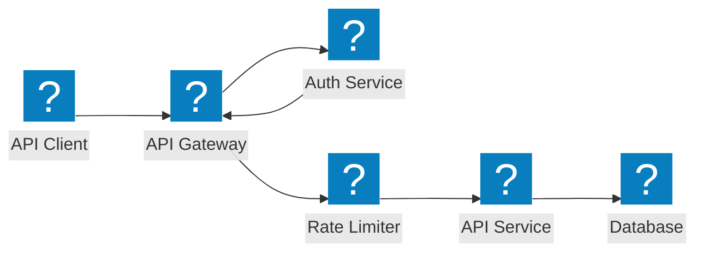
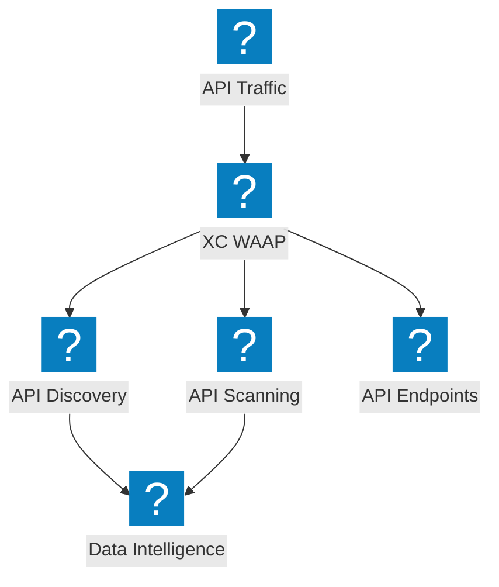

مخططات معمارية لحماية API تغطي أمان بوابة API، واكتشاف Shadow API، وتحديد معدل الطلبات، والتحقق من المخطط مع F5 Distributed Cloud.

## أمان بوابة API

بوابة API مع المصادقة، والتفويض، وتحديد معدل الطلبات، والتحقق من المخطط قبل الوصول إلى خدمات الواجهة الخلفية.

## اكتشاف وحماية API مع F5 XC

يوفر F5 Distributed Cloud اكتشاف API، وكشف Shadow API، وأمان API شاملاً مع رؤية حركة المرور.

## مسار أمان API

مسار متعدد المراحل للتحقق من صحة طلبات API يشمل TLS، والتحقق من JWT، وتحديد معدل الطلبات، وفحص الحمولة.

```mermaid
architecture-beta
  group security(lucide:shield)[API Security Layer]
  group backend(carbon:cloud-services)[Backend Services]

  service tls(lucide:lock)[TLS Termination] in security
  service jwt(lucide:key)[JWT Validation] in security
  service rate(carbon:load-balancer-vpc)[Rate Limiter] in security
  service schema(carbon:gateway-security)[Schema Validation] in security
  service api1(carbon:api)[Users API] in backend
  service api2(carbon:api)[Orders API] in backend

  tls:R --> L:jwt
  jwt:R --> L:rate
  rate:R --> L:schema
  schema:R --> L:api1
  schema:B --> T:api2
```

