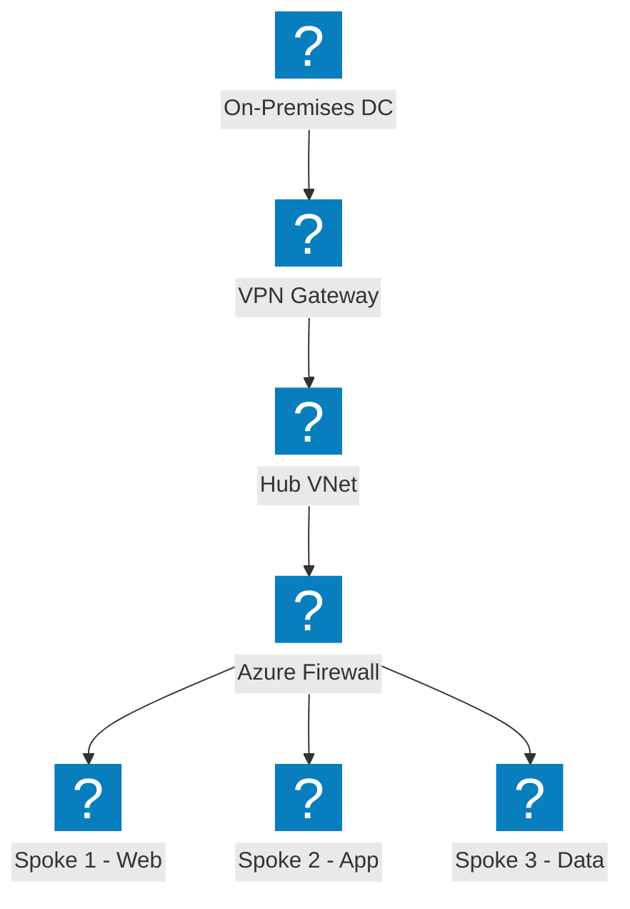
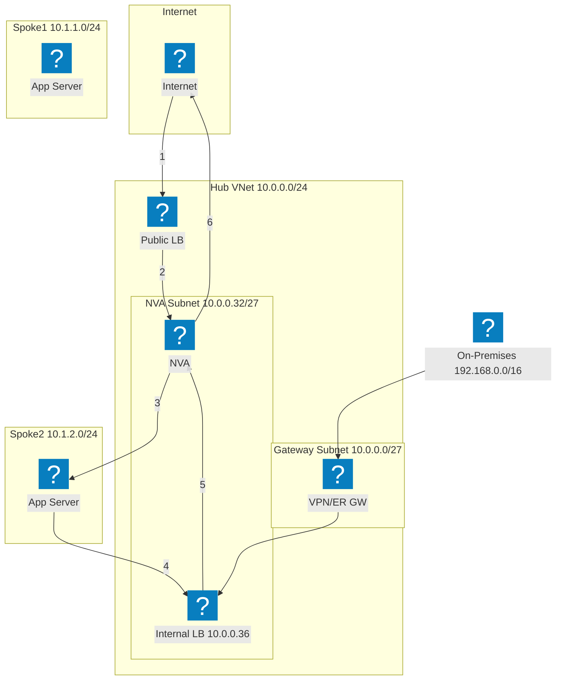
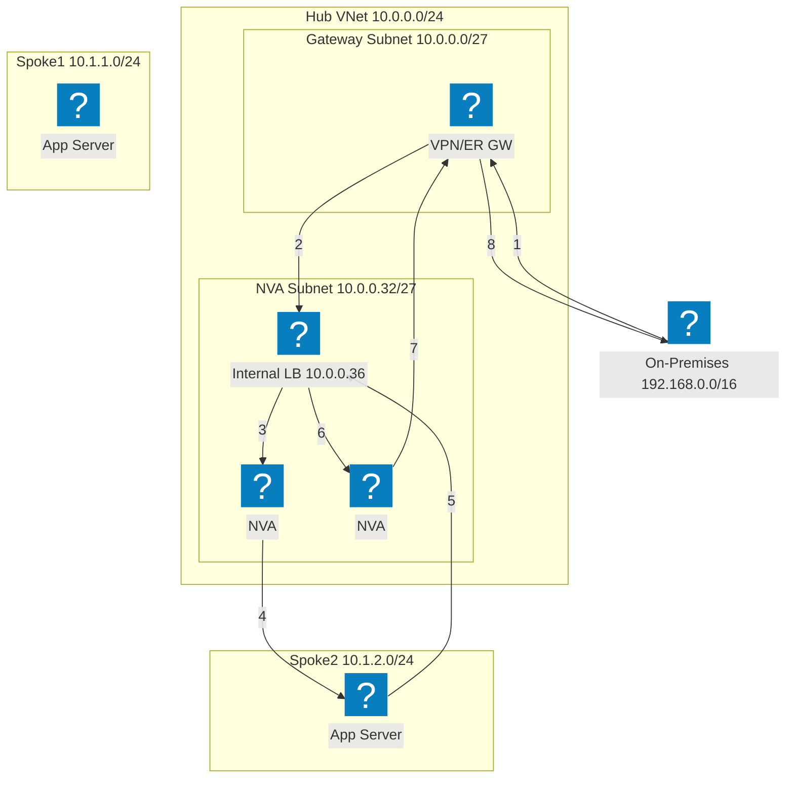
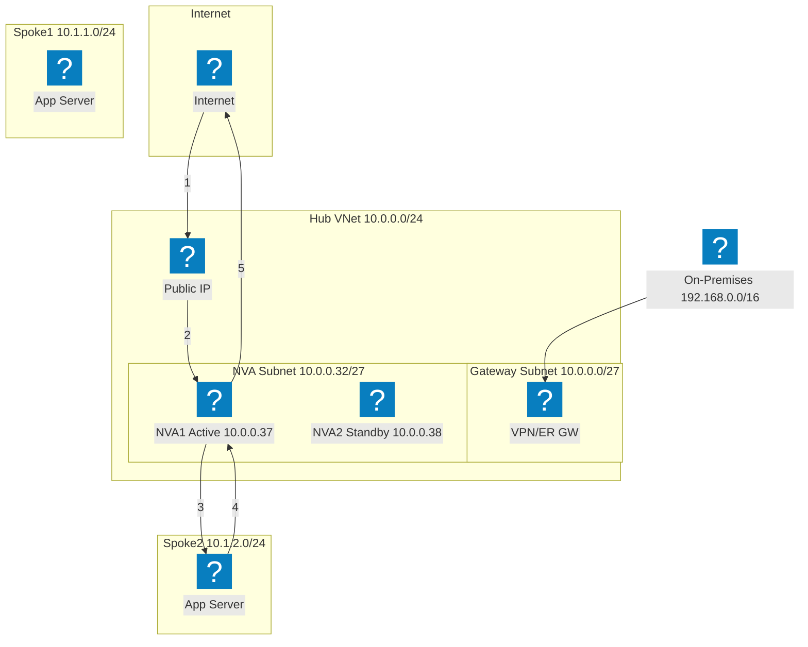
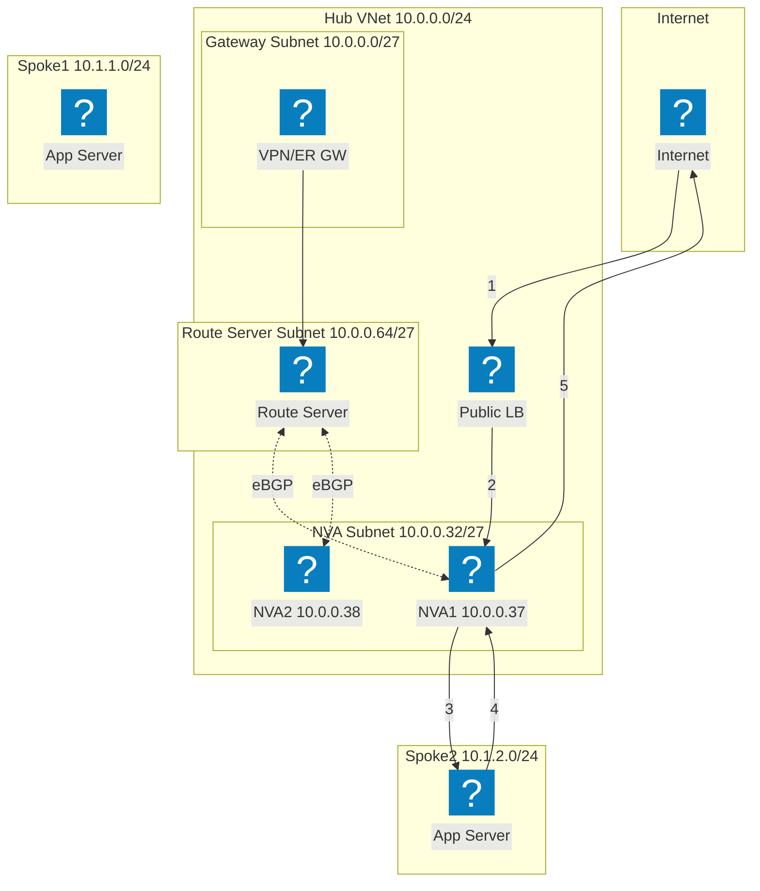
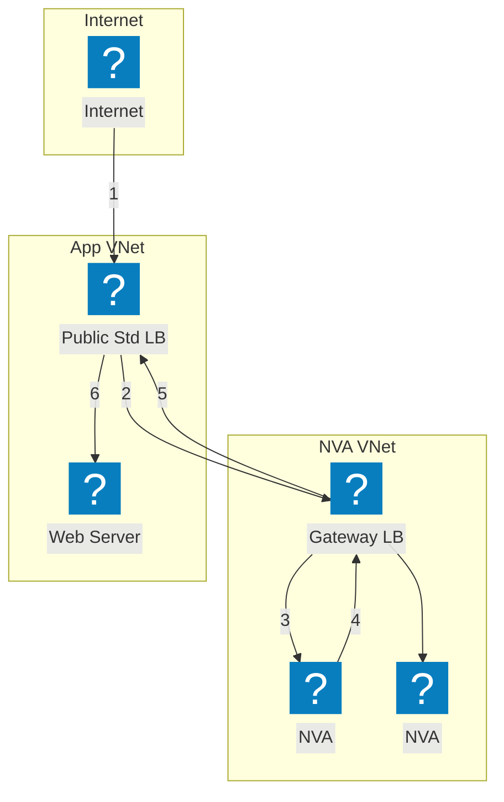

مخططات بنية تحتية لـ Azure باستخدام حزم أيقونات HashiCorp Flight وCarbon لشبكات VNet والحوسبة والخدمات المدارة.

## VNet مع App Gateway

Azure VNet مع بوابة وشبكات فرعية للتطبيق والبيانات. يوزع Application Gateway حركة المرور على VM Scale Sets.

```mermaid
architecture-beta
  group vnet(carbon:virtual-private-cloud)[Azure VNet]
  group gwsub(carbon:ibm-cloud-subnets)[Gateway Subnet] in vnet
  group appsub(carbon:ibm-cloud-subnets)[App Subnet] in vnet
  group datasub(carbon:ibm-cloud-subnets)[Data Subnet] in vnet

  service appgw(carbon:gateway-security)[App Gateway] in gwsub
  service vm1(hashicorp-flight:azure-vms-color)[VM Scale Set] in appsub
  service vm2(hashicorp-flight:azure-vms-color)[VM Scale Set] in appsub
  service sqldb(carbon:data-base)[Azure SQL] in datasub

  appgw:R --> L:vm1
  appgw:B --> T:vm2
  vm1:R --> L:sqldb
  vm2:R --> L:sqldb
```

## AKS مع F5 XC Multi-Cloud Connect

خدمة Azure Kubernetes مدعومة بـ F5 Distributed Cloud لاتصال التطبيقات متعددة السحابات والأمان.

```mermaid
architecture-beta
  group xc(lucide:cloud)[F5 XC]
  group aks(hashicorp-flight:azure-aks-color)[AKS Cluster]

  service mcn(f5xc:multi-cloud-network-connect)[Network Connect] in xc
  service waap(f5xc:web-app-and-api-protection)[WAAP] in xc
  service ingress(carbon:gateway)[Ingress] in aks
  service app(hashicorp-flight:docker-color)[App Pods] in aks
  service cache(carbon:datastore)[Redis Cache] in aks
  service blob(hashicorp-flight:azure-blob-storage-color)[Blob Storage]

  mcn:R --> L:waap
  waap:R --> L:ingress
  ingress:R --> L:app
  app:B --> T:cache
  app:R --> L:blob
```

## طبولوجيا شبكة Hub-Spoke

بنية Azure Hub-Spoke مع أمان مركزي وخدمات مشتركة تربط شبكات VNet متعددة من نوع Spoke.

## توافر NVA العالي مع موازن التحميل — حركة مرور الإنترنت

تصل حركة مرور الإنترنت الواردة إلى موازن تحميل عام، يوزعها على نسخ NVA في المحور. يقوم NVA بإعادة توجيه حركة المرور المفحوصة إلى أحمال عمل Spoke. تمر حركة المرور العائدة من Spoke عبر موازن تحميل داخلي للوصول إلى NVA للخروج. تُظهر الخطوات المرقمة المسار الوارد (1-3) ومسار الإرجاع (4-6).

## توافر NVA العالي مع موازن التحميل — حركة المرور من الشبكة المحلية

تدخل حركة المرور القادمة من الشبكة المحلية عبر بوابة VPN أو ExpressRoute وتُوجَّه إلى موازن تحميل داخلي يقف أمام نسخ NVA متعددة. يفحص NVA حركة المرور ويعيد توجيهها إلى أحمال عمل Spoke. تعبر حركة المرور العائدة نفس موازن التحميل الداخلي لضمان تماثل التدفق ومنع مشكلات التوجيه غير المتماثل.

## توافر NVA العالي مع PIP/UDR — نشط/احتياطي

زوج NVA نشط/احتياطي حيث تحتفظ النسخة النشطة (NVA1) بعنوان IP العام. عند الفشل، تستدعي NVA2 الاحتياطية واجهة Azure API لإعادة تعيين عنوان IP العام وتحديث مسارات المستخدم المعرّفة للإشارة إلى نفسها. يتجنب هذا النهج موازنات التحميل لكنه يتطلب تنسيق تجاوز الفشل على مستوى API.

## توافر NVA العالي مع Azure Route Server

توافر عالٍ قائم على BGP باستخدام Azure Route Server. يُنشئ Route Server مجاورات eBGP مع كلتا نسختي NVA ويُبرمج مسارات Spoke الفعّالة بصورة ديناميكية. يوازن ECMP الحمل عبر NVAs دون الحاجة إلى مسارات معرّفة من قِبل المستخدم. يضخ Route Server إدخالات next-hop لعناوين IP الخاصة بكلا NVA في جميع الشبكات الظاهرية المتناظرة.

## توافر NVA العالي مع Gateway Load Balancer

إدراج NVA شفاف باستخدام Azure Gateway Load Balancer. يُحوَّل حركة المرور المتجهة إلى التطبيق بصورة شفافة من موازن التحميل العام القياسي إلى Gateway LB في شبكة NVA الظاهرية المنفصلة. تفحص نسخ NVA حركة المرور وتعيدها إلى Gateway LB الذي يعيد توجيهها إلى التطبيق. لا يلزم تناظر الشبكات الظاهرية أو مسارات UDR بين شبكتَي NVA والتطبيق.

