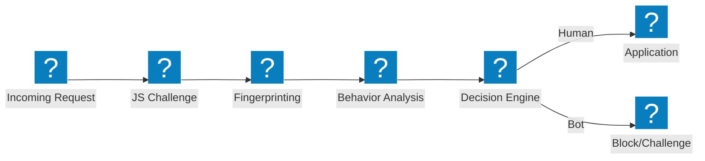
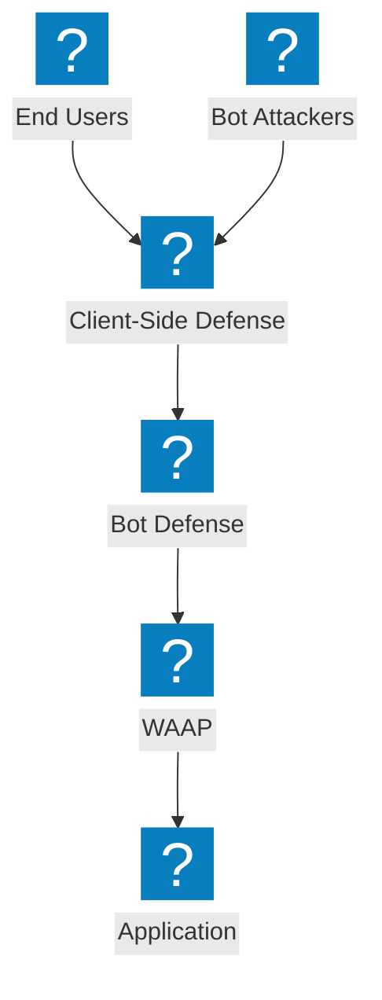

مخططات معمارية لدفاع Bot تُغطي خطوط أنابيب الكشف، والتخفيف من حشو بيانات الاعتماد، والدفاع من جهة العميل، وقدرات إدارة Bot في F5 Distributed Cloud.

## خط أنابيب كشف Bot

خط أنابيب متعدد المراحل لكشف Bot يتضمن تحدي JavaScript وتحليل السلوك والبصمة الرقمية قبل السماح بالوصول.

## دفاع Bot في F5 XC والدفاع من جهة العميل

دفاع Bot متكامل في F5 Distributed Cloud مع الحماية من جهة العميل للوقاية من حشو بيانات الاعتماد والاستيلاء على الحسابات.

## معمارية الدفاع ضد حشو بيانات الاعتماد

دفاع متعدد الطبقات ضد هجمات حشو بيانات الاعتماد يشمل بصمة الأجهزة وذكاء بيانات الاعتماد وحماية الحسابات.

