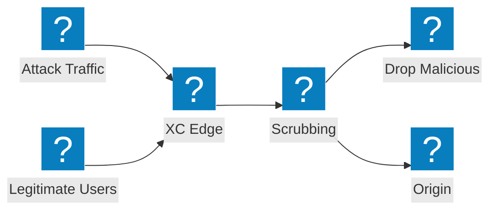

مخططات هندسة تخفيف هجمات DDoS التي تغطي تصميم مركز التنقية وتكامل خدمات العبور وحماية الهجمات الضخمة في F5 Distributed Cloud.

## هندسة تخفيف هجمات DDoS

تخفيف متعدد الطبقات لهجمات DDoS مع تنقية على مستوى الشبكة وفحص على مستوى التطبيق وتوصيل حركة المرور النظيفة إلى خادم المصدر.

```mermaid
architecture-beta
  group scrub(lucide:shield)[Scrubbing Center]
  group origin(carbon:cloud-services)[Origin DC]

  service edge(carbon:edge-node)[Edge Router] in scrub
  service filter(carbon:firewall)[Traffic Filter] in scrub
  service clean(carbon:load-balancer-global)[Clean Pipe] in scrub
  service lb(carbon:load-balancer-application)[Load Balancer] in origin
  service app(carbon:application)[Application] in origin
  service db(carbon:data-base)[Database] in origin

  edge:R --> L:filter
  filter:R --> L:clean
  clean:R --> L:lb
  lb:R --> L:app
  app:B --> T:db
```

## حماية DDoS وخدمات العبور في F5 XC

يوفر F5 Distributed Cloud حماية DDoS وخدمات العبور مع شبكة توصيل محتوى متكاملة وأمان التطبيقات.

```mermaid
architecture-beta
  group xc(lucide:cloud)[F5 Distributed Cloud]
  group cloud(carbon:cloud-services)[Cloud Infrastructure]

  service ddos(f5xc:ddos-and-transit-services)[DDoS Protection] in xc
  service cdn(f5xc:content-delivery-network)[CDN] in xc
  service waap(f5xc:web-app-and-api-protection)[WAAP] in xc
  service lb(carbon:load-balancer-application)[Load Balancer] in cloud
  service app(carbon:application)[App Cluster] in cloud
  service db(carbon:data-base)[Database] in cloud

  ddos:R --> L:cdn
  cdn:R --> L:waap
  waap:R --> L:lb
  lb:R --> L:app
  app:B --> T:db
```

## تدفق الهجوم الضخم

تدفق حركة مرور الهجوم الذي يُظهر كيفية امتصاص هجمات DDoS الضخمة وتخفيفها عند حافة F5 XC قبل الوصول إلى البنية التحتية لخادم المصدر.

