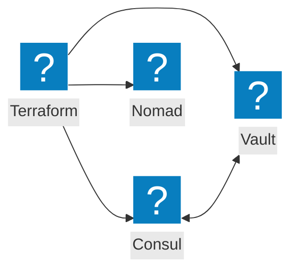
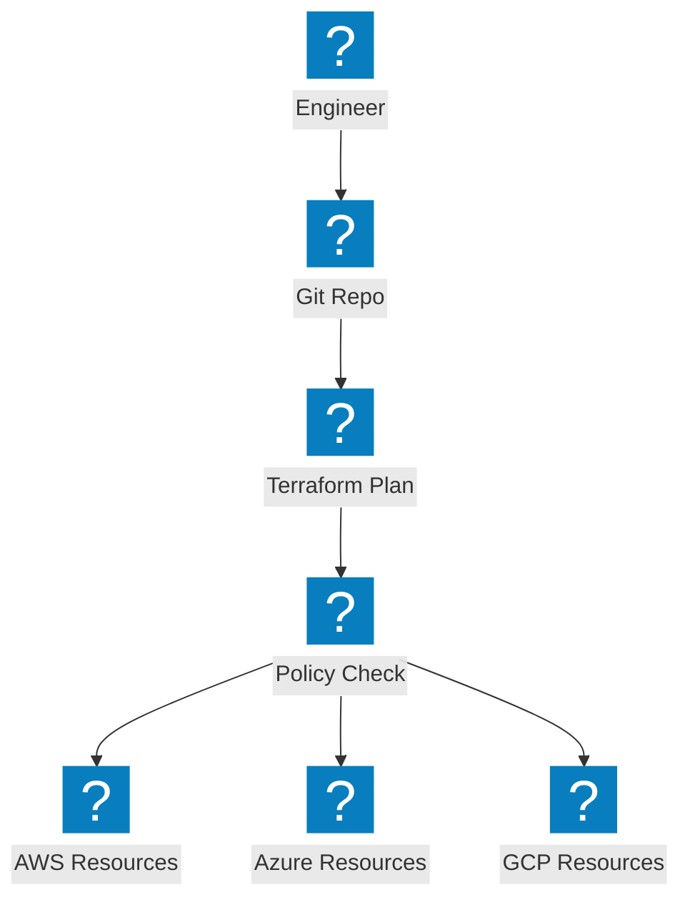

مخططات البنية التحتية كرمز تغطي أتمتة Terraform وتكامل أدوات HashiCorp وسير عمل التوفير متعددة السحابات.

## تكامل مجموعة HashiCorp

يُنسّق Terraform توفير البنية التحتية مع Consul لاكتشاف الخدمات، وVault للأسرار، وNomad لجدولة أحمال العمل.

## خط أنابيب IaC متعدد السحابات

يُوفّر Terraform البنية التحتية عبر AWS وAzure وGCP مع إدارة الحالة وتطبيق السياسات.

## أتمتة بنية F5 XC التحتية

يُؤتمت Terraform تهيئة F5 Distributed Cloud مع موازنات التحميل وتجمعات المصدر وسياسات الأمان.

```mermaid
architecture-beta
  group iac(hashicorp-flight:terraform-color)[Terraform Workspace]
  group xc(lucide:cloud)[F5 XC Tenant]

  service tfplan(hashicorp-flight:terraform-color)[Terraform] in iac
  service vault(hashicorp-flight:vault-color)[Vault Secrets] in iac
  service consul(hashicorp-flight:consul-color)[Consul Registry] in iac
  service waap(f5xc:web-app-and-api-protection)[WAAP Policy] in xc
  service lb(f5xc:multi-cloud-app-connect)[App Connect] in xc
  service dns(f5xc:dns-management)[DNS Config] in xc

  tfplan:R --> L:vault
  vault:R --> L:consul
  tfplan:B --> T:waap
  tfplan:B --> T:lb
  tfplan:B --> T:dns
```

