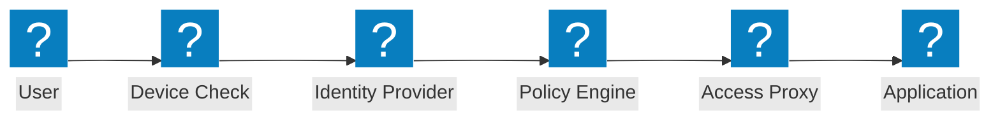
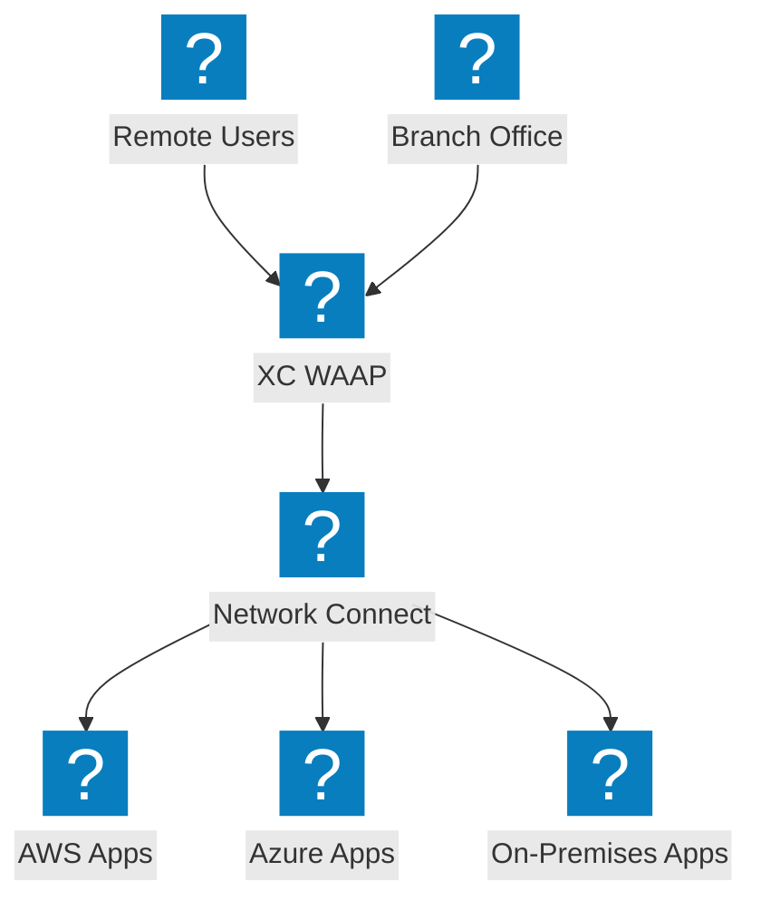

مخططات معمارية الثقة الصفرية التي تغطي تدفقات الوصول وفق ZTNA، والتحقق من الهوية، والتحكم في الوصول المستند إلى السياسات، والتجزئة الدقيقة مع تكامل F5 XC.

## تدفق الوصول وفق الثقة الصفرية

تدفق الوصول وفق الثقة الصفرية مع فحص وضع الجهاز، والتحقق من الهوية، وتقييم السياسات، والوصول إلى التطبيقات عبر الوكيل.

## معمارية الثقة الصفرية لـ F5 XC

توفير F5 Distributed Cloud وصولاً إلى التطبيقات وفق الثقة الصفرية مع WAAP، والوكيل المدرك للهوية، والتجزئة الدقيقة عبر السحابات.

## معمارية التجزئة الدقيقة

التجزئة الدقيقة للشبكة مع سياسات قائمة على الهوية تتحكم في حركة المرور الشرقية-الغربية بين طبقات التطبيق.

```mermaid
architecture-beta
  group trust(lucide:shield)[Zero Trust Fabric]
  group apps(carbon:cloud-services)[Application Tiers]

  service idp(lucide:key)[Identity Provider] in trust
  service policy(carbon:gateway-security)[Policy Engine] in trust
  service seg(carbon:subnet-acl-rules)[Segmentation] in trust
  service web(carbon:application)[Web Tier] in apps
  service api(carbon:api)[API Tier] in apps
  service data(carbon:data-base)[Data Tier] in apps

  idp:R --> L:policy
  policy:R --> L:seg
  seg:R --> L:web
  web:R --> L:api
  api:R --> L:data
```

