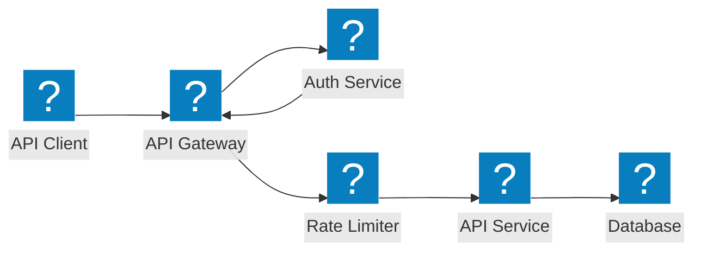
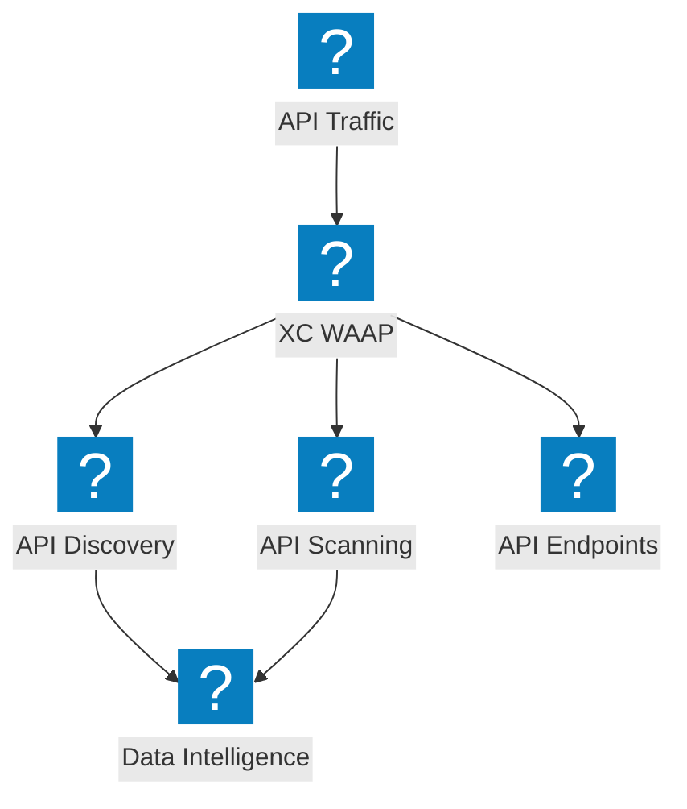

API-Schutzarchitekturdiagramme zu API-Gateway-Sicherheit, Shadow-API-Erkennung, Ratenbegrenzung und Schema-Validierung mit F5 Distributed Cloud.

## API-Gateway-Sicherheit

API-Gateway mit Authentifizierung, Autorisierung, Ratenbegrenzung und Schema-Validierung vor dem Erreichen der Backend-Dienste.

## F5 XC API-Erkennung und -Schutz

F5 Distributed Cloud bietet API-Erkennung, Shadow-API-Erkennung und umfassende API-Sicherheit mit Datenverkehrseinblicken.

## API-Sicherheitspipeline

Mehrstufige API-Anforderungsvalidierungspipeline mit TLS, JWT-Überprüfung, Ratenbegrenzung und Payload-Inspektion.

```mermaid
architecture-beta
  group security(lucide:shield)[API Security Layer]
  group backend(carbon:cloud-services)[Backend Services]

  service tls(lucide:lock)[TLS Termination] in security
  service jwt(lucide:key)[JWT Validation] in security
  service rate(carbon:load-balancer-vpc)[Rate Limiter] in security
  service schema(carbon:gateway-security)[Schema Validation] in security
  service api1(carbon:api)[Users API] in backend
  service api2(carbon:api)[Orders API] in backend

  tls:R --> L:jwt
  jwt:R --> L:rate
  rate:R --> L:schema
  schema:R --> L:api1
  schema:B --> T:api2
```

