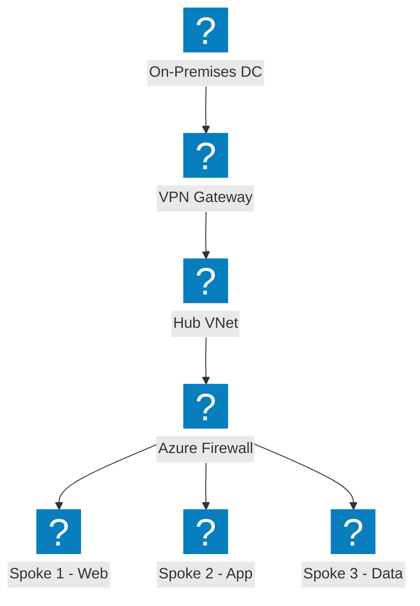
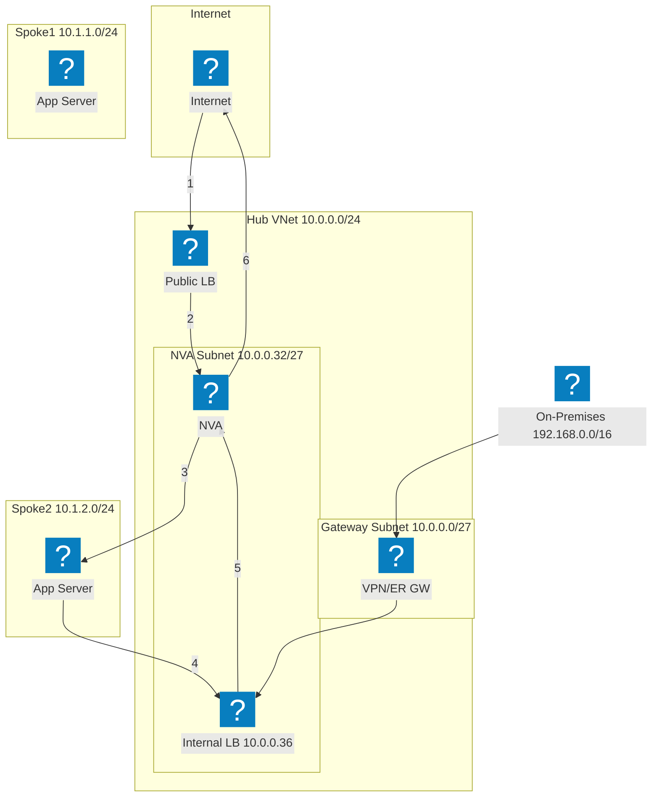
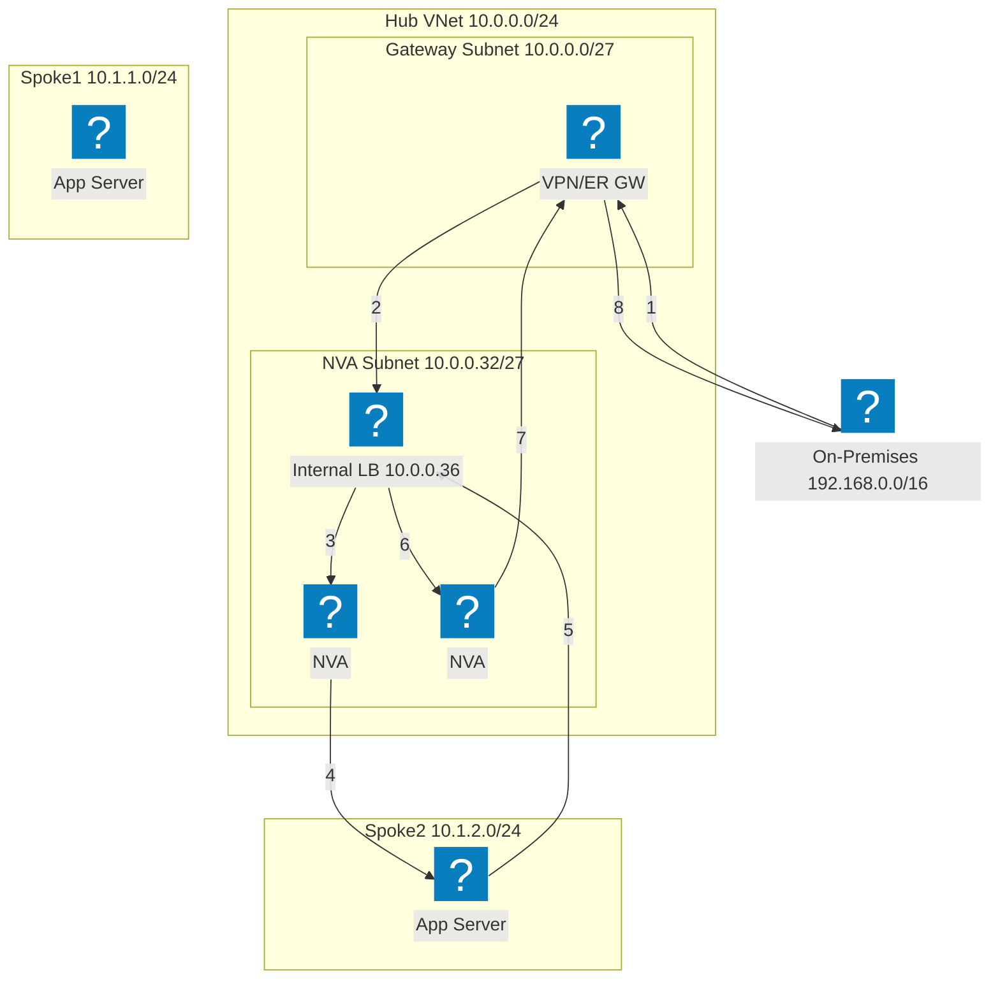
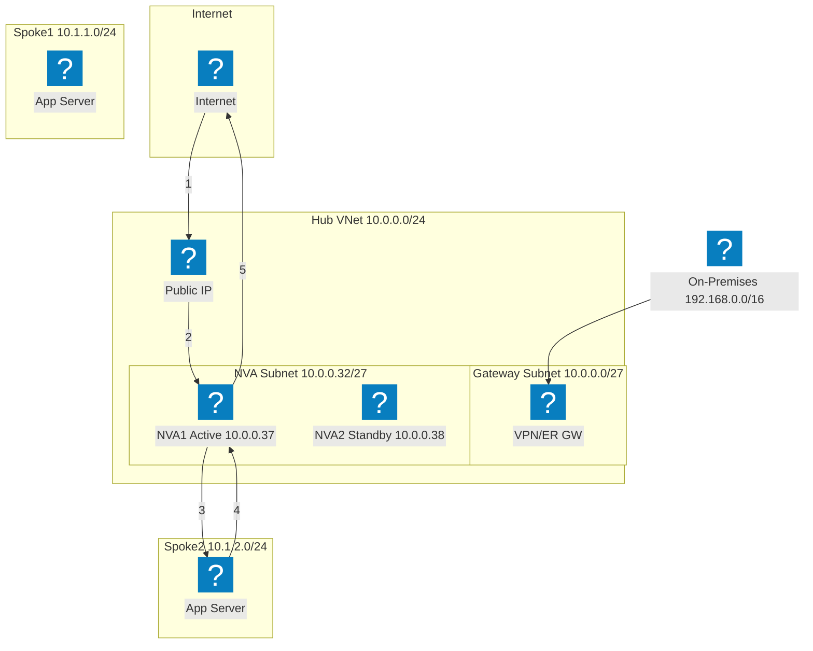
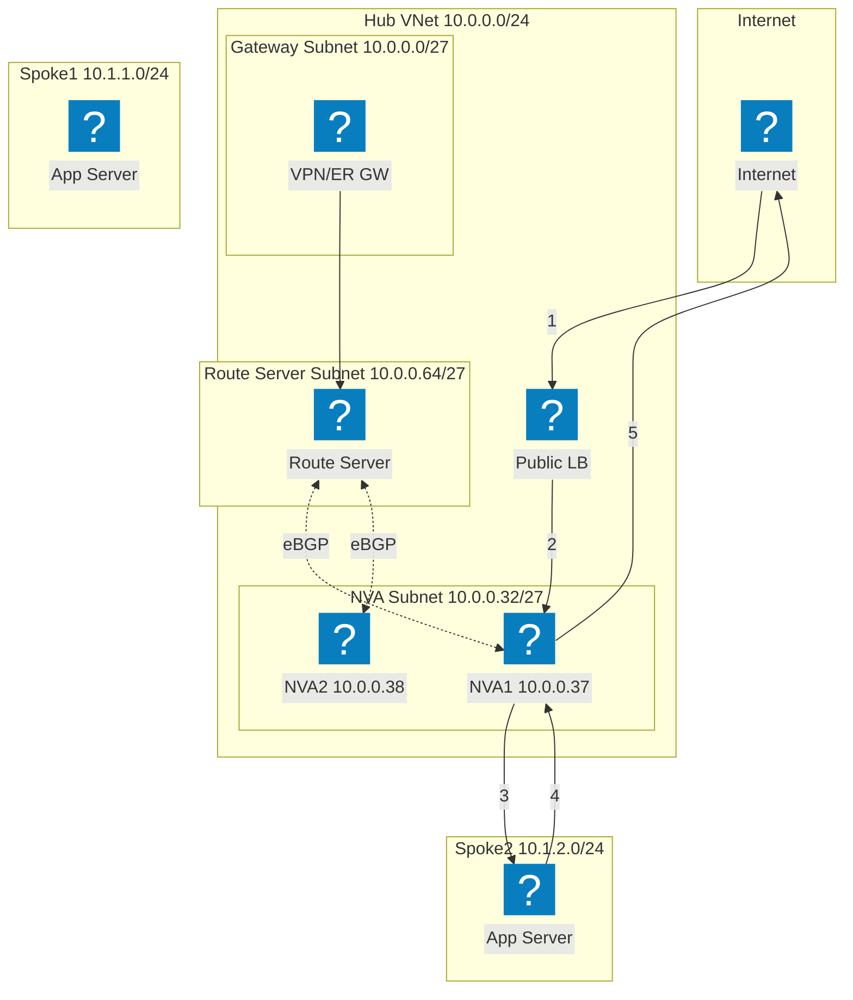
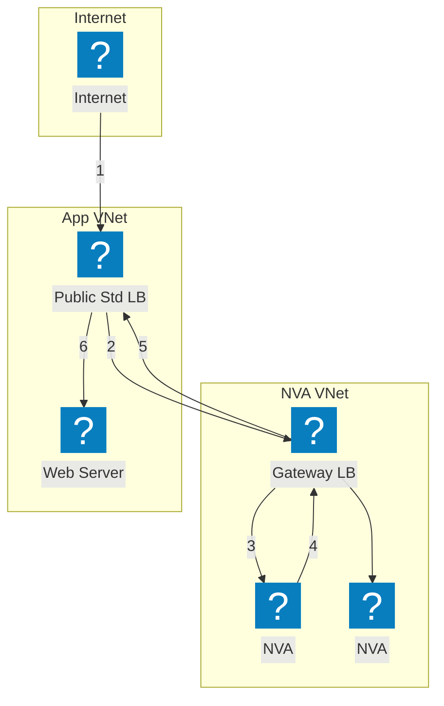

Azure-Infrastrukturdiagramme mit HashiCorp Flight und Carbon Icon-Paketen für VNet-Netzwerk, Compute und verwaltete Dienste.

## VNet mit App Gateway

Azure VNet mit Gateway-, Anwendungs- und Daten-Subnetzen. Das Application Gateway verteilt den Datenverkehr auf VM Scale Sets.

```mermaid
architecture-beta
  group vnet(carbon:virtual-private-cloud)[Azure VNet]
  group gwsub(carbon:ibm-cloud-subnets)[Gateway Subnet] in vnet
  group appsub(carbon:ibm-cloud-subnets)[App Subnet] in vnet
  group datasub(carbon:ibm-cloud-subnets)[Data Subnet] in vnet

  service appgw(carbon:gateway-security)[App Gateway] in gwsub
  service vm1(hashicorp-flight:azure-vms-color)[VM Scale Set] in appsub
  service vm2(hashicorp-flight:azure-vms-color)[VM Scale Set] in appsub
  service sqldb(carbon:data-base)[Azure SQL] in datasub

  appgw:R --> L:vm1
  appgw:B --> T:vm2
  vm1:R --> L:sqldb
  vm2:R --> L:sqldb
```

## AKS mit F5 XC Multi-Cloud Connect

Azure Kubernetes Service mit vorgelagertem F5 Distributed Cloud für Multi-Cloud-Anwendungskonnektivität und Sicherheit.

```mermaid
architecture-beta
  group xc(lucide:cloud)[F5 XC]
  group aks(hashicorp-flight:azure-aks-color)[AKS Cluster]

  service mcn(f5xc:multi-cloud-network-connect)[Network Connect] in xc
  service waap(f5xc:web-app-and-api-protection)[WAAP] in xc
  service ingress(carbon:gateway)[Ingress] in aks
  service app(hashicorp-flight:docker-color)[App Pods] in aks
  service cache(carbon:datastore)[Redis Cache] in aks
  service blob(hashicorp-flight:azure-blob-storage-color)[Blob Storage]

  mcn:R --> L:waap
  waap:R --> L:ingress
  ingress:R --> L:app
  app:B --> T:cache
  app:R --> L:blob
```

## Hub-Spoke-Netzwerktopologie

Azure Hub-Spoke-Architektur mit zentralisierter Sicherheit und gemeinsamen Diensten, die mehrere Spoke-VNets verbinden.

## NVA-Hochverfügbarkeit mit Load Balancer — Internetdatenverkehr

Eingehender Internetdatenverkehr trifft auf einen öffentlichen Load Balancer, der ihn auf NVA-Instanzen im Hub verteilt. Die NVA leitet geprüften Datenverkehr an Spoke-Workloads weiter. Rückkehrdatenverkehr von Spokes wird über einen internen Load Balancer zurück zur NVA für den ausgehenden Datenverkehr geleitet. Nummerierte Schritte zeigen den eingehenden Pfad (1–3) und den Rückgabepfad (4–6).

## NVA-Hochverfügbarkeit mit Load Balancer — On-Premises-Datenverkehr

On-Premises-Datenverkehr gelangt über ein VPN- oder ExpressRoute-Gateway und wird an einen internen Load Balancer weitergeleitet, der mehrere NVA-Instanzen vorschaltet. Die NVA prüft und leitet den Datenverkehr an Spoke-Workloads weiter. Rückkehrdatenverkehr durchläuft denselben internen Load Balancer, um Flow-Symmetrie sicherzustellen und asymmetrische Routingprobleme zu vermeiden.

## NVA-Hochverfügbarkeit mit PIP/UDR — Aktiv/Standby

Aktiv/Standby-NVA-Paar, bei dem die aktive Instanz (NVA1) die öffentliche IP-Adresse hält. Bei einem Ausfall ruft die Standby-NVA2 die Azure-API auf, um die öffentliche IP-Adresse neu zuzuweisen und benutzerdefinierte Routen zu aktualisieren, sodass diese auf sich selbst verweisen. Dieser Ansatz vermeidet Load Balancer, erfordert jedoch eine Failover-Orchestrierung auf API-Ebene.

## NVA-Hochverfügbarkeit mit Azure Route Server

BGP-basierte Hochverfügbarkeit mit Azure Route Server. Der Route Server stellt eBGP-Adjacencies mit beiden NVA-Instanzen her und programmiert dynamisch die effektiven Routen der Spokes. ECMP verteilt die Last auf die NVAs ohne benutzerdefinierte Routen. Der Route Server injiziert Next-Hop-Einträge für beide NVA-IPs in alle gepeerden VNets.

## NVA-Hochverfügbarkeit mit Gateway Load Balancer

Transparente NVA-Einbindung über Azure Gateway Load Balancer. Datenverkehr, der für die Anwendung bestimmt ist, wird transparent vom öffentlichen Standard-Load-Balancer zum Gateway LB in einem separaten NVA-VNet umgeleitet. NVAs prüfen den Datenverkehr und geben ihn an den Gateway LB zurück, der ihn an die Anwendung weiterleitet. Zwischen den NVA- und Anwendungs-VNets sind weder VNet-Peering noch UDRs erforderlich.

