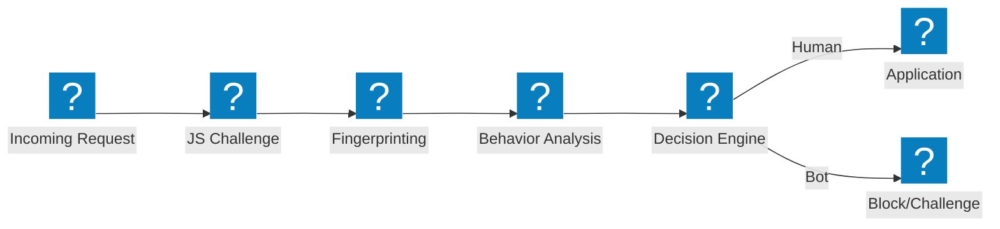
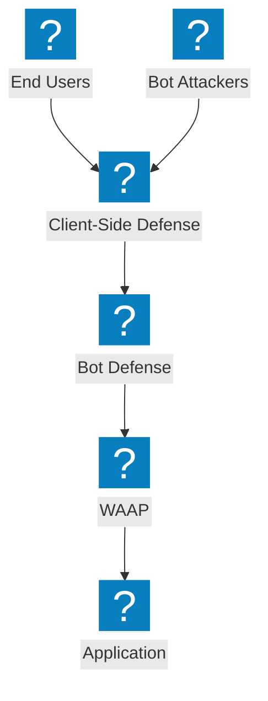

Architekturdiagramme zur Bot-Abwehr, die Erkennungspipelines, Credential-Stuffing-Mitigation, clientseitige Abwehr und F5 Distributed Cloud Bot-Verwaltungsfunktionen abdecken.

## Bot-Erkennungspipeline

Mehrstufige Bot-Erkennungspipeline mit JavaScript-Challenge, Verhaltensanalyse und Fingerprinting vor der Zugriffsgewährung.

## F5 XC Bot-Abwehr und clientseitige Abwehr

In F5 Distributed Cloud integrierte Bot-Abwehr mit clientseitigem Schutz zur Prävention von Credential Stuffing und Kontoübernahmen.

## Credential-Stuffing-Abwehrarchitektur

Mehrschichtige Abwehr gegen Credential-Stuffing-Angriffe mit Gerätefingerprinting, Credential-Intelligence und Kontoschutz.

