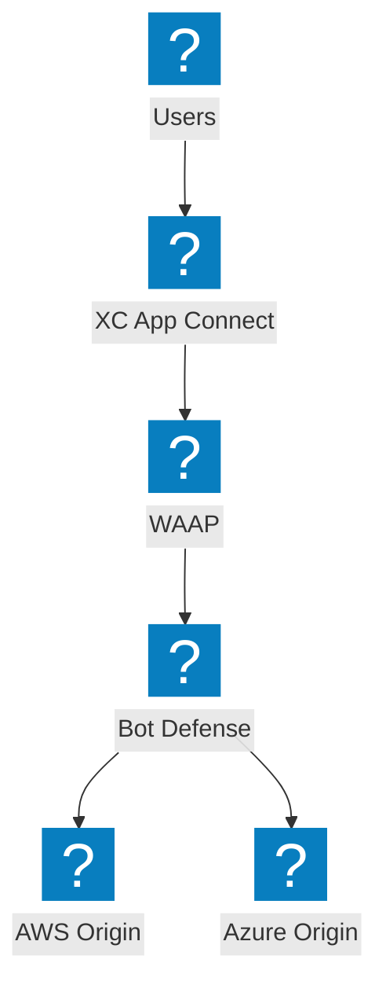
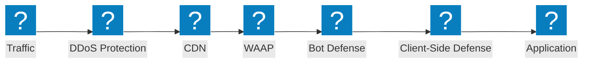

F5-Produktsymbol-Showcase-Diagramme zur Demonstration des F5 XC-Dienstportfolios, der NGINX-Produktlinie und der BIG-IP-Funktionen unter Verwendung der Icon-Packs `f5xc` und `f5-brand`.

## F5 XC-Dienstportfolio

Übersicht über F5 Distributed Cloud-Dienste, die Sicherheit, Netzwerk und Anwendungsbereitstellung umfassen.

## F5 XC-Sicherheits-Stack

Vollständiger F5 XC-Sicherheits-Stack mit WAAP, Bot-Abwehr, clientseitiger Abwehr, DDoS-Schutz und API-Erkennung.

## F5 XC-Netzwerkdienste

F5 Distributed Cloud-Netzwerkdienste mit Multi-Cloud-Verbindung, DNS-Verwaltung und verteilten Anwendungen.

```mermaid
architecture-beta
  group xc(lucide:cloud)[F5 Distributed Cloud]
  group infra(carbon:cloud-services)[Infrastructure]

  service mcn(f5xc:multi-cloud-network-connect)[Network Connect] in xc
  service mca(f5xc:multi-cloud-app-connect)[App Connect] in xc
  service dns(f5xc:dns-management)[DNS Management] in xc
  service dapp(f5xc:distributed-apps)[Distributed Apps] in xc
  service k8s(hashicorp-flight:kubernetes-color)[K8s Clusters] in infra
  service vm(carbon:virtual-machine)[VM Workloads] in infra

  mcn:R --> L:mca
  mca:R --> L:dns
  dns:R --> L:dapp
  mcn:B --> T:k8s
  mca:B --> T:vm
```

## F5 XC-Beobachtbarkeit und Intelligenz

F5 Distributed Cloud-Beobachtbarkeit, Datenverkehrseinblicke und Datenintelligenz für umfassende Anwendungstransparenz.

```mermaid
architecture-beta
  group apps(carbon:cloud-services)[Application Layer]
  group intel(lucide:cloud)[F5 XC Intelligence]

  service app1(carbon:application)[Web App] in apps
  service app2(carbon:api)[API Service] in apps
  service app3(f5xc:distributed-apps)[Distributed App] in apps
  service obs(f5xc:observability)[Observability] in intel
  service ati(f5xc:application-traffic-insight)[Traffic Insight] in intel
  service di(f5xc:data-intelligence)[Data Intelligence] in intel

  app1:B --> T:obs
  app2:B --> T:ati
  app3:B --> T:di
  obs:R --> L:ati
  ati:R --> L:di
```

