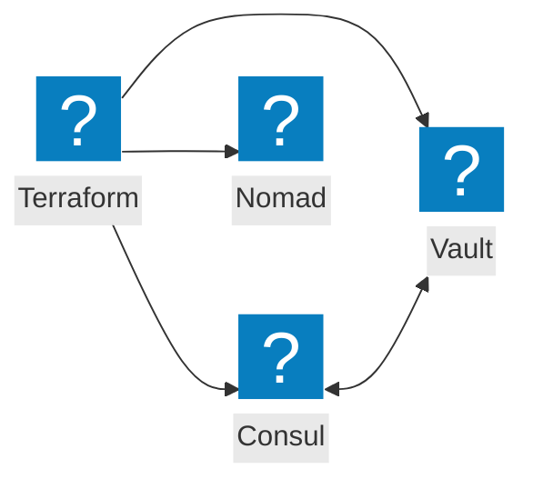
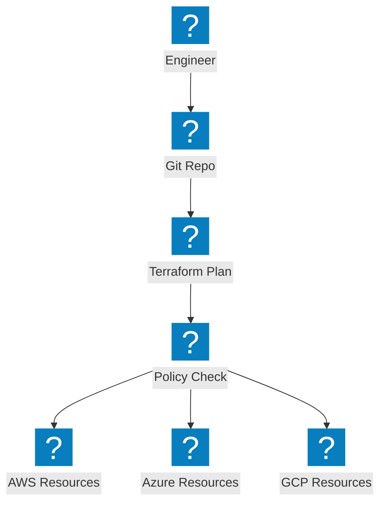

Infrastructure-as-Code-Diagramme zu Terraform-Automatisierung, HashiCorp-Werkzeugintegration und Multi-Cloud-Provisionierungs-Workflows.

## HashiCorp-Stack-Integration

Terraform orchestriert die Infrastrukturbereitstellung mit Consul für die Diensterkennung, Vault für Geheimnisse und Nomad für die Workload-Planung.

## Multi-Cloud-IaC-Pipeline

Terraform provisioniert Infrastruktur über AWS, Azure und GCP mit Zustandsverwaltung und Richtliniendurchsetzung.

## F5 XC Infrastruktur-Automatisierung

Terraform automatisiert die F5 Distributed Cloud-Konfiguration mit Load Balancern, Ursprungspools und Sicherheitsrichtlinien.

```mermaid
architecture-beta
  group iac(hashicorp-flight:terraform-color)[Terraform Workspace]
  group xc(lucide:cloud)[F5 XC Tenant]

  service tfplan(hashicorp-flight:terraform-color)[Terraform] in iac
  service vault(hashicorp-flight:vault-color)[Vault Secrets] in iac
  service consul(hashicorp-flight:consul-color)[Consul Registry] in iac
  service waap(f5xc:web-app-and-api-protection)[WAAP Policy] in xc
  service lb(f5xc:multi-cloud-app-connect)[App Connect] in xc
  service dns(f5xc:dns-management)[DNS Config] in xc

  tfplan:R --> L:vault
  vault:R --> L:consul
  tfplan:B --> T:waap
  tfplan:B --> T:lb
  tfplan:B --> T:dns
```

