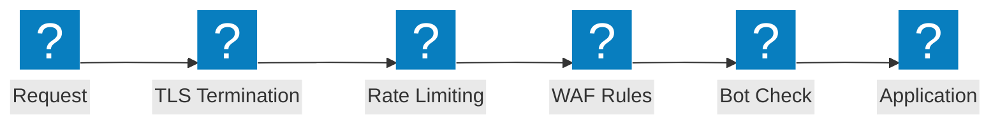

Architekturdiagramme für Web-Application-Firewalls, die Sicherheitsinspektionsketten, OWASP-Schutzabläufe und F5 Distributed Cloud WAAP-Fähigkeiten abdecken.

## Sicherheitsinspektions-Pipeline

Mehrschichtige Sicherheitsinspektionskette vom CDN-Edge über WAF, Bot-Abwehr und Load Balancer bis zur Ursprungsinfrastruktur.

```mermaid
architecture-beta
  group edge(lucide:shield)[Security Edge]
  group origin(carbon:cloud-services)[Origin Infrastructure]

  service cdn(carbon:content-delivery-network)[CDN] in edge
  service waf(carbon:firewall)[WAF] in edge
  service bot(lucide:shield-check)[Bot Defense] in edge
  service lb(carbon:load-balancer-application)[Load Balancer] in origin
  service app(carbon:application)[App Server] in origin
  service db(carbon:data-base)[Database] in origin

  cdn:R --> L:waf
  waf:R --> L:bot
  bot:R --> L:lb
  lb:R --> L:app
  app:B --> T:db
```

## F5 XC WAAP-Schutz

F5 Distributed Cloud Web Application and API Protection mit integrierter Bot-Abwehr und clientseitiger Abwehr.

```mermaid
architecture-beta
  group xcedge(lucide:cloud)[F5 XC Edge]
  group cloud(carbon:cloud-services)[Cloud Origin]

  service waap(f5xc:web-app-and-api-protection)[WAAP] in xcedge
  service botdef(f5xc:bot-defense)[Bot Defense] in xcedge
  service csd(f5xc:client-side-defense)[Client-Side Defense] in xcedge
  service lb(carbon:load-balancer-application)[Load Balancer] in cloud
  service app(carbon:application)[Application] in cloud
  service api(carbon:api)[API Service] in cloud

  waap:R --> L:botdef
  botdef:R --> L:csd
  csd:R --> L:lb
  lb:R --> L:app
  lb:B --> T:api
```

## OWASP-Schutzablauf

WAF-Anforderungsverarbeitungs-Pipeline mit Inspektionsstufen für OWASP Top 10 Bedrohungskategorien.

