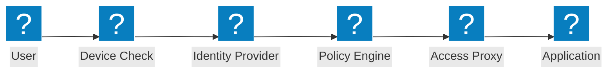
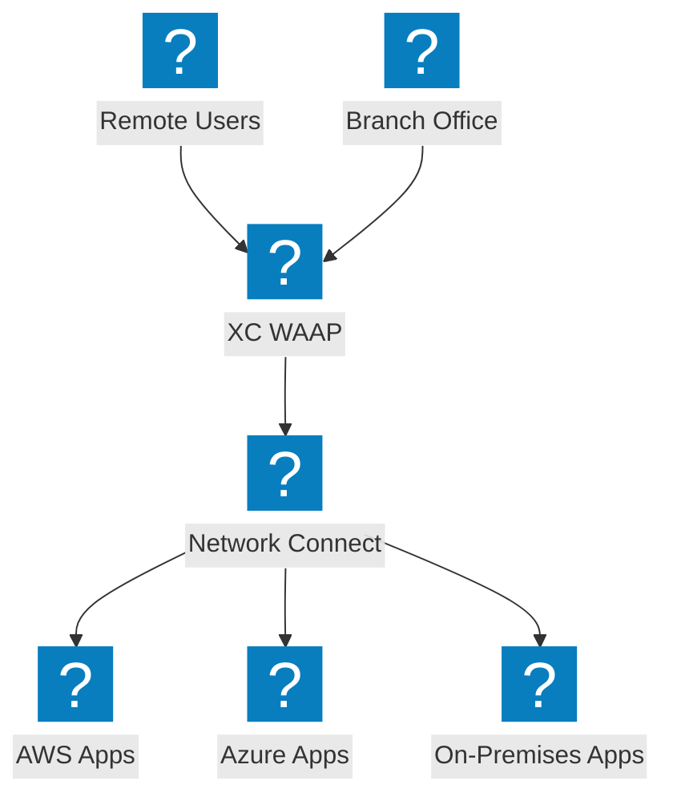

Zero-Trust-Architekturdiagramme zu ZTNA-Zugriffsflüssen, Identitätsverifizierung, richtlinienbasierter Zugangskontrolle und Mikrosegmentierung mit F5 XC-Integration.

## Zero-Trust-Zugriffsfluss

Zero-Trust-Zugriffsfluss mit Gerätestatusüberprüfung, Identitätsverifizierung, Richtlinienauswertung und proxyvermitteltem Anwendungszugriff.

## F5 XC Zero-Trust-Architektur

F5 Distributed Cloud bietet Zero-Trust-Anwendungszugriff mit WAAP, identitätsbewusstem Proxy und Mikrosegmentierung über mehrere Clouds hinweg.

## Mikrosegmentierungsarchitektur

Netzwerk-Mikrosegmentierung mit identitätsbasierten Richtlinien zur Steuerung des Ost-West-Datenverkehrs zwischen Anwendungsebenen.

```mermaid
architecture-beta
  group trust(lucide:shield)[Zero Trust Fabric]
  group apps(carbon:cloud-services)[Application Tiers]

  service idp(lucide:key)[Identity Provider] in trust
  service policy(carbon:gateway-security)[Policy Engine] in trust
  service seg(carbon:subnet-acl-rules)[Segmentation] in trust
  service web(carbon:application)[Web Tier] in apps
  service api(carbon:api)[API Tier] in apps
  service data(carbon:data-base)[Data Tier] in apps

  idp:R --> L:policy
  policy:R --> L:seg
  seg:R --> L:web
  web:R --> L:api
  api:R --> L:data
```

