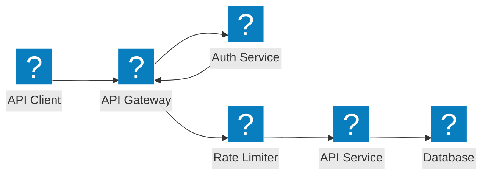
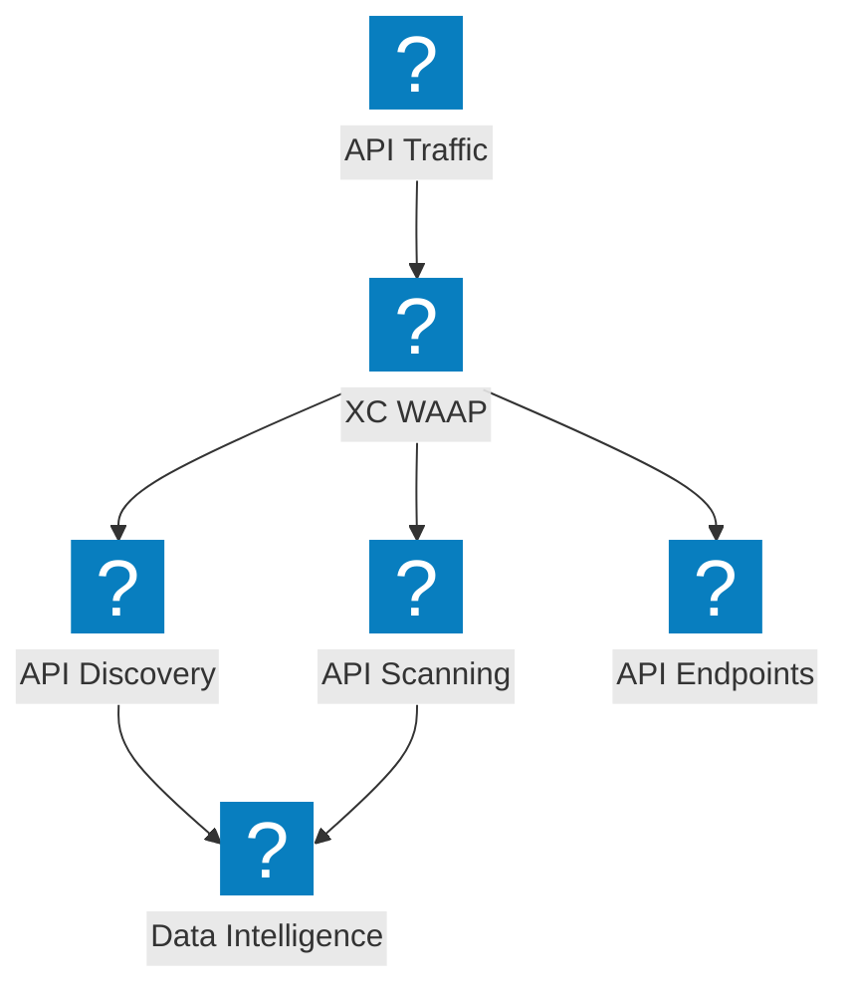

API protection architecture diagrams covering API gateway security, shadow API discovery, rate limiting, and schema validation with F5 Distributed Cloud.

## API Gateway Security

API gateway with authentication, authorization, rate limiting, and schema validation before reaching backend services.

## F5 XC API Discovery and Protection

F5 Distributed Cloud providing API discovery, shadow API detection, and comprehensive API security with traffic insight.

## API Security Pipeline

Multi-stage API request validation pipeline with TLS, JWT verification, rate limiting, and payload inspection.

```mermaid
architecture-beta
  group security(lucide:shield)[API Security Layer]
  group backend(carbon:cloud-services)[Backend Services]

  service tls(lucide:lock)[TLS Termination] in security
  service jwt(lucide:key)[JWT Validation] in security
  service rate(carbon:load-balancer-vpc)[Rate Limiter] in security
  service schema(carbon:gateway-security)[Schema Validation] in security
  service api1(carbon:api)[Users API] in backend
  service api2(carbon:api)[Orders API] in backend

  tls:R --> L:jwt
  jwt:R --> L:rate
  rate:R --> L:schema
  schema:R --> L:api1
  schema:B --> T:api2
```

