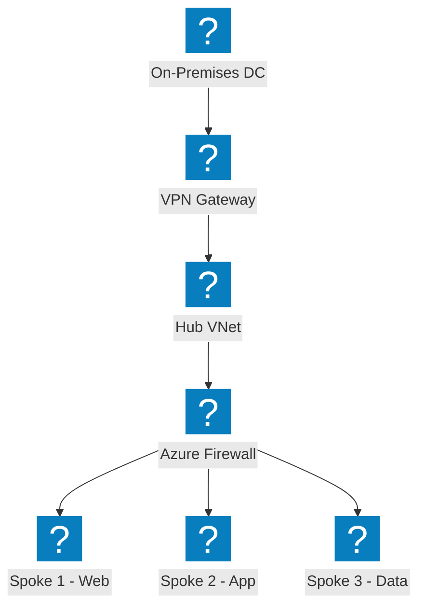

Azure infrastructure diagrams using HashiCorp Flight and Carbon icon packs for VNet networking, compute, and managed services.

## VNet with App Gateway

Azure VNet with gateway, application, and data subnets. Application Gateway distributes traffic to VM Scale Sets.

```mermaid
architecture-beta
  group vnet(carbon:virtual-private-cloud)[Azure VNet]
  group gwsub(carbon:ibm-cloud-subnets)[Gateway Subnet] in vnet
  group appsub(carbon:ibm-cloud-subnets)[App Subnet] in vnet
  group datasub(carbon:ibm-cloud-subnets)[Data Subnet] in vnet

  service appgw(carbon:gateway-security)[App Gateway] in gwsub
  service vm1(hashicorp-flight:azure-vms-color)[VM Scale Set] in appsub
  service vm2(hashicorp-flight:azure-vms-color)[VM Scale Set] in appsub
  service sqldb(carbon:data-base)[Azure SQL] in datasub

  appgw:R --> L:vm1
  appgw:B --> T:vm2
  vm1:R --> L:sqldb
  vm2:R --> L:sqldb
```

## AKS with F5 XC Multi-Cloud Connect

Azure Kubernetes Service fronted by F5 Distributed Cloud for multi-cloud application connectivity and security.

```mermaid
architecture-beta
  group xc(lucide:cloud)[F5 XC]
  group aks(hashicorp-flight:azure-aks-color)[AKS Cluster]

  service mcn(f5xc:multi-cloud-network-connect)[Network Connect] in xc
  service waap(f5xc:web-app-and-api-protection)[WAAP] in xc
  service ingress(carbon:gateway)[Ingress] in aks
  service app(hashicorp-flight:docker-color)[App Pods] in aks
  service cache(carbon:datastore)[Redis Cache] in aks
  service blob(hashicorp-flight:azure-blob-storage-color)[Blob Storage]

  mcn:R --> L:waap
  waap:R --> L:ingress
  ingress:R --> L:app
  app:B --> T:cache
  app:R --> L:blob
```

## Hub-Spoke Network Topology

Azure Hub-Spoke architecture with centralized security and shared services connecting multiple spoke VNets.

