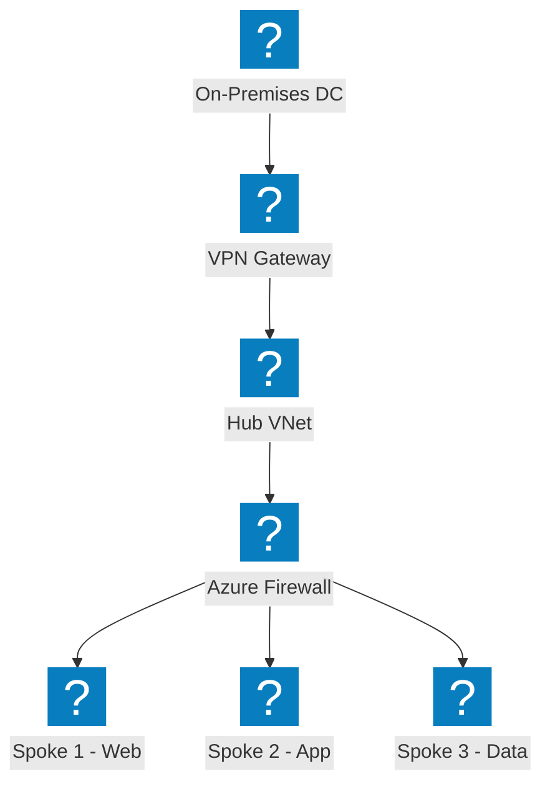
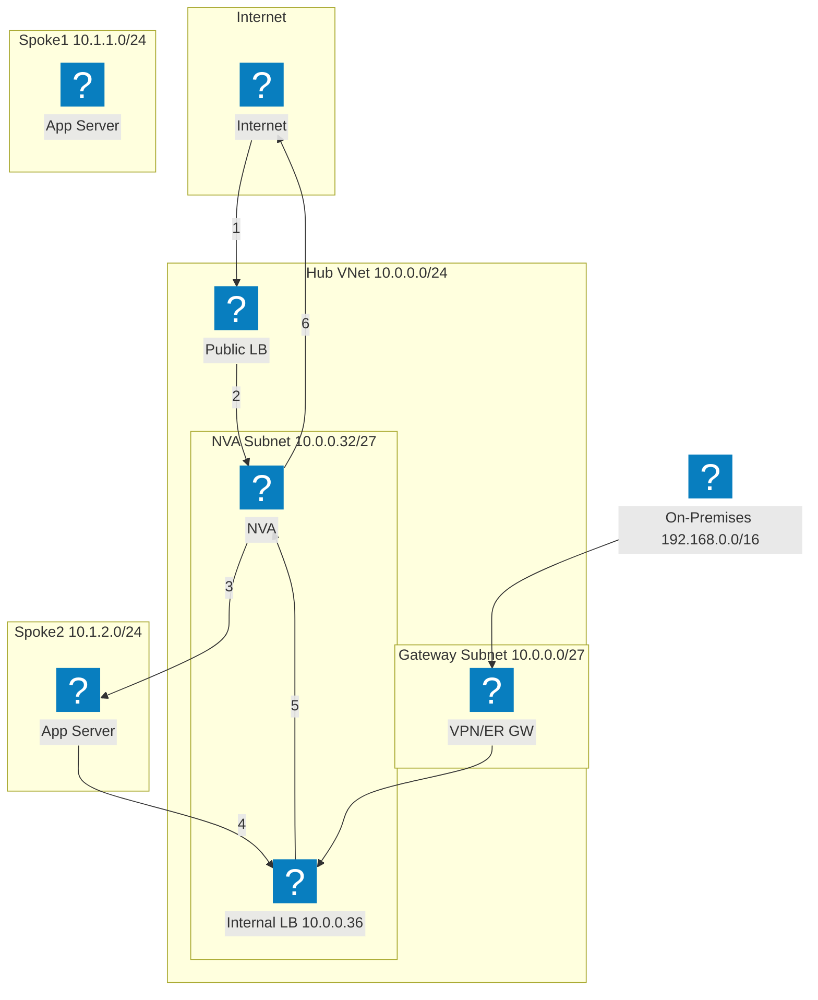
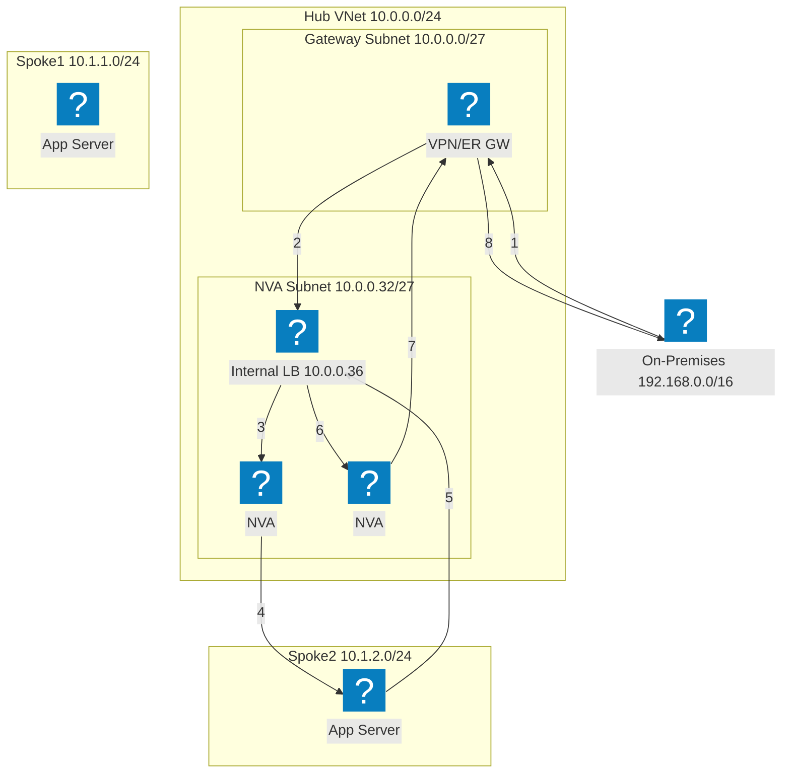
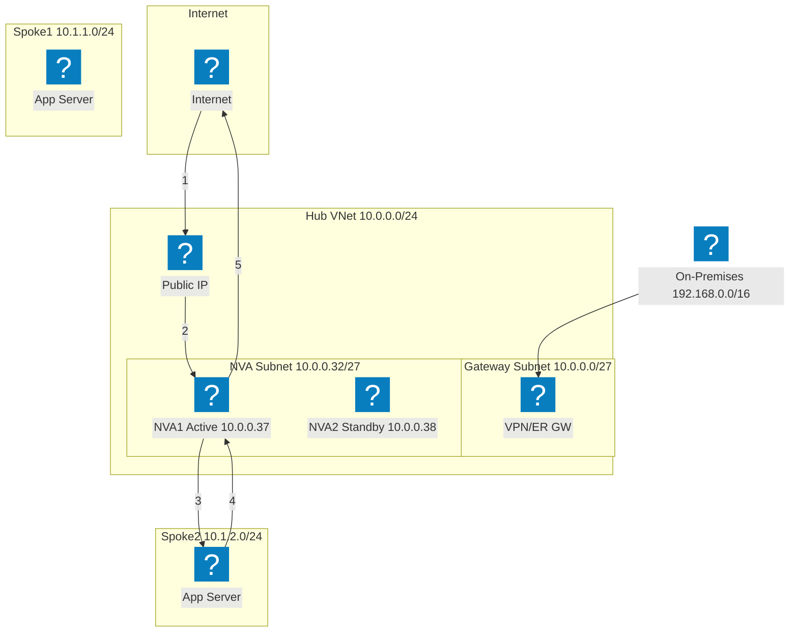
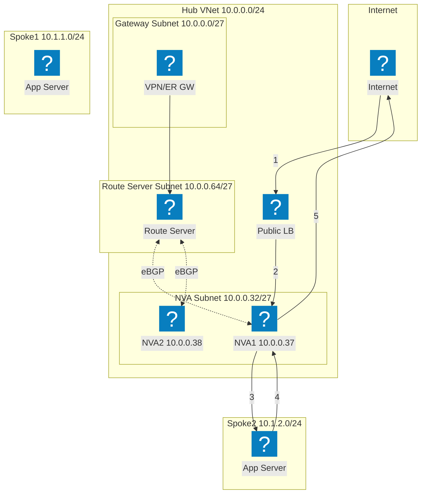
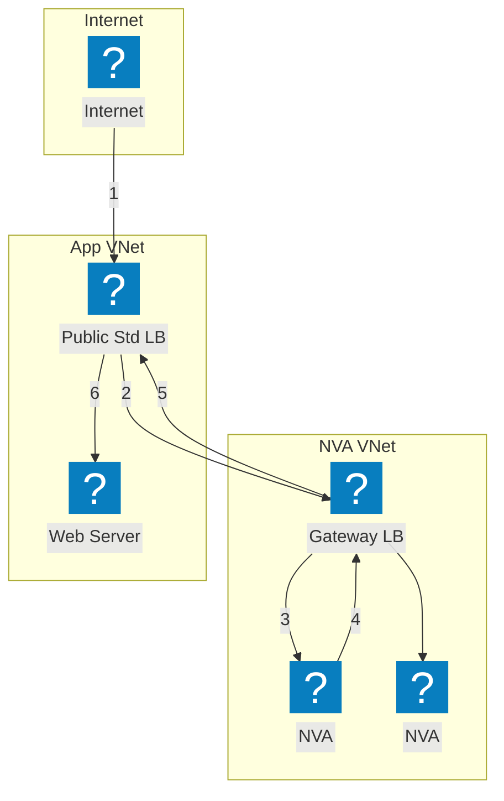

Azure infrastructure diagrams using HashiCorp Flight and Carbon icon packs for VNet networking, compute, and managed services.

## VNet with App Gateway

Azure VNet with gateway, application, and data subnets. Application Gateway distributes traffic to VM Scale Sets.

```mermaid
architecture-beta
  group vnet(carbon:virtual-private-cloud)[Azure VNet]
  group gwsub(carbon:ibm-cloud-subnets)[Gateway Subnet] in vnet
  group appsub(carbon:ibm-cloud-subnets)[App Subnet] in vnet
  group datasub(carbon:ibm-cloud-subnets)[Data Subnet] in vnet

  service appgw(carbon:gateway-security)[App Gateway] in gwsub
  service vm1(hashicorp-flight:azure-vms-color)[VM Scale Set] in appsub
  service vm2(hashicorp-flight:azure-vms-color)[VM Scale Set] in appsub
  service sqldb(carbon:data-base)[Azure SQL] in datasub

  appgw:R --> L:vm1
  appgw:B --> T:vm2
  vm1:R --> L:sqldb
  vm2:R --> L:sqldb
```

## AKS with F5 XC Multi-Cloud Connect

Azure Kubernetes Service fronted by F5 Distributed Cloud for multi-cloud application connectivity and security.

```mermaid
architecture-beta
  group xc(lucide:cloud)[F5 XC]
  group aks(hashicorp-flight:azure-aks-color)[AKS Cluster]

  service mcn(f5xc:multi-cloud-network-connect)[Network Connect] in xc
  service waap(f5xc:web-app-and-api-protection)[WAAP] in xc
  service ingress(carbon:gateway)[Ingress] in aks
  service app(hashicorp-flight:docker-color)[App Pods] in aks
  service cache(carbon:datastore)[Redis Cache] in aks
  service blob(hashicorp-flight:azure-blob-storage-color)[Blob Storage]

  mcn:R --> L:waap
  waap:R --> L:ingress
  ingress:R --> L:app
  app:B --> T:cache
  app:R --> L:blob
```

## Hub-Spoke Network Topology

Azure Hub-Spoke architecture with centralized security and shared services connecting multiple spoke VNets.

## NVA HA with Load Balancer — Internet Traffic

Inbound internet traffic hits a public load balancer, which distributes to NVA instances in the hub. The NVA forwards inspected traffic to spoke workloads. Return traffic from spokes routes through an internal load balancer back to the NVA for egress. Numbered steps show the inbound path (1-3) and return path (4-6).

## NVA HA with Load Balancer — On-Premises Traffic

On-premises traffic enters through a VPN or ExpressRoute gateway and is directed to an internal load balancer fronting multiple NVA instances. The NVA inspects and forwards traffic to spoke workloads. Return traffic traverses the same internal load balancer to ensure flow symmetry, preventing asymmetric routing issues.

## NVA HA with PIP/UDR — Active/Standby

Active/standby NVA pair where the active instance (NVA1) holds the public IP address. On failure, the standby NVA2 calls the Azure API to reassign the public IP and update user-defined routes to point to itself. This approach avoids load balancers but requires API-level failover orchestration.

## NVA HA with Azure Route Server

BGP-based high availability using Azure Route Server. The Route Server establishes eBGP adjacencies with both NVA instances and dynamically programs spoke effective routes. ECMP load balances across NVAs without user-defined routes. Route Server injects next-hop entries for both NVA IPs into all peered VNets.

## NVA HA with Gateway Load Balancer

Transparent NVA insertion using Azure Gateway Load Balancer. Traffic destined for the application is transparently diverted from the public standard load balancer to the Gateway LB in a separate NVA VNet. NVAs inspect traffic and return it to the Gateway LB, which forwards it back to the application. No VNet peering or UDRs are required between the NVA and application VNets.

