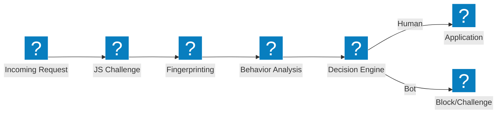
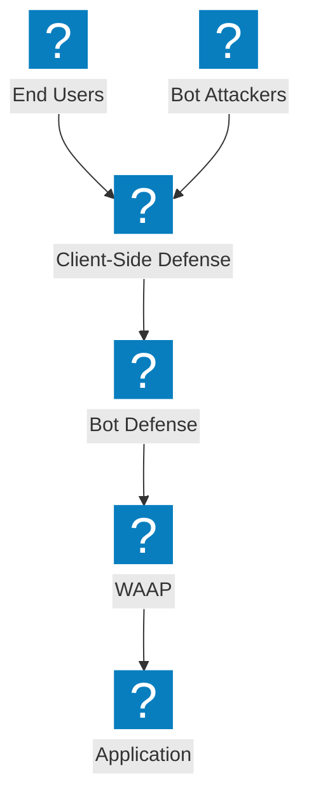

Bot defense architecture diagrams covering detection pipelines, credential stuffing mitigation, client-side defense, and F5 Distributed Cloud bot management capabilities.

## Bot Detection Pipeline

Multi-stage bot detection pipeline with JavaScript challenge, behavioral analysis, and fingerprinting before allowing access.

## F5 XC Bot Defense and Client-Side Defense

F5 Distributed Cloud integrated bot defense with client-side protection for credential stuffing and account takeover prevention.

## Credential Stuffing Defense Architecture

Multi-layer defense against credential stuffing attacks with device fingerprinting, credential intelligence, and account protection.

