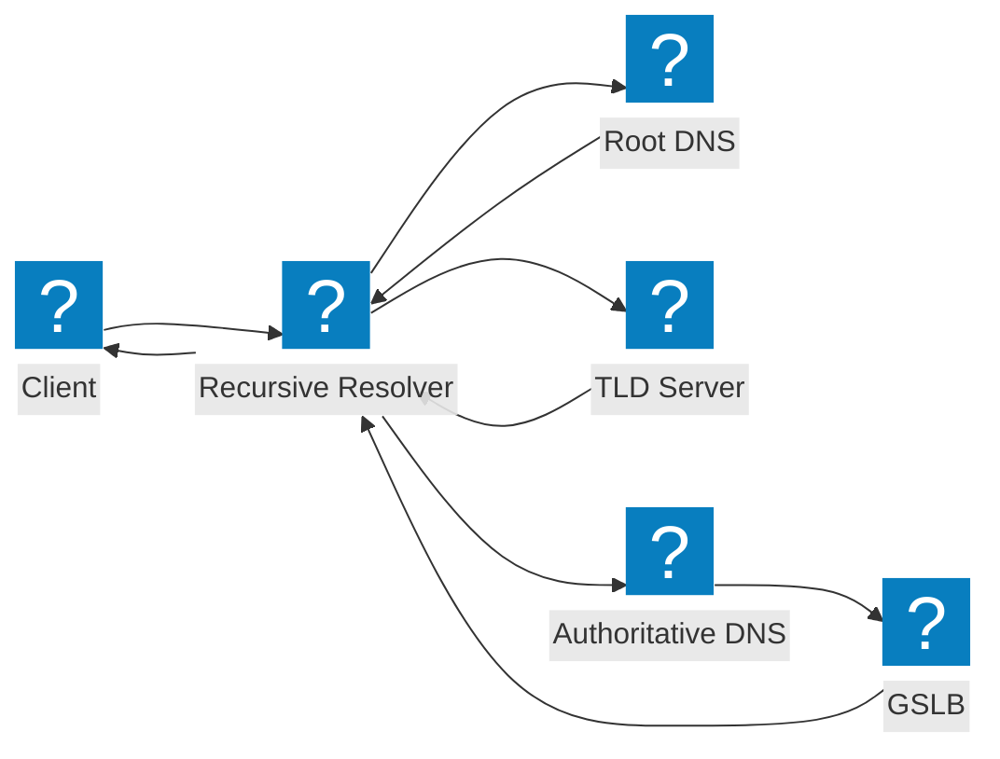
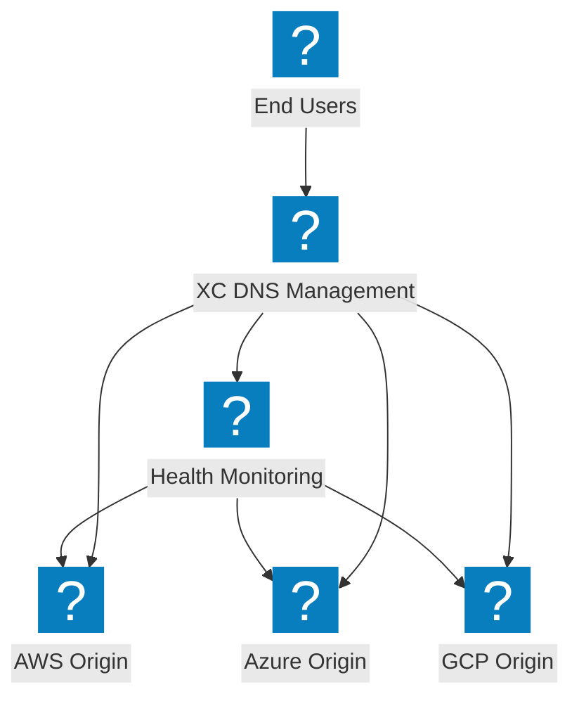

DNS architecture diagrams covering recursive resolution flows, global server load balancing, and F5 Distributed Cloud DNS management.

## DNS Resolution Flow

Standard DNS query resolution from client through recursive resolver to authoritative nameserver with GSLB integration.

## F5 XC DNS Management

F5 Distributed Cloud DNS management providing intelligent DNS load balancing across multi-cloud origins.

## DNS Load Balancing Architecture

Multi-tier DNS load balancing with geographic routing, health checks, and failover between cloud regions.

```mermaid
architecture-beta
  group dns(carbon:dns-services)[DNS Infrastructure]
  group region1(hashicorp-flight:aws-color)[US East]
  group region2(hashicorp-flight:azure-color)[EU West]

  service gslb(carbon:load-balancer-global)[GSLB] in dns
  service health(carbon:application)[Health Check] in dns
  service lb1(carbon:load-balancer-application)[Regional LB] in region1
  service app1(carbon:virtual-machine)[App Servers] in region1
  service lb2(carbon:load-balancer-application)[Regional LB] in region2
  service app2(carbon:virtual-machine)[App Servers] in region2

  gslb:R --> L:health
  gslb:B --> T:lb1
  lb1:R --> L:app1
  gslb:B --> T:lb2
  lb2:R --> L:app2
```

