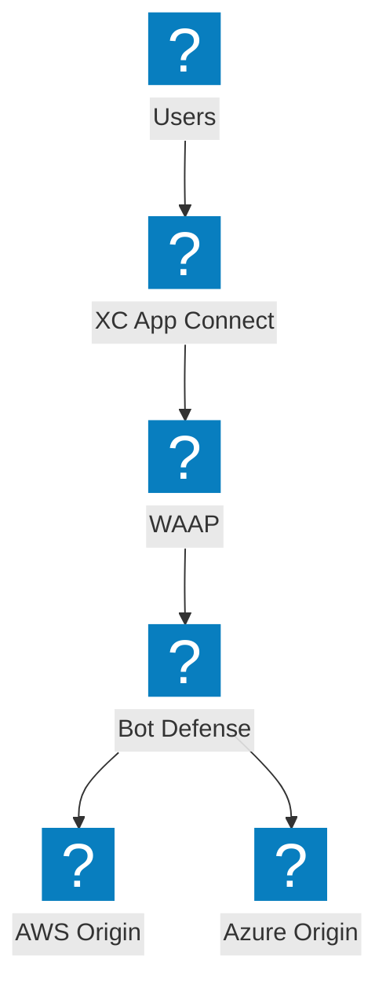
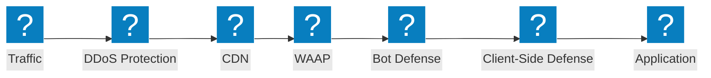

F5 product icon showcase diagrams demonstrating the F5 XC service portfolio, NGINX product line, and BIG-IP capabilities using the `f5xc` and `f5-brand` icon packs.

## F5 XC Service Portfolio

Overview of F5 Distributed Cloud services spanning security, networking, and application delivery.

## F5 XC Security Stack

Complete F5 XC security stack with WAAP, bot defense, client-side defense, DDoS protection, and API discovery.

## F5 XC Networking Services

F5 Distributed Cloud networking services with multi-cloud connect, DNS management, and distributed applications.

```mermaid
architecture-beta
  group xc(lucide:cloud)[F5 Distributed Cloud]
  group infra(carbon:cloud-services)[Infrastructure]

  service mcn(f5xc:multi-cloud-network-connect)[Network Connect] in xc
  service mca(f5xc:multi-cloud-app-connect)[App Connect] in xc
  service dns(f5xc:dns-management)[DNS Management] in xc
  service dapp(f5xc:distributed-apps)[Distributed Apps] in xc
  service k8s(hashicorp-flight:kubernetes-color)[K8s Clusters] in infra
  service vm(carbon:virtual-machine)[VM Workloads] in infra

  mcn:R --> L:mca
  mca:R --> L:dns
  dns:R --> L:dapp
  mcn:B --> T:k8s
  mca:B --> T:vm
```

## F5 XC Observability and Intelligence

F5 Distributed Cloud observability, traffic insight, and data intelligence for comprehensive application visibility.

```mermaid
architecture-beta
  group apps(carbon:cloud-services)[Application Layer]
  group intel(lucide:cloud)[F5 XC Intelligence]

  service app1(carbon:application)[Web App] in apps
  service app2(carbon:api)[API Service] in apps
  service app3(f5xc:distributed-apps)[Distributed App] in apps
  service obs(f5xc:observability)[Observability] in intel
  service ati(f5xc:application-traffic-insight)[Traffic Insight] in intel
  service di(f5xc:data-intelligence)[Data Intelligence] in intel

  app1:B --> T:obs
  app2:B --> T:ati
  app3:B --> T:di
  obs:R --> L:ati
  ati:R --> L:di
```

