F5 Distributed Cloud use case diagrams demonstrating security, networking, and application delivery architectures using the `f5-brand` icon pack.

## Web App & API Protection

### WAAP Security Inspection Pipeline

Multi-layer WAAP inspection pipeline with firewall, application code protection, and bot defense before reaching the application.

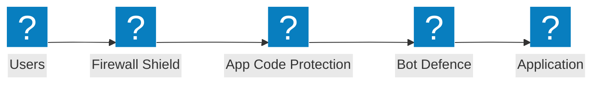

### Edge Security Architecture

Edge security architecture with WAF, shield checkmark verification, and application protection groups across cloud origins.

```mermaid
architecture-beta
  group edge(f5-brand:security-firewall-shield)[Security Edge]
  group origins(carbon:cloud-services)[Cloud Origins]

  service waf(f5-brand:security-firewall)[WAF] in edge
  service shield(f5-brand:security-shield-checkmark)[Shield Verify] in edge
  service appshield(f5-brand:security-shield-app-code)[App Shield] in edge
  service aws(hashicorp-flight:aws-color)[AWS Origin] in origins
  service azure(hashicorp-flight:azure-color)[Azure Origin] in origins

  waf:R --> L:shield
  shield:R --> L:appshield
  appshield:R --> L:aws
  appshield:B --> T:azure
```

### API Protection with Rate Limiting

API request validation pipeline with firewall, rate limiting, and schema validation before reaching API endpoints.

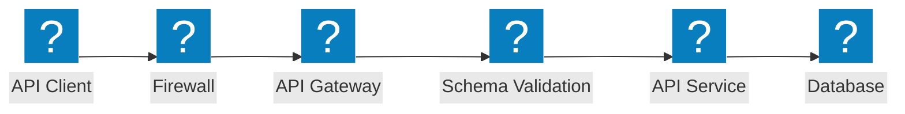

## Bot Defense

### Bot Detection Pipeline

Multi-stage bot detection with JavaScript challenge, device fingerprinting, behavioral analysis, and decision engine.

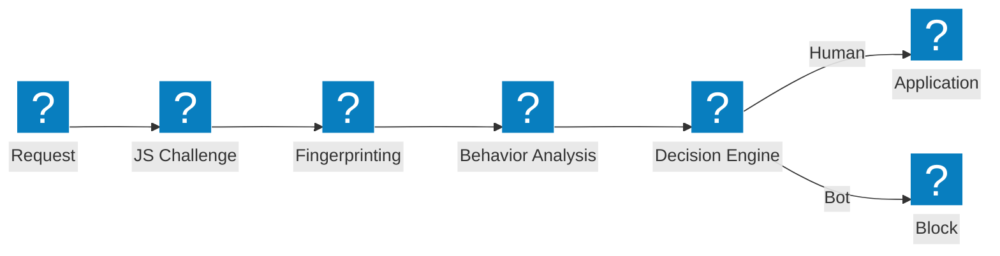

### Bot Defense Layers

Layered bot defense architecture with credential intelligence, bot detection, and device posture analysis.

```mermaid
architecture-beta
  group defense(f5-brand:security-bot-defence)[Bot Defense Layers]
  group app(carbon:cloud-services)[Application]

  service botfw(f5-brand:security-firewall-bot)[Bot Firewall] in defense
  service botdef(f5-brand:security-bot-defence)[Bot Defence] in defense
  service intel(f5-brand:security-password-bot)[Credential Intel] in defense
  service login(carbon:application)[Login Service] in app
  service account(carbon:security)[Account Service] in app
  service db(carbon:data-base)[User Store] in app

  botfw:R --> L:botdef
  botdef:R --> L:intel
  intel:R --> L:login
  login:R --> L:account
  account:B --> T:db
```

### Client-Side Defense

Client-side defense pipeline with device posture verification, laptop bot detection, and Magecart protection.

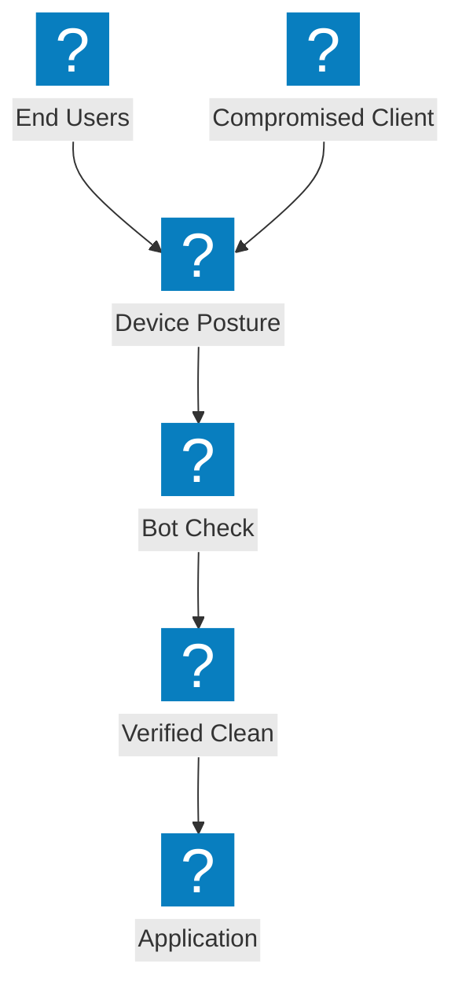

## Multi-Cloud Networking

### Multi-Cloud App Connect

Multi-cloud application connectivity across AWS, Azure, and GCP with centralized app delivery fabric.


### Network Connect with Site Mesh

Multi-cloud network connect with site mesh topology and transit gateway linking cloud regions.

```mermaid
architecture-beta
  group net(f5-brand:cloud-network-connect)[Network Connect]
  group region1(hashicorp-flight:aws-color)[AWS Region]
  group region2(hashicorp-flight:azure-color)[Azure Region]

  service mesh(f5-brand:cloud-multi-network)[Site Mesh] in net
  service gw(f5-brand:network-gateway)[Transit Gateway] in net
  service web1(carbon:virtual-machine)[Web Tier] in region1
  service db1(carbon:data-base)[Database] in region1
  service web2(carbon:virtual-machine)[Web Tier] in region2
  service db2(carbon:data-base)[Database] in region2

  mesh:R --> L:gw
  gw:B --> T:web1
  web1:R --> L:db1
  gw:B --> T:web2
  web2:R --> L:db2
```

### Multi-Cloud App Delivery

End-to-end multi-cloud app delivery with global load balancing, security, and distributed workloads.

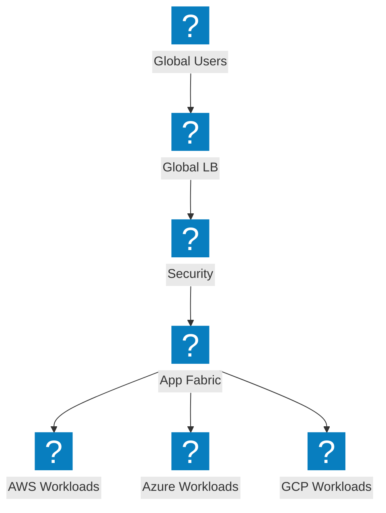

## DDoS & Edge Services

### DDoS Scrubbing Architecture

DDoS scrubbing center with network-layer protection, site scrubbing, and clean traffic delivery to origin.

```mermaid
architecture-beta
  group scrub(f5-brand:network-ddos-protection)[Scrubbing Center]
  group origin(carbon:cloud-services)[Origin DC]

  service ddos(f5-brand:network-ddos-protection)[DDoS Protection] in scrub
  service sitescrub(f5-brand:security-site-scrubbing)[Site Scrubbing] in scrub
  service clean(f5-brand:network-globe-load-balance)[Clean Pipe] in scrub
  service lb(carbon:load-balancer-application)[Load Balancer] in origin
  service app(carbon:application)[Application] in origin
  service db(carbon:data-base)[Database] in origin

  ddos:R --> L:sitescrub
  sitescrub:R --> L:clean
  clean:R --> L:lb
  lb:R --> L:app
  app:B --> T:db
```

### Volumetric Attack Mitigation

Attack traffic flow showing volumetric DDoS absorption and mitigation at the edge before reaching origin.

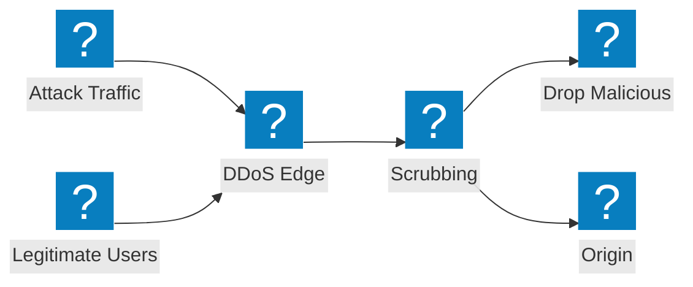

### CDN + DDoS + WAF Layered Protection

Layered edge protection combining CDN caching, DDoS mitigation, and WAF inspection in a unified pipeline.

```mermaid
architecture-beta
  group edge(f5-brand:cloud-performance-arrow)[Edge Services]
  group security(f5-brand:security-firewall-shield)[Security Layer]
  group app(carbon:cloud-services)[Application]

  service cdn(f5-brand:cloud-performance-arrow)[CDN] in edge
  service ddos(f5-brand:network-ddos-protection)[DDoS Protection] in edge
  service waf(f5-brand:security-firewall-shield)[WAF] in security
  service shield(f5-brand:security-shield-checkmark)[Shield] in security
  service web(carbon:application)[Web App] in app
  service api(carbon:api)[API Service] in app

  cdn:R --> L:ddos
  ddos:R --> L:waf
  waf:R --> L:shield
  shield:R --> L:web
  shield:B --> T:api
```

## DNS & Traffic Management

### DNS-Based GSLB with Health Monitoring

DNS-based global server load balancing with health monitoring across multi-cloud endpoints.

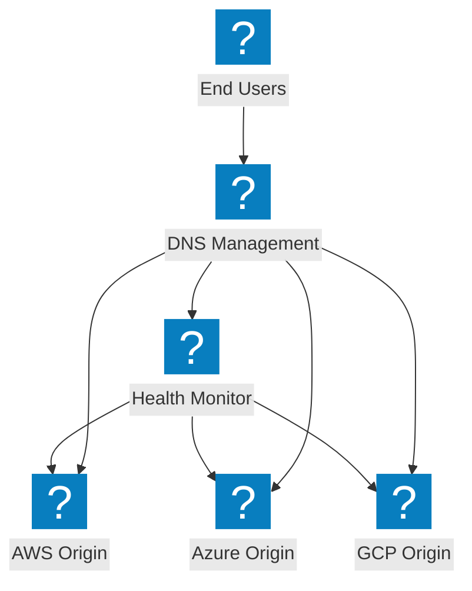

### DNS Management Architecture

DNS management infrastructure with DNS load balancing and shield DNS protection across cloud regions.

```mermaid
architecture-beta
  group dnsinfra(f5-brand:network-dns-1)[DNS Infrastructure]
  group region1(hashicorp-flight:aws-color)[US East]
  group region2(hashicorp-flight:azure-color)[EU West]

  service dns(f5-brand:network-dns-load-balance)[DNS Load Balance] in dnsinfra
  service shielddns(f5-brand:security-shield-dns)[Shield DNS] in dnsinfra
  service lb1(carbon:load-balancer-application)[Regional LB] in region1
  service app1(carbon:virtual-machine)[App Servers] in region1
  service lb2(carbon:load-balancer-application)[Regional LB] in region2
  service app2(carbon:virtual-machine)[App Servers] in region2

  dns:R --> L:shielddns
  dns:B --> T:lb1
  lb1:R --> L:app1
  dns:B --> T:lb2
  lb2:R --> L:app2
```

### Intelligent DNS Load Balancing with Failover

Intelligent DNS load balancing with cloud DNS integration, performance routing, and automatic failover.

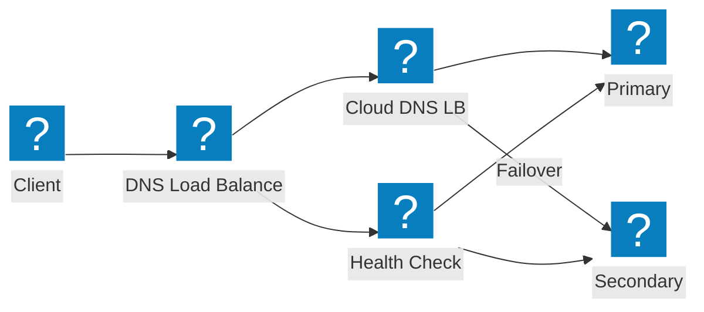

## API Security & Discovery

### Shadow API Discovery Pipeline

Shadow API discovery pipeline detecting unknown APIs through traffic analysis and inventory management.

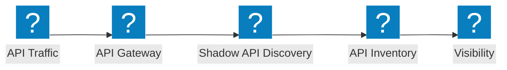

### API Gateway Architecture

API gateway with authentication, rate limiting, and security validation protecting backend API services.

```mermaid
architecture-beta
  group gateway(f5-brand:network-api-gateway)[API Gateway]
  group backend(carbon:cloud-services)[Backend Services]

  service apigw(f5-brand:network-api-gateway)[API Gateway] in gateway
  service auth(f5-brand:security-key-lock)[Authentication] in gateway
  service rate(f5-brand:network-api)[Rate Limiter] in gateway
  service shield(f5-brand:security-shield-checkmark)[Schema Check] in gateway
  service api1(carbon:api)[Users API] in backend
  service api2(carbon:api)[Orders API] in backend

  apigw:R --> L:auth
  auth:R --> L:rate
  rate:R --> L:shield
  shield:R --> L:api1
  shield:B --> T:api2
```

### API Lifecycle: Discovery to Protection

API lifecycle pipeline from shadow API discovery through inventory cataloging to active protection.

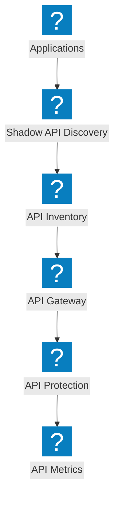

## Platform & Observability

### Distributed Apps with NGINX One

Distributed application platform with NGINX One management, Kubernetes workloads, and centralized control.

```mermaid
architecture-beta
  group platform(f5-brand:service-f5)[F5 Platform]
  group compute(carbon:cloud-services)[Compute]

  service nginx(f5-brand:service-nginx)[NGINX One] in platform
  service netng(f5-brand:network-nginx)[NGINX Network] in platform
  service f5svc(f5-brand:service-f5)[F5 Service] in platform
  service k8s(f5-brand:app-kubernetes)[Kubernetes] in compute
  service dist(f5-brand:cloud-distributed)[Distributed App] in compute
  service container(f5-brand:cloud-container-app)[Container App] in compute

  nginx:R --> L:netng
  netng:R --> L:f5svc
  nginx:B --> T:k8s
  netng:B --> T:dist
  f5svc:B --> T:container
```

### Observability Pipeline

Observability pipeline collecting metrics from applications and producing insights, alerts, and dashboards.

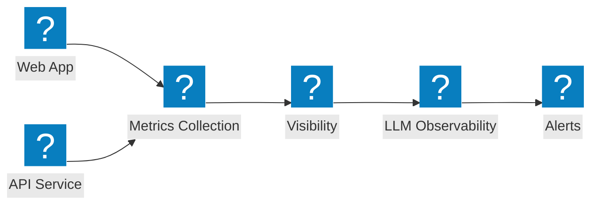

### Full Platform View

Comprehensive F5 platform view connecting security, networking, and application delivery under a unified service.

```mermaid
architecture-beta
  group f5(f5-brand:service-f5)[F5 Service Platform]
  group security(f5-brand:security-firewall-shield)[Security]
  group networking(f5-brand:cloud-network-connect)[Networking]

  service svcf5(f5-brand:service-f5)[F5 Service] in f5
  service bigip(f5-brand:service-big-ip-next)[BIG-IP Next] in f5
  service obs(f5-brand:other-site-metrics)[Observability] in f5
  service fw(f5-brand:security-firewall-shield)[WAF] in security
  service botd(f5-brand:security-bot-defence)[Bot Defence] in security
  service ddos(f5-brand:network-ddos-protection)[DDoS] in security
  service multi(f5-brand:cloud-multi-network)[Multi-Cloud Net] in networking
  service fabric(f5-brand:app-delivery-fabric)[App Fabric] in networking
  service nginx(f5-brand:service-nginx)[NGINX One] in networking

  svcf5:B --> T:fw
  svcf5:B --> T:multi
  bigip:B --> T:botd
  bigip:B --> T:fabric
  obs:B --> T:ddos
  obs:B --> T:nginx
```
