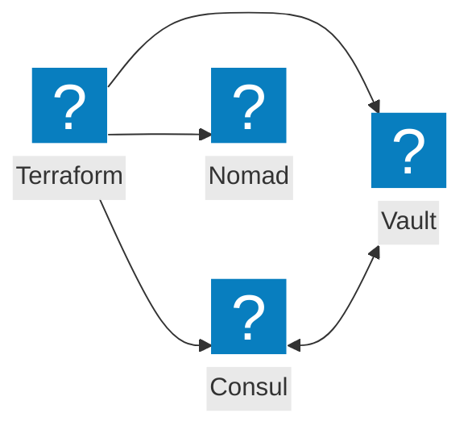
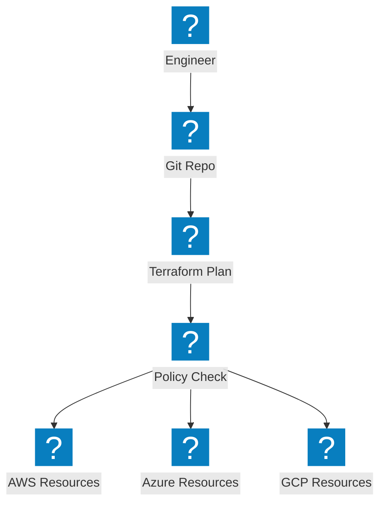

Infrastructure as Code diagrams covering Terraform automation, HashiCorp tool integration, and multi-cloud provisioning workflows.

## HashiCorp Stack Integration

Terraform orchestrating infrastructure provisioning with Consul for service discovery, Vault for secrets, and Nomad for workload scheduling.

## Multi-Cloud IaC Pipeline

Terraform provisioning infrastructure across AWS, Azure, and GCP with state management and policy enforcement.

## F5 XC Infrastructure Automation

Terraform automating F5 Distributed Cloud configuration with load balancers, origin pools, and security policies.

```mermaid
architecture-beta
  group iac(hashicorp-flight:terraform-color)[Terraform Workspace]
  group xc(lucide:cloud)[F5 XC Tenant]

  service tfplan(hashicorp-flight:terraform-color)[Terraform] in iac
  service vault(hashicorp-flight:vault-color)[Vault Secrets] in iac
  service consul(hashicorp-flight:consul-color)[Consul Registry] in iac
  service waap(f5xc:web-app-and-api-protection)[WAAP Policy] in xc
  service lb(f5xc:multi-cloud-app-connect)[App Connect] in xc
  service dns(f5xc:dns-management)[DNS Config] in xc

  tfplan:R --> L:vault
  vault:R --> L:consul
  tfplan:B --> T:waap
  tfplan:B --> T:lb
  tfplan:B --> T:dns
```

