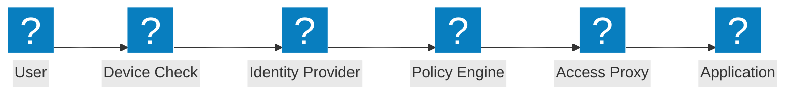
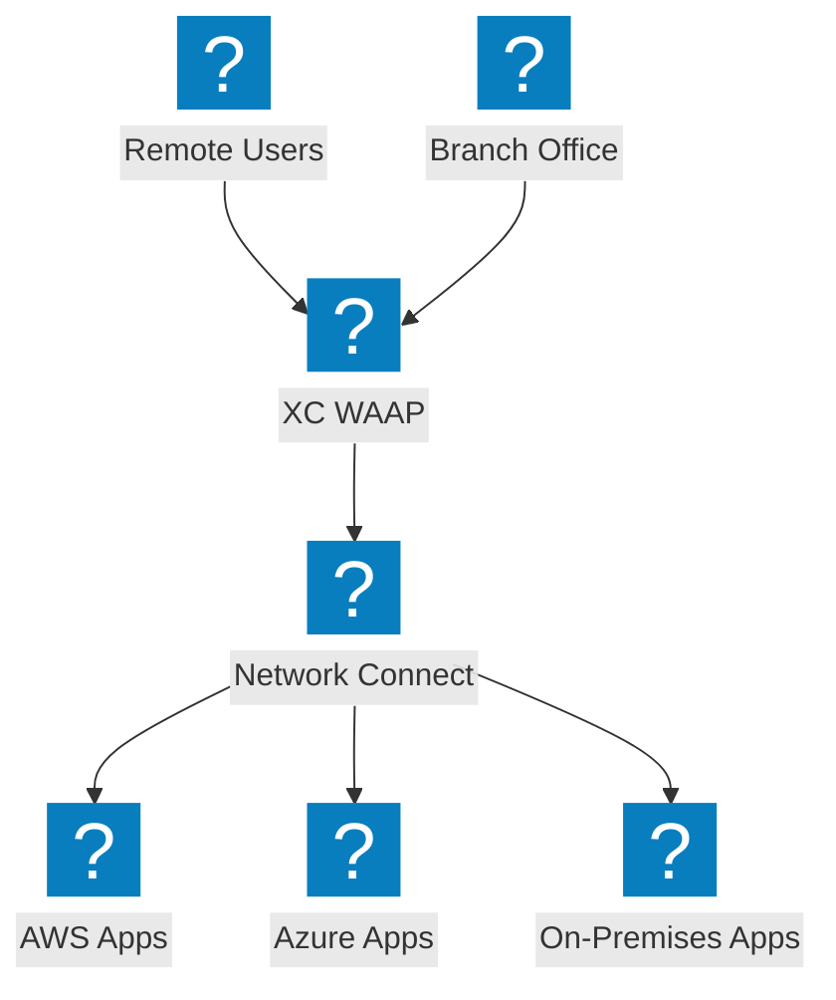

Zero trust architecture diagrams covering ZTNA access flows, identity verification, policy-based access control, and micro-segmentation with F5 XC integration.

## Zero Trust Access Flow

Zero trust access flow with device posture check, identity verification, policy evaluation, and proxied application access.

## F5 XC Zero Trust Architecture

F5 Distributed Cloud providing zero trust application access with WAAP, identity-aware proxy, and micro-segmentation across clouds.

## Micro-Segmentation Architecture

Network micro-segmentation with identity-based policies controlling east-west traffic between application tiers.

```mermaid
architecture-beta
  group trust(lucide:shield)[Zero Trust Fabric]
  group apps(carbon:cloud-services)[Application Tiers]

  service idp(lucide:key)[Identity Provider] in trust
  service policy(carbon:gateway-security)[Policy Engine] in trust
  service seg(carbon:subnet-acl-rules)[Segmentation] in trust
  service web(carbon:application)[Web Tier] in apps
  service api(carbon:api)[API Tier] in apps
  service data(carbon:data-base)[Data Tier] in apps

  idp:R --> L:policy
  policy:R --> L:seg
  seg:R --> L:web
  web:R --> L:api
  api:R --> L:data
```

