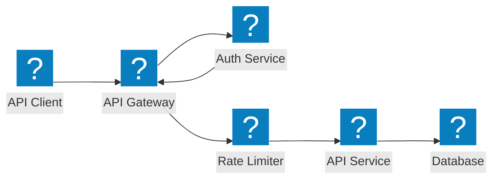
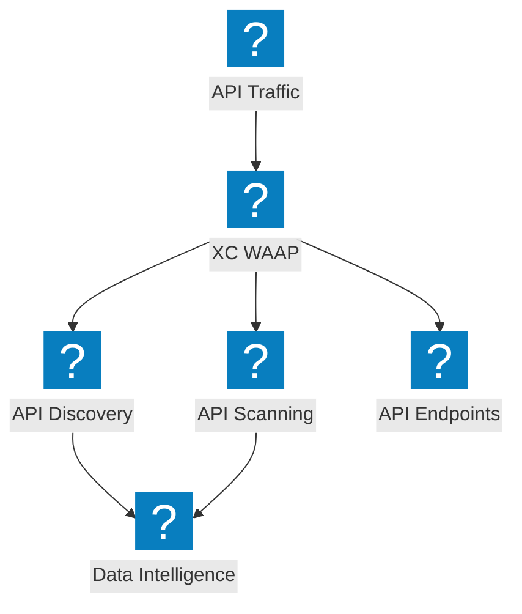

Diagramas de arquitectura de protección de API que cubren la seguridad del gateway de API, el descubrimiento de API ocultas, la limitación de velocidad y la validación de esquema con F5 Distributed Cloud.

## Seguridad del Gateway de API

Gateway de API con autenticación, autorización, limitación de velocidad y validación de esquema antes de llegar a los servicios backend.

## Descubrimiento y Protección de API con F5 XC

F5 Distributed Cloud proporciona descubrimiento de API, detección de API ocultas y seguridad integral de API con análisis de tráfico.

## Pipeline de Seguridad de API

Pipeline de validación de solicitudes de API en múltiples etapas con TLS, verificación JWT, limitación de velocidad e inspección de carga útil.

```mermaid
architecture-beta
  group security(lucide:shield)[API Security Layer]
  group backend(carbon:cloud-services)[Backend Services]

  service tls(lucide:lock)[TLS Termination] in security
  service jwt(lucide:key)[JWT Validation] in security
  service rate(carbon:load-balancer-vpc)[Rate Limiter] in security
  service schema(carbon:gateway-security)[Schema Validation] in security
  service api1(carbon:api)[Users API] in backend
  service api2(carbon:api)[Orders API] in backend

  tls:R --> L:jwt
  jwt:R --> L:rate
  rate:R --> L:schema
  schema:R --> L:api1
  schema:B --> T:api2
```

