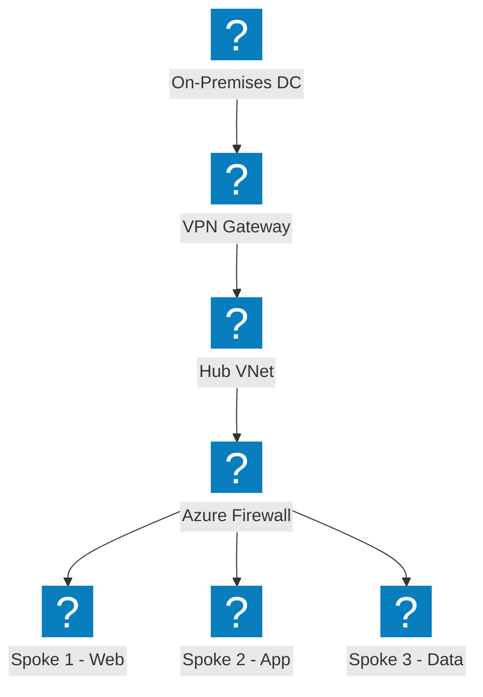
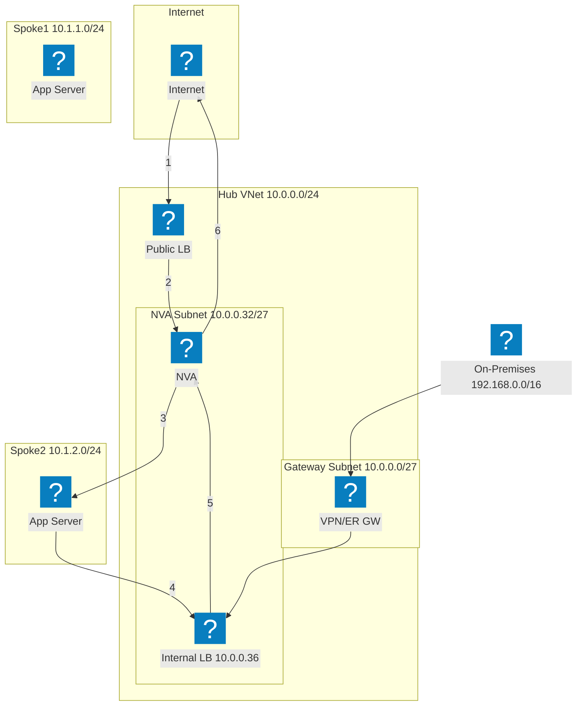
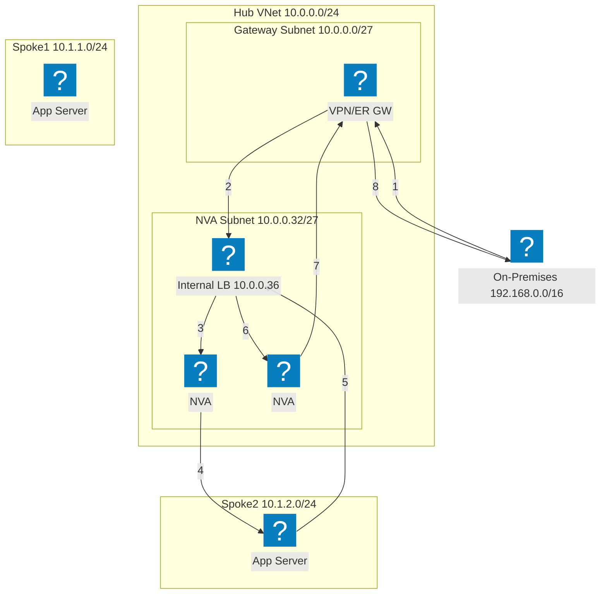
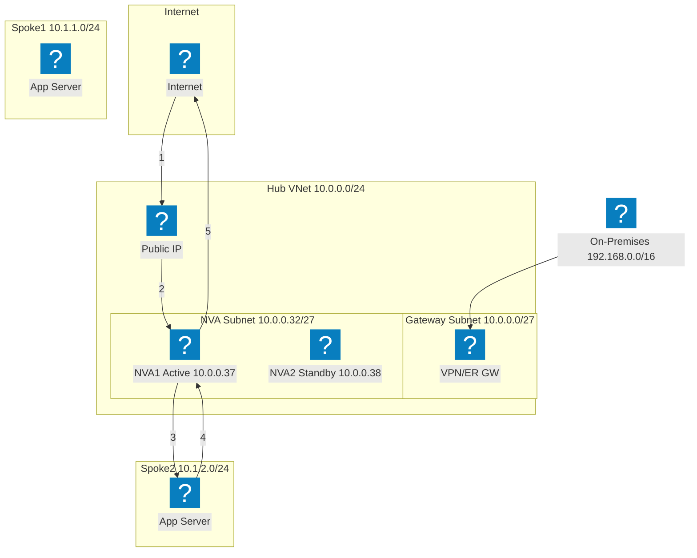
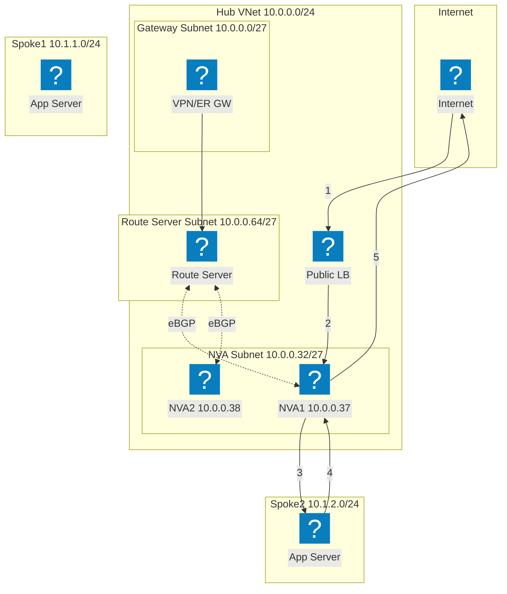
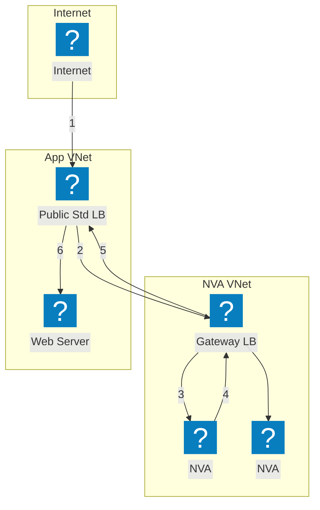

Diagramas de infraestructura de Azure que utilizan los paquetes de iconos HashiCorp Flight y Carbon para redes VNet, cómputo y servicios administrados.

## VNet con App Gateway

VNet de Azure con subredes de gateway, aplicación y datos. Application Gateway distribuye el tráfico a VM Scale Sets.

```mermaid
architecture-beta
  group vnet(carbon:virtual-private-cloud)[Azure VNet]
  group gwsub(carbon:ibm-cloud-subnets)[Gateway Subnet] in vnet
  group appsub(carbon:ibm-cloud-subnets)[App Subnet] in vnet
  group datasub(carbon:ibm-cloud-subnets)[Data Subnet] in vnet

  service appgw(carbon:gateway-security)[App Gateway] in gwsub
  service vm1(hashicorp-flight:azure-vms-color)[VM Scale Set] in appsub
  service vm2(hashicorp-flight:azure-vms-color)[VM Scale Set] in appsub
  service sqldb(carbon:data-base)[Azure SQL] in datasub

  appgw:R --> L:vm1
  appgw:B --> T:vm2
  vm1:R --> L:sqldb
  vm2:R --> L:sqldb
```

## AKS con F5 XC Multi-Cloud Connect

Azure Kubernetes Service con F5 Distributed Cloud al frente para conectividad y seguridad de aplicaciones en múltiples nubes.

```mermaid
architecture-beta
  group xc(lucide:cloud)[F5 XC]
  group aks(hashicorp-flight:azure-aks-color)[AKS Cluster]

  service mcn(f5xc:multi-cloud-network-connect)[Network Connect] in xc
  service waap(f5xc:web-app-and-api-protection)[WAAP] in xc
  service ingress(carbon:gateway)[Ingress] in aks
  service app(hashicorp-flight:docker-color)[App Pods] in aks
  service cache(carbon:datastore)[Redis Cache] in aks
  service blob(hashicorp-flight:azure-blob-storage-color)[Blob Storage]

  mcn:R --> L:waap
  waap:R --> L:ingress
  ingress:R --> L:app
  app:B --> T:cache
  app:R --> L:blob
```

## Topología de red Hub-Spoke

Arquitectura Hub-Spoke de Azure con seguridad centralizada y servicios compartidos que conectan múltiples VNets radiales.

## Alta disponibilidad de NVA con balanceador de carga — Tráfico de Internet

El tráfico de Internet entrante llega a un balanceador de carga público, el cual lo distribuye a las instancias NVA en el hub. El NVA reenvía el tráfico inspeccionado hacia las cargas de trabajo en los radiales. El tráfico de retorno desde los radiales se enruta a través de un balanceador de carga interno de vuelta al NVA para la salida. Los pasos numerados muestran la ruta de entrada (1-3) y la ruta de retorno (4-6).

## Alta disponibilidad de NVA con balanceador de carga — Tráfico local

El tráfico local entra a través de un gateway VPN o ExpressRoute y se dirige a un balanceador de carga interno que tiene al frente múltiples instancias NVA. El NVA inspecciona y reenvía el tráfico hacia las cargas de trabajo en los radiales. El tráfico de retorno recorre el mismo balanceador de carga interno para garantizar la simetría del flujo, evitando problemas de enrutamiento asimétrico.

## Alta disponibilidad de NVA con PIP/UDR — Activo/En espera

Par de NVA activo/en espera donde la instancia activa (NVA1) mantiene la dirección IP pública. Ante un fallo, el NVA2 en espera llama a la API de Azure para reasignar la IP pública y actualizar las rutas definidas por el usuario para que apunten a sí mismo. Este enfoque evita el uso de balanceadores de carga, pero requiere orquestación de conmutación por error a nivel de API.

## Alta disponibilidad de NVA con Azure Route Server

Alta disponibilidad basada en BGP mediante Azure Route Server. El Route Server establece adyacencias eBGP con ambas instancias NVA y programa dinámicamente las rutas efectivas en los radiales. ECMP distribuye la carga entre los NVA sin necesidad de rutas definidas por el usuario. El Route Server inyecta entradas de siguiente salto para las IPs de ambos NVA en todas las VNets emparejadas.

## Alta disponibilidad de NVA con Gateway Load Balancer

Inserción transparente de NVA mediante Azure Gateway Load Balancer. El tráfico destinado a la aplicación se desvía de forma transparente desde el balanceador de carga estándar público hacia el Gateway LB en una VNet de NVA separada. Los NVA inspeccionan el tráfico y lo devuelven al Gateway LB, que lo reenvía de vuelta a la aplicación. No se requieren emparejamientos de VNet ni rutas definidas por el usuario entre las VNets del NVA y de la aplicación.

