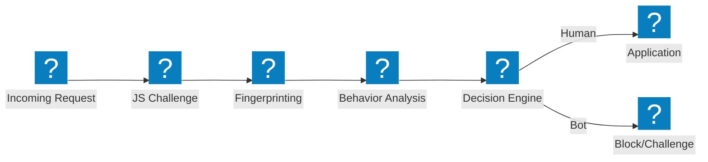
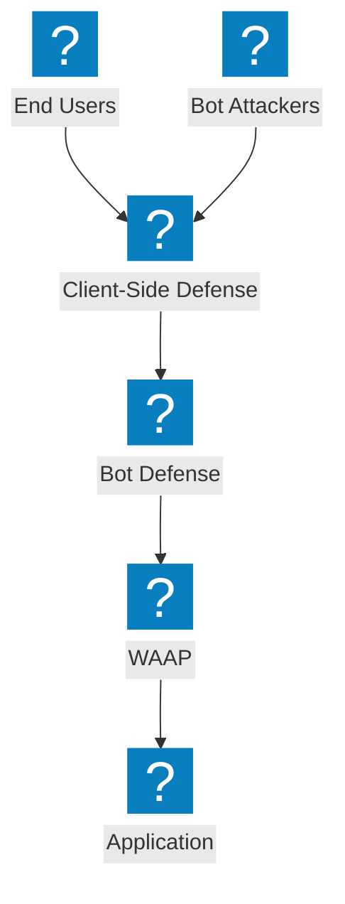

Diagramas de arquitectura de defensa bot que cubren canales de detección, mitigación del relleno de credenciales, defensa del lado del cliente y capacidades de gestión de bots de F5 Distributed Cloud.

## Canal de Detección de Bots

Canal de detección de bots en múltiples etapas con desafío JavaScript, análisis de comportamiento y toma de huellas digitales antes de permitir el acceso.

## F5 XC Defensa Bot y Defensa del lado del cliente

Defensa bot integrada de F5 Distributed Cloud con protección del lado del cliente para la prevención del relleno de credenciales y la apropiación de cuentas.

## Arquitectura de Defensa contra el Relleno de Credenciales

Defensa multicapa contra ataques de relleno de credenciales con toma de huellas digitales de dispositivos, inteligencia de credenciales y protección de cuentas.

