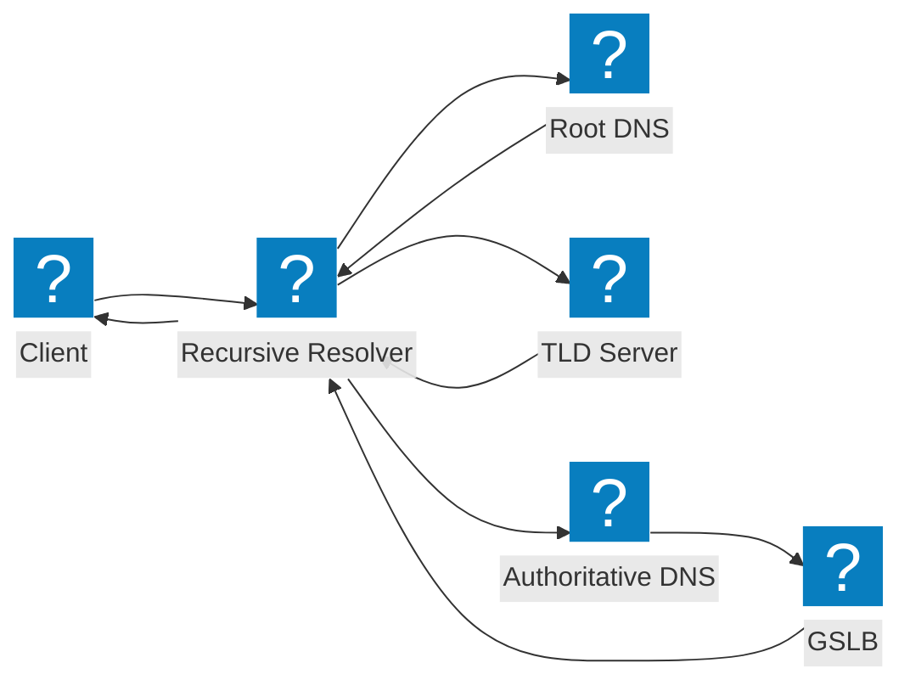
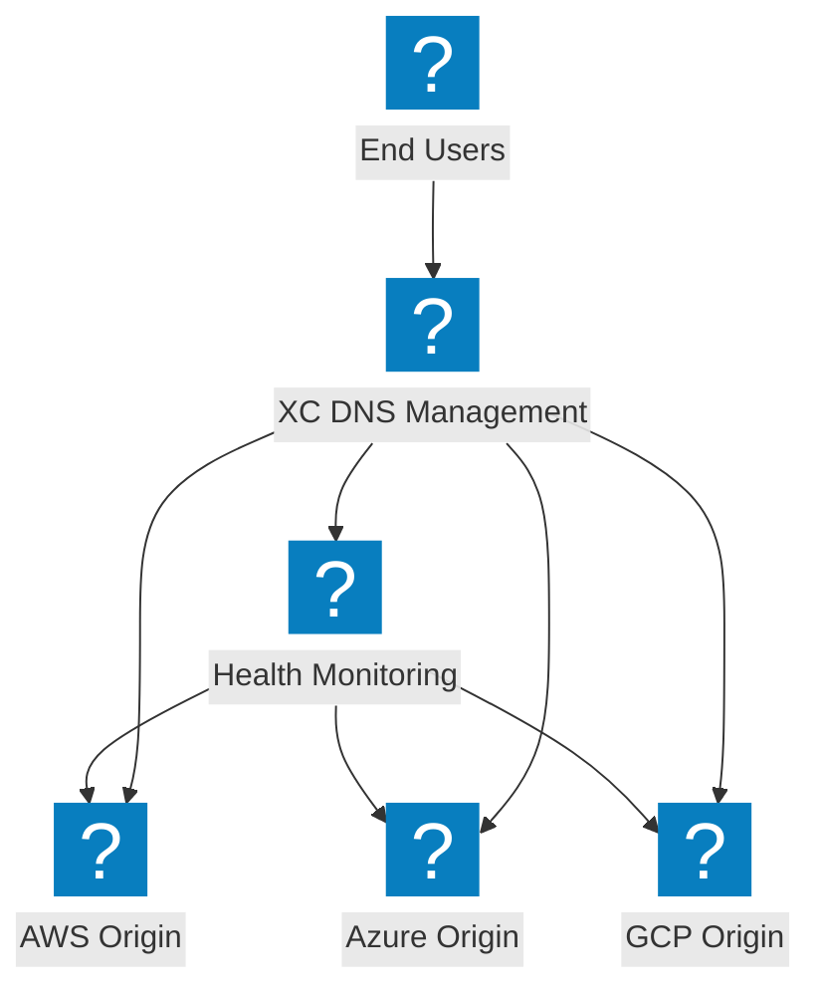

Diagramas de arquitectura DNS que cubren flujos de resolución recursiva, balanceo de carga global de servidores y gestión de DNS en F5 Distributed Cloud.

## Flujo de resolución DNS

Resolución estándar de consultas DNS desde el cliente a través del resolvedor recursivo hasta el servidor de nombres autoritativo con integración GSLB.

## Gestión de DNS en F5 XC

Gestión de DNS en F5 Distributed Cloud que proporciona balanceo de carga DNS inteligente en orígenes multinube.

## Arquitectura de balanceo de carga DNS

Balanceo de carga DNS multinivel con enrutamiento geográfico, verificaciones de estado y conmutación por error entre regiones de nube.

```mermaid
architecture-beta
  group dns(carbon:dns-services)[DNS Infrastructure]
  group region1(hashicorp-flight:aws-color)[US East]
  group region2(hashicorp-flight:azure-color)[EU West]

  service gslb(carbon:load-balancer-global)[GSLB] in dns
  service health(carbon:application)[Health Check] in dns
  service lb1(carbon:load-balancer-application)[Regional LB] in region1
  service app1(carbon:virtual-machine)[App Servers] in region1
  service lb2(carbon:load-balancer-application)[Regional LB] in region2
  service app2(carbon:virtual-machine)[App Servers] in region2

  gslb:R --> L:health
  gslb:B --> T:lb1
  lb1:R --> L:app1
  gslb:B --> T:lb2
  lb2:R --> L:app2
```

