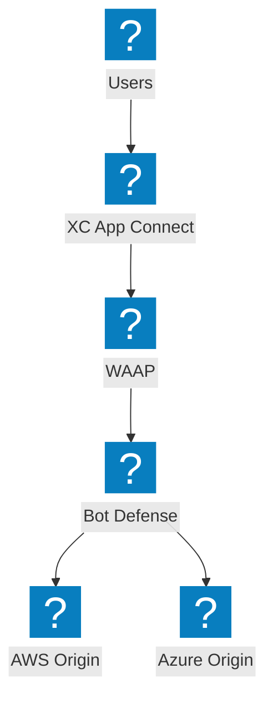
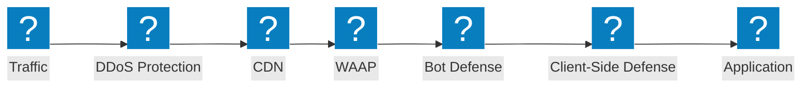

Diagramas de presentación de iconos de productos F5 que demuestran el portafolio de servicios F5 XC, la línea de productos NGINX y las capacidades de BIG-IP utilizando los paquetes de iconos `f5xc` y `f5-brand`.

## Portafolio de servicios F5 XC

Descripción general de los servicios de F5 Distributed Cloud que abarcan seguridad, redes y distribución de aplicaciones.

## Pila de seguridad F5 XC

Pila de seguridad completa de F5 XC con WAAP, defensa bot, defensa del lado del cliente, protección DDoS y descubrimiento de API.

## Servicios de Redes F5 XC

Servicios de redes de F5 Distributed Cloud con conexión multinube, gestión de DNS y aplicaciones distribuidas.

```mermaid
architecture-beta
  group xc(lucide:cloud)[F5 Distributed Cloud]
  group infra(carbon:cloud-services)[Infrastructure]

  service mcn(f5xc:multi-cloud-network-connect)[Network Connect] in xc
  service mca(f5xc:multi-cloud-app-connect)[App Connect] in xc
  service dns(f5xc:dns-management)[DNS Management] in xc
  service dapp(f5xc:distributed-apps)[Distributed Apps] in xc
  service k8s(hashicorp-flight:kubernetes-color)[K8s Clusters] in infra
  service vm(carbon:virtual-machine)[VM Workloads] in infra

  mcn:R --> L:mca
  mca:R --> L:dns
  dns:R --> L:dapp
  mcn:B --> T:k8s
  mca:B --> T:vm
```

## Observabilidad e inteligencia de F5 XC

Observabilidad, análisis de tráfico e inteligencia de datos de F5 Distributed Cloud para una visibilidad integral de las aplicaciones.

```mermaid
architecture-beta
  group apps(carbon:cloud-services)[Application Layer]
  group intel(lucide:cloud)[F5 XC Intelligence]

  service app1(carbon:application)[Web App] in apps
  service app2(carbon:api)[API Service] in apps
  service app3(f5xc:distributed-apps)[Distributed App] in apps
  service obs(f5xc:observability)[Observability] in intel
  service ati(f5xc:application-traffic-insight)[Traffic Insight] in intel
  service di(f5xc:data-intelligence)[Data Intelligence] in intel

  app1:B --> T:obs
  app2:B --> T:ati
  app3:B --> T:di
  obs:R --> L:ati
  ati:R --> L:di
```

