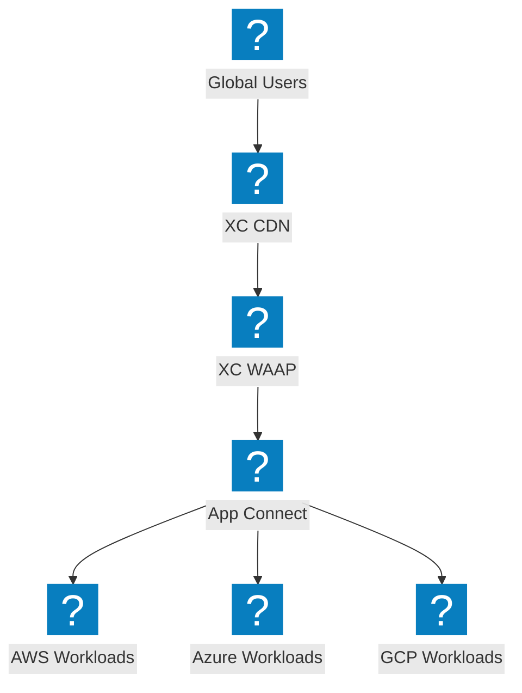

Diagramas de arquitectura multi-nube que muestran conectividad entre proveedores, balanceo de carga global y tejido de red de F5 Distributed Cloud.

## Topología de Red Multi-Nube

Balanceador de carga global que distribuye el tráfico entre regiones de AWS y Azure con replicación de base de datos.

```mermaid
architecture-beta
  group aws(hashicorp-flight:aws-color)[AWS Region]
  group azure(hashicorp-flight:azure-color)[Azure Region]

  service lb(carbon:load-balancer-global)[Global LB]
  service web1(carbon:virtual-machine)[Web Tier] in aws
  service db1(carbon:data-base)[Primary DB] in aws
  service web2(carbon:virtual-machine)[Web Tier] in azure
  service db2(carbon:data-base)[Replica DB] in azure

  lb:R --> L:web1
  lb:B --> T:web2
  web1:R --> L:db1
  web2:R --> L:db2
  db1:B --> T:db2
```

## F5 XC Multi-Cloud Connect

F5 Distributed Cloud proporcionando conectividad segura entre AWS, Azure y GCP con Observabilidad unificada.

```mermaid
architecture-beta
  group xc(lucide:cloud)[F5 Distributed Cloud]
  group aws(hashicorp-flight:aws-color)[AWS]
  group azure(hashicorp-flight:azure-color)[Azure]

  service mcn(f5xc:multi-cloud-network-connect)[Network Connect] in xc
  service mca(f5xc:multi-cloud-app-connect)[App Connect] in xc
  service obs(f5xc:observability)[Observability] in xc
  service eks(hashicorp-flight:kubernetes-color)[EKS] in aws
  service rds(carbon:data-base)[RDS] in aws
  service aks(hashicorp-flight:azure-aks-color)[AKS] in azure
  service sql(carbon:data-base)[Azure SQL] in azure

  mcn:R --> L:mca
  mca:R --> L:obs
  mcn:B --> T:eks
  eks:R --> L:rds
  mcn:B --> T:aks
  aks:R --> L:sql
```

## Distribución de Aplicaciones Multi-Nube con F5 XC

Distribución de aplicaciones de extremo a extremo en múltiples nubes con F5 XC proporcionando seguridad y gestión de tráfico en el edge.

