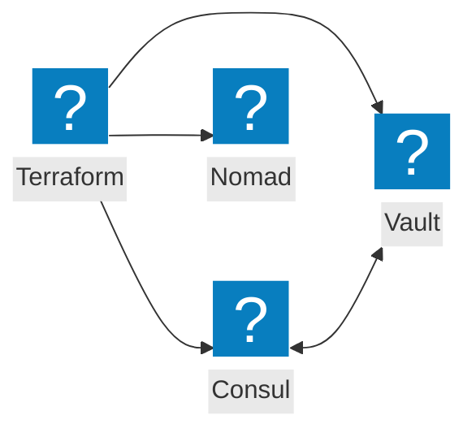
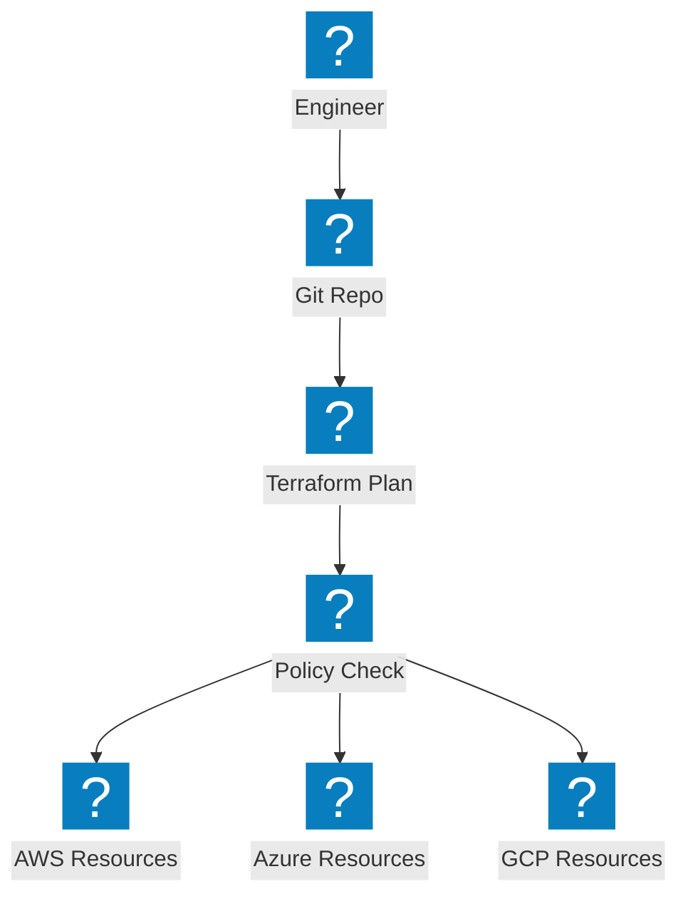

Diagramas de Infraestructura como Código que cubren la automatización con Terraform, la integración de herramientas de HashiCorp y los flujos de trabajo de aprovisionamiento multinube.

## Integración del Stack de HashiCorp

Terraform orquestando el aprovisionamiento de infraestructura con Consul para el descubrimiento de servicios, Vault para secretos y Nomad para la programación de cargas de trabajo.

## Pipeline de IaC Multinube

Terraform aprovisionando infraestructura en AWS, Azure y GCP con gestión de estado y aplicación de políticas.

## Automatización de Infraestructura de F5 XC

Terraform automatizando la configuración de F5 Distributed Cloud con balanceadores de carga, grupos de origen y políticas de seguridad.

```mermaid
architecture-beta
  group iac(hashicorp-flight:terraform-color)[Terraform Workspace]
  group xc(lucide:cloud)[F5 XC Tenant]

  service tfplan(hashicorp-flight:terraform-color)[Terraform] in iac
  service vault(hashicorp-flight:vault-color)[Vault Secrets] in iac
  service consul(hashicorp-flight:consul-color)[Consul Registry] in iac
  service waap(f5xc:web-app-and-api-protection)[WAAP Policy] in xc
  service lb(f5xc:multi-cloud-app-connect)[App Connect] in xc
  service dns(f5xc:dns-management)[DNS Config] in xc

  tfplan:R --> L:vault
  vault:R --> L:consul
  tfplan:B --> T:waap
  tfplan:B --> T:lb
  tfplan:B --> T:dns
```

