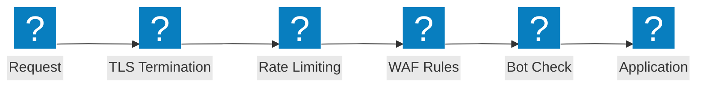

Diagramas de arquitectura de firewall de aplicaciones web que cubren cadenas de inspección de seguridad, flujos de protección OWASP y capacidades de F5 Distributed Cloud WAAP.

## Canal de inspección de seguridad

Cadena de inspección de seguridad multicapa desde el borde CDN a través del WAF, defensa bot y balanceador de carga hasta la infraestructura de origen.

```mermaid
architecture-beta
  group edge(lucide:shield)[Security Edge]
  group origin(carbon:cloud-services)[Origin Infrastructure]

  service cdn(carbon:content-delivery-network)[CDN] in edge
  service waf(carbon:firewall)[WAF] in edge
  service bot(lucide:shield-check)[Bot Defense] in edge
  service lb(carbon:load-balancer-application)[Load Balancer] in origin
  service app(carbon:application)[App Server] in origin
  service db(carbon:data-base)[Database] in origin

  cdn:R --> L:waf
  waf:R --> L:bot
  bot:R --> L:lb
  lb:R --> L:app
  app:B --> T:db
```

## Protección F5 XC WAAP

Protección de aplicaciones web y API en F5 Distributed Cloud con defensa bot integrada y defensa del lado del cliente.

```mermaid
architecture-beta
  group xcedge(lucide:cloud)[F5 XC Edge]
  group cloud(carbon:cloud-services)[Cloud Origin]

  service waap(f5xc:web-app-and-api-protection)[WAAP] in xcedge
  service botdef(f5xc:bot-defense)[Bot Defense] in xcedge
  service csd(f5xc:client-side-defense)[Client-Side Defense] in xcedge
  service lb(carbon:load-balancer-application)[Load Balancer] in cloud
  service app(carbon:application)[Application] in cloud
  service api(carbon:api)[API Service] in cloud

  waap:R --> L:botdef
  botdef:R --> L:csd
  csd:R --> L:lb
  lb:R --> L:app
  lb:B --> T:api
```

## Flujo de protección OWASP

Canal de procesamiento de solicitudes WAF que muestra las etapas de inspección para las categorías de amenazas del OWASP Top 10.

