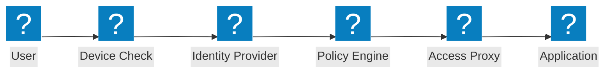
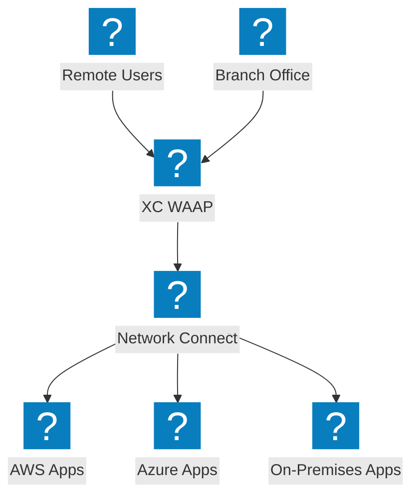

Diagramas de arquitectura de confianza cero que cubren flujos de acceso ZTNA, verificación de identidad, control de acceso basado en políticas y micro-segmentación con integración de F5 XC.

## Flujo de Acceso de Confianza Cero

Flujo de acceso de confianza cero con verificación de postura del dispositivo, verificación de identidad, evaluación de políticas y acceso a aplicaciones mediante proxy.

## Arquitectura de Confianza Cero de F5 XC

F5 Distributed Cloud proporcionando acceso a aplicaciones de confianza cero con WAAP, proxy con reconocimiento de identidad y micro-segmentación a través de nubes.

## Arquitectura de Micro-Segmentación

Micro-segmentación de red con políticas basadas en identidad que controlan el tráfico este-oeste entre los niveles de la aplicación.

```mermaid
architecture-beta
  group trust(lucide:shield)[Zero Trust Fabric]
  group apps(carbon:cloud-services)[Application Tiers]

  service idp(lucide:key)[Identity Provider] in trust
  service policy(carbon:gateway-security)[Policy Engine] in trust
  service seg(carbon:subnet-acl-rules)[Segmentation] in trust
  service web(carbon:application)[Web Tier] in apps
  service api(carbon:api)[API Tier] in apps
  service data(carbon:data-base)[Data Tier] in apps

  idp:R --> L:policy
  policy:R --> L:seg
  seg:R --> L:web
  web:R --> L:api
  api:R --> L:data
```

