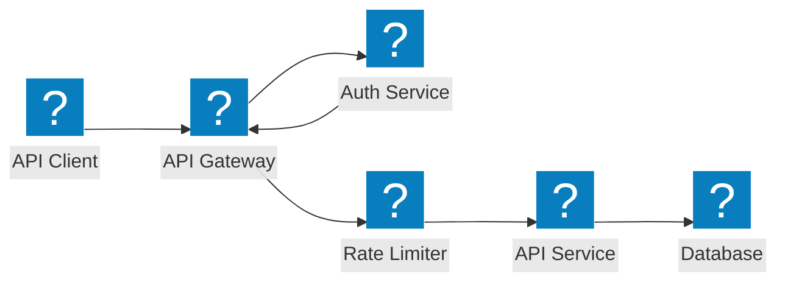
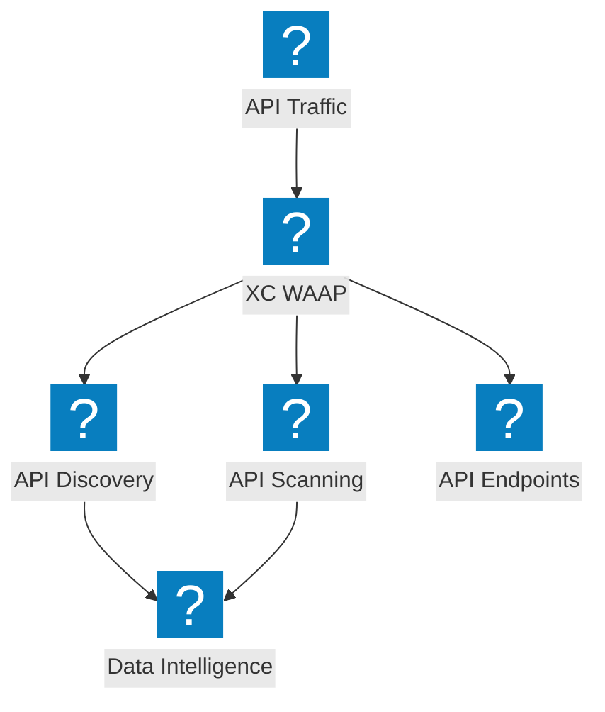

Diagrammes d'architecture de protection des API couvrant la sécurité des passerelles API, la découverte des API fantômes, la limitation de débit et la validation de schéma avec F5 Distributed Cloud.

## Sécurité de la passerelle API

Passerelle API avec authentification, autorisation, limitation de débit et validation de schéma avant d'atteindre les services backend.

## Découverte et protection des API avec F5 XC

F5 Distributed Cloud assurant la découverte des API, la détection des API fantômes et une sécurité complète des API avec analyse du trafic.

## Pipeline de sécurité des API

Pipeline de validation des requêtes API à plusieurs étapes avec TLS, vérification JWT, limitation de débit et inspection de la charge utile.

```mermaid
architecture-beta
  group security(lucide:shield)[API Security Layer]
  group backend(carbon:cloud-services)[Backend Services]

  service tls(lucide:lock)[TLS Termination] in security
  service jwt(lucide:key)[JWT Validation] in security
  service rate(carbon:load-balancer-vpc)[Rate Limiter] in security
  service schema(carbon:gateway-security)[Schema Validation] in security
  service api1(carbon:api)[Users API] in backend
  service api2(carbon:api)[Orders API] in backend

  tls:R --> L:jwt
  jwt:R --> L:rate
  rate:R --> L:schema
  schema:R --> L:api1
  schema:B --> T:api2
```

