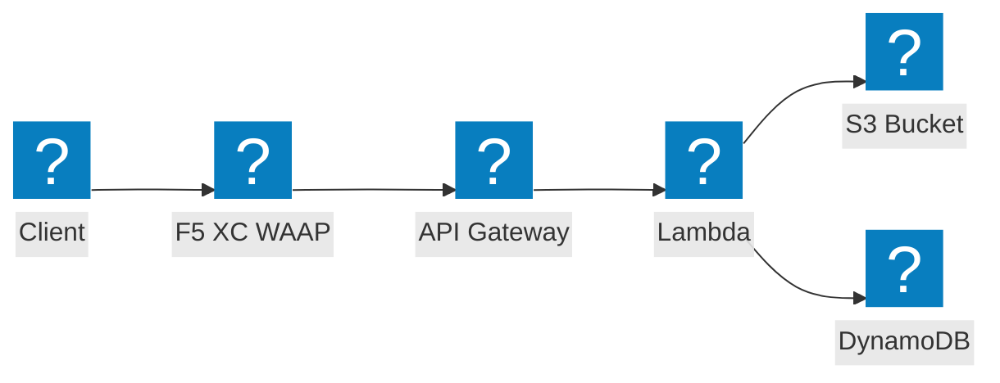

Diagrammes d'infrastructure AWS utilisant les packs d'icônes HashiCorp Flight et Carbon pour les architectures de réseau VPC, de calcul et sans serveur.

## VPC avec ALB et EC2

Sous-réseaux publics et privés avec un équilibreur de charge applicatif distribuant le trafic vers des instances EC2 adossées à RDS.

```mermaid
architecture-beta
  group vpc(carbon:virtual-private-cloud)[AWS VPC]
  group pubsub(carbon:ibm-cloud-subnets)[Public Subnet] in vpc
  group privsub(carbon:ibm-cloud-subnets)[Private Subnet] in vpc

  service igw(carbon:gateway)[Internet GW] in vpc
  service alb(carbon:load-balancer-application)[ALB] in pubsub
  service ec2a(hashicorp-flight:aws-ec2-color)[EC2] in privsub
  service ec2b(hashicorp-flight:aws-ec2-color)[EC2] in privsub
  service rds(carbon:data-base)[RDS] in privsub

  igw:R --> L:alb
  alb:R --> L:ec2a
  alb:B --> T:ec2b
  ec2a:R --> L:rds
  ec2b:R --> L:rds
```

## Cluster EKS avec F5 XC WAAP

Cluster Amazon EKS avec F5 Distributed Cloud assurant la protection des applications web et des API à la périphérie.

```mermaid
architecture-beta
  group edge(lucide:shield)[F5 XC Edge]
  group eks(hashicorp-flight:kubernetes-color)[EKS Cluster]

  service waap(f5xc:web-app-and-api-protection)[WAAP] in edge
  service bot(f5xc:bot-defense)[Bot Defense] in edge
  service ingress(carbon:gateway)[Ingress] in eks
  service frontend(hashicorp-flight:docker-color)[Frontend] in eks
  service api(carbon:api)[API Service] in eks
  service db(carbon:data-base)[Aurora DB]

  waap:R --> L:bot
  bot:R --> L:ingress
  ingress:R --> L:frontend
  ingress:B --> T:api
  api:R --> L:db
```

## Pipeline d'événements sans serveur

AWS Lambda traitant des événements depuis S3 avec un frontend API Gateway, protégé par F5 XC.

