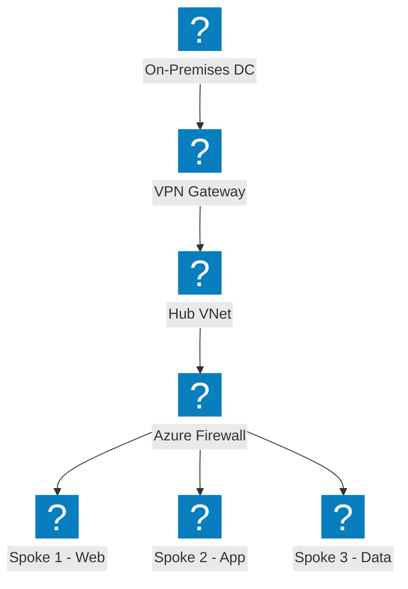
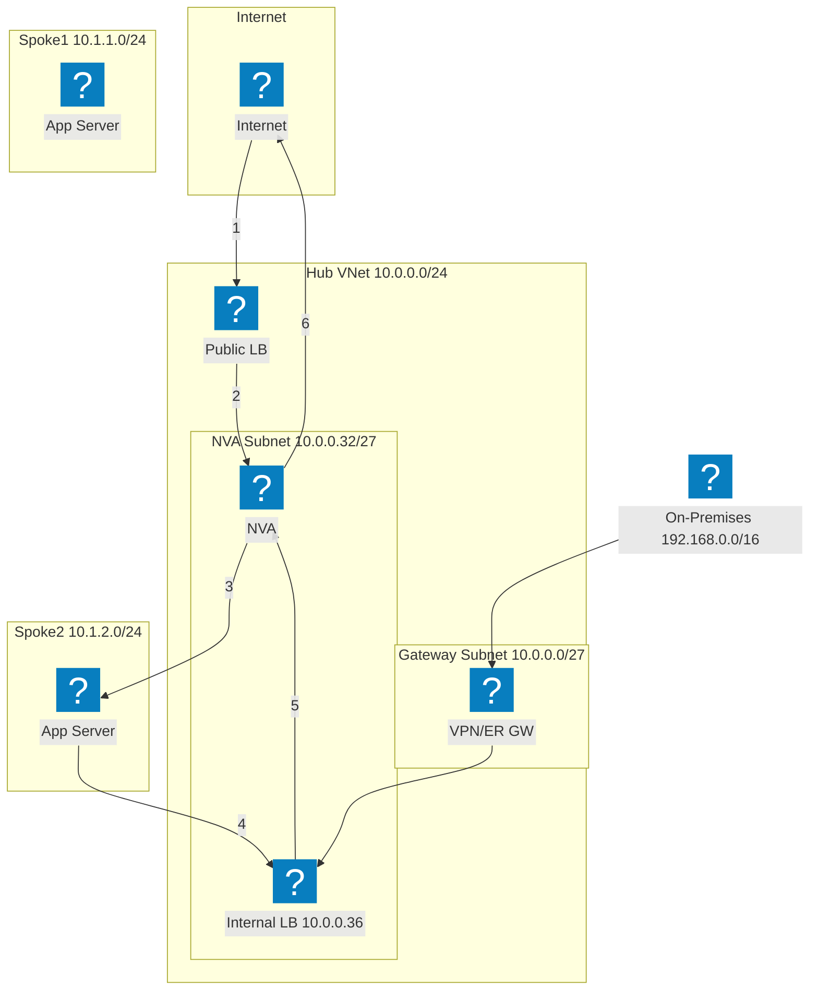
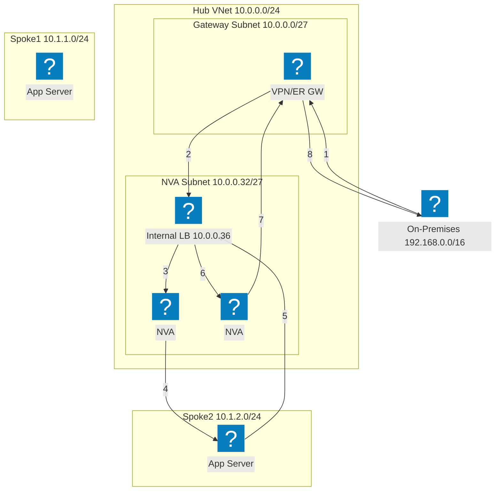
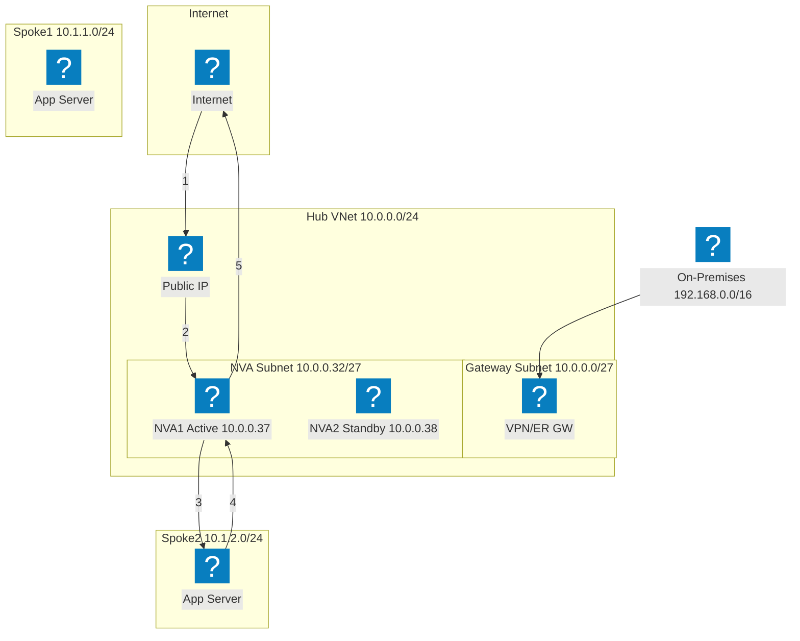
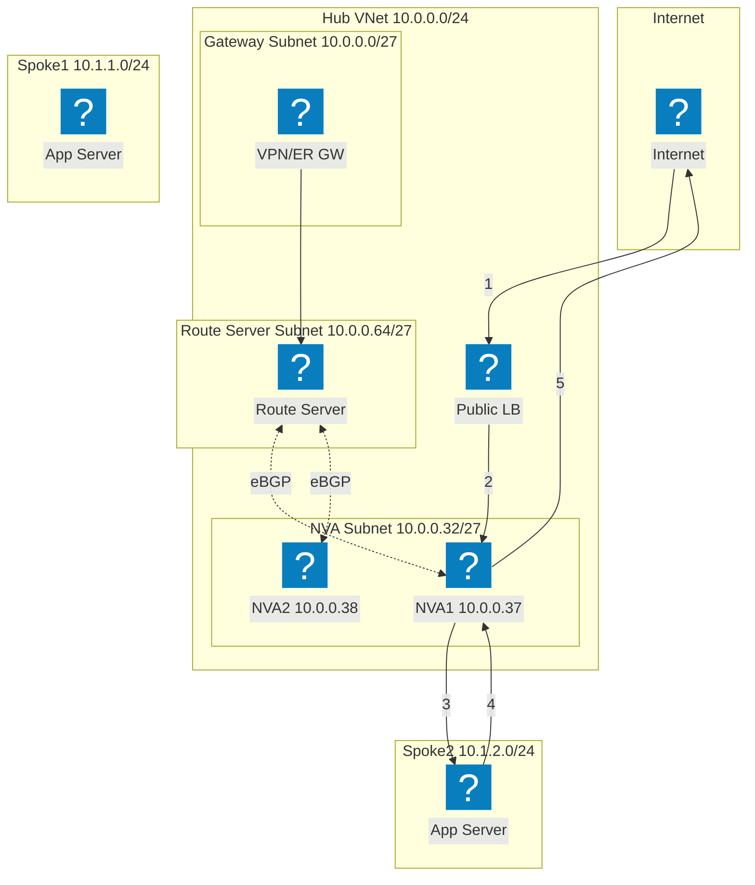
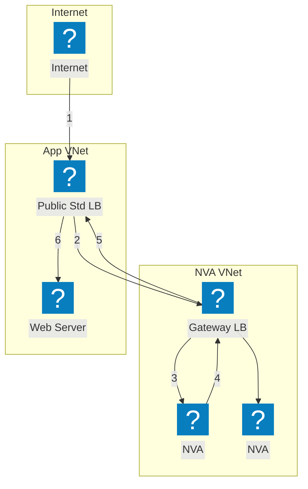

Diagrammes d'infrastructure Azure utilisant les packs d'icônes HashiCorp Flight et Carbon pour les réseaux VNet, le calcul et les services managés.

## VNet avec App Gateway

VNet Azure avec sous-réseaux de passerelle, d'application et de données. L'Application Gateway distribue le trafic vers les VM Scale Sets.

```mermaid
architecture-beta
  group vnet(carbon:virtual-private-cloud)[Azure VNet]
  group gwsub(carbon:ibm-cloud-subnets)[Gateway Subnet] in vnet
  group appsub(carbon:ibm-cloud-subnets)[App Subnet] in vnet
  group datasub(carbon:ibm-cloud-subnets)[Data Subnet] in vnet

  service appgw(carbon:gateway-security)[App Gateway] in gwsub
  service vm1(hashicorp-flight:azure-vms-color)[VM Scale Set] in appsub
  service vm2(hashicorp-flight:azure-vms-color)[VM Scale Set] in appsub
  service sqldb(carbon:data-base)[Azure SQL] in datasub

  appgw:R --> L:vm1
  appgw:B --> T:vm2
  vm1:R --> L:sqldb
  vm2:R --> L:sqldb
```

## AKS avec F5 XC Multi-Cloud Connect

Azure Kubernetes Service exposé via F5 Distributed Cloud pour la connectivité et la sécurité des applications multi-cloud.

```mermaid
architecture-beta
  group xc(lucide:cloud)[F5 XC]
  group aks(hashicorp-flight:azure-aks-color)[AKS Cluster]

  service mcn(f5xc:multi-cloud-network-connect)[Network Connect] in xc
  service waap(f5xc:web-app-and-api-protection)[WAAP] in xc
  service ingress(carbon:gateway)[Ingress] in aks
  service app(hashicorp-flight:docker-color)[App Pods] in aks
  service cache(carbon:datastore)[Redis Cache] in aks
  service blob(hashicorp-flight:azure-blob-storage-color)[Blob Storage]

  mcn:R --> L:waap
  waap:R --> L:ingress
  ingress:R --> L:app
  app:B --> T:cache
  app:R --> L:blob
```

## Topologie réseau Hub-Spoke

Architecture Hub-Spoke Azure avec une sécurité centralisée et des services partagés reliant plusieurs VNets en rayon.

## Haute disponibilité NVA avec Load Balancer — Trafic Internet

Le trafic Internet entrant arrive sur un équilibreur de charge public, qui le distribue vers les instances NVA dans le hub. Le NVA transfère le trafic inspecté vers les charges de travail en rayon. Le trafic de retour en provenance des rayons passe par un équilibreur de charge interne vers le NVA pour la sortie. Les étapes numérotées indiquent le chemin entrant (1-3) et le chemin de retour (4-6).

## Haute disponibilité NVA avec Load Balancer — Trafic On-Premises

Le trafic on-premises entre via une passerelle VPN ou ExpressRoute et est dirigé vers un équilibreur de charge interne exposant plusieurs instances NVA. Le NVA inspecte et transfère le trafic vers les charges de travail en rayon. Le trafic de retour traverse le même équilibreur de charge interne pour garantir la symétrie des flux et éviter les problèmes de routage asymétrique.

## Haute disponibilité NVA avec PIP/UDR — Actif/Passif

Paire NVA actif/passif où l'instance active (NVA1) détient l'adresse IP publique. En cas de défaillance, le NVA2 en attente appelle l'API Azure pour réaffecter l'IP publique et mettre à jour les routes définies par l'utilisateur afin de pointer vers lui-même. Cette approche évite les équilibreurs de charge mais nécessite une orchestration du basculement au niveau de l'API.

## Haute disponibilité NVA avec Azure Route Server

Haute disponibilité basée sur BGP via Azure Route Server. Le Route Server établit des adjacences eBGP avec les deux instances NVA et programme dynamiquement les routes effectives des rayons. ECMP répartit la charge entre les NVA sans recourir aux routes définies par l'utilisateur. Le Route Server injecte des entrées de saut suivant pour les deux IP NVA dans tous les VNets appairés.

## Haute disponibilité NVA avec Gateway Load Balancer

Insertion transparente de NVA via Azure Gateway Load Balancer. Le trafic à destination de l'application est redirigé de manière transparente depuis l'équilibreur de charge standard public vers le Gateway LB dans un VNet NVA distinct. Les NVA inspectent le trafic et le renvoient au Gateway LB, qui le retransmet à l'application. Aucun appairage de VNet ni de routes définies par l'utilisateur n'est requis entre les VNets NVA et application.

