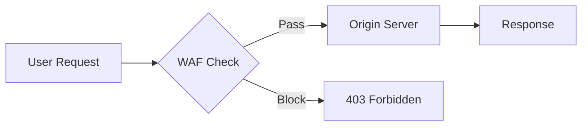
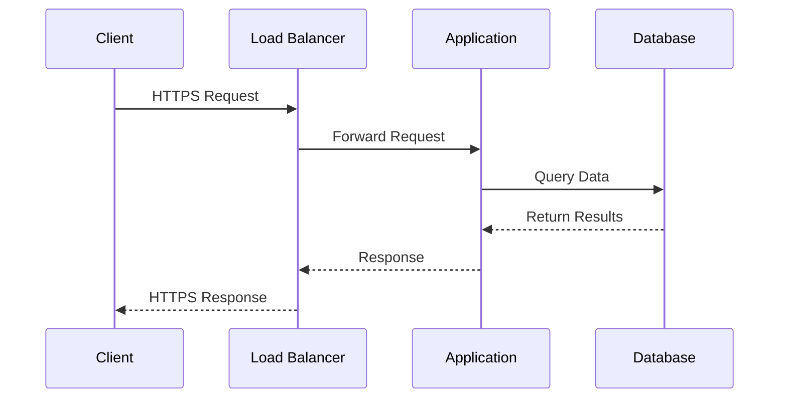
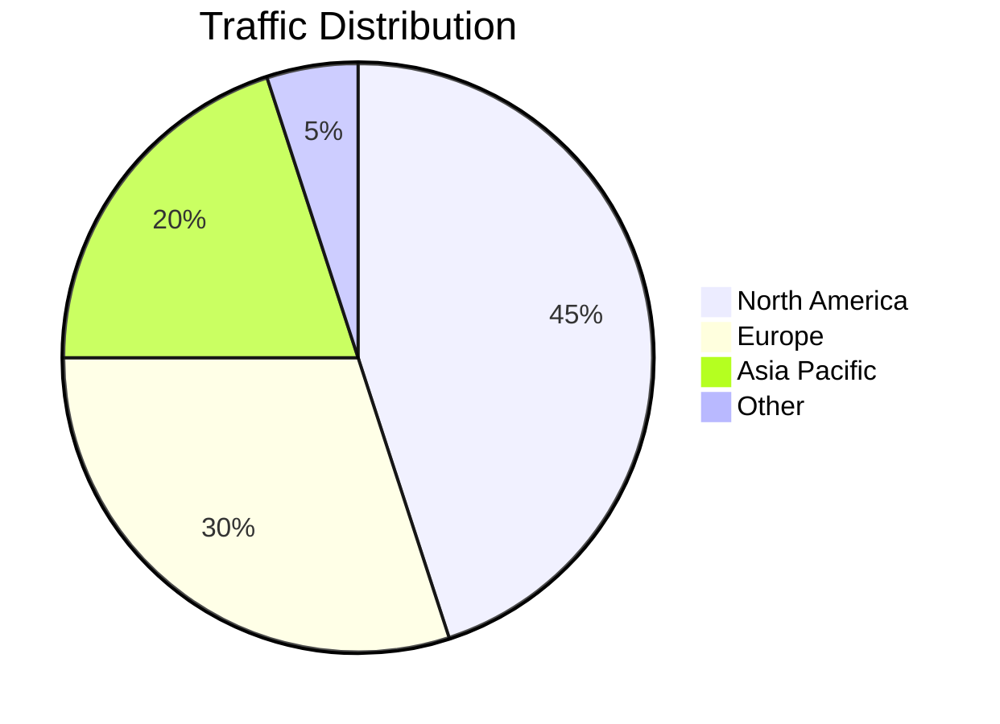
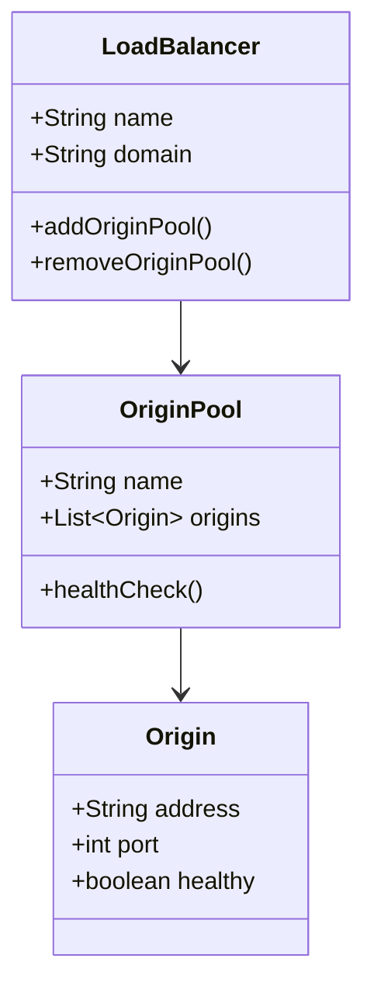
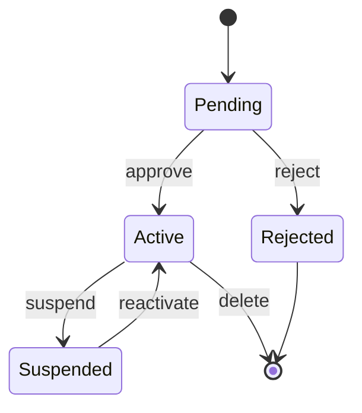
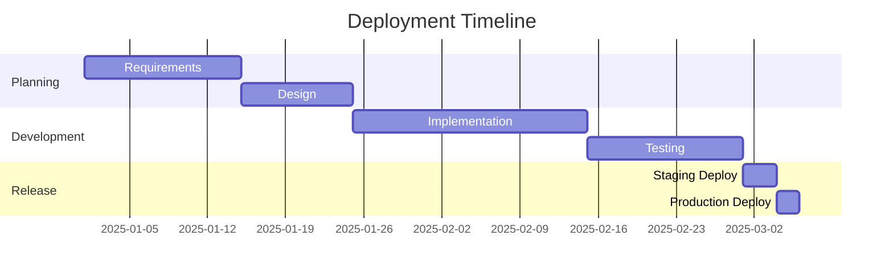

Types de diagrammes Mermaid essentiels pour la documentation générale. Ceux-ci fonctionnent sans aucun paquet d'icônes personnalisé.

## Organigramme

## Diagramme de séquence

## Graphique en camembert

## Diagramme de classes

## Diagramme d'états

## Diagramme de Gantt

