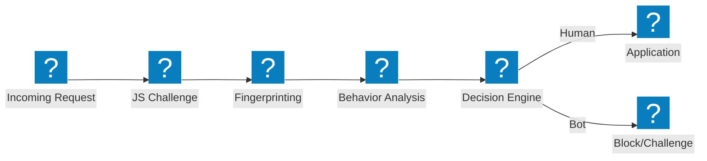
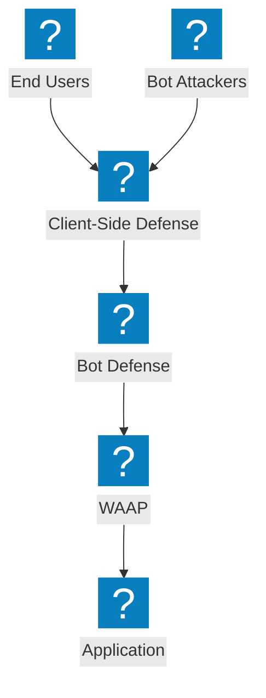

Diagrammes d'architecture de défense bot couvrant les pipelines de détection, la mitigation du credential stuffing, la défense côté client et les capacités de gestion des bots F5 Distributed Cloud.

## Pipeline de détection des bots

Pipeline de détection des bots à plusieurs étapes avec défi JavaScript, analyse comportementale et empreinte numérique avant d'autoriser l'accès.

## Défense Bot F5 XC et Défense côté client

Défense bot intégrée de F5 Distributed Cloud avec protection côté client pour la prévention du credential stuffing et de la prise de contrôle de compte.

## Architecture de défense contre le credential stuffing

Défense multicouche contre les attaques de credential stuffing avec empreinte numérique des appareils, renseignement sur les identifiants et protection des comptes.

