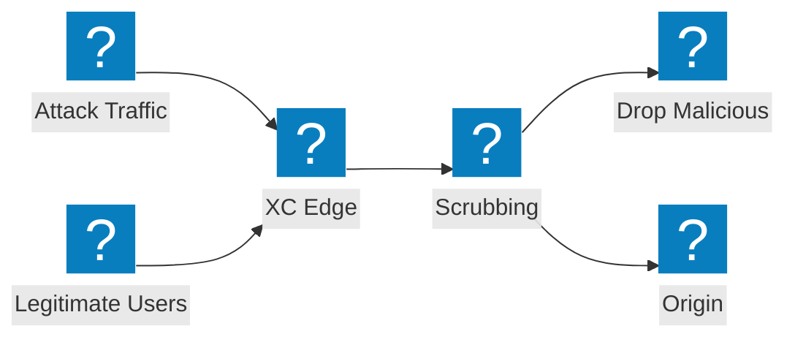

Schémas d'architecture de mitigation DDoS couvrant la conception des centres de nettoyage, l'intégration des services de transit et la protection contre les attaques volumétriques F5 Distributed Cloud.

## Architecture de mitigation DDoS

Mitigation DDoS multi-niveaux avec nettoyage au niveau de la couche réseau, inspection au niveau de la couche applicative et acheminement du trafic propre vers l'origine.

```mermaid
architecture-beta
  group scrub(lucide:shield)[Scrubbing Center]
  group origin(carbon:cloud-services)[Origin DC]

  service edge(carbon:edge-node)[Edge Router] in scrub
  service filter(carbon:firewall)[Traffic Filter] in scrub
  service clean(carbon:load-balancer-global)[Clean Pipe] in scrub
  service lb(carbon:load-balancer-application)[Load Balancer] in origin
  service app(carbon:application)[Application] in origin
  service db(carbon:data-base)[Database] in origin

  edge:R --> L:filter
  filter:R --> L:clean
  clean:R --> L:lb
  lb:R --> L:app
  app:B --> T:db
```

## Protection DDoS et services de transit F5 XC

F5 Distributed Cloud fournissant une Protection DDoS et des services de transit avec un CDN intégré et une sécurité applicative.

```mermaid
architecture-beta
  group xc(lucide:cloud)[F5 Distributed Cloud]
  group cloud(carbon:cloud-services)[Cloud Infrastructure]

  service ddos(f5xc:ddos-and-transit-services)[DDoS Protection] in xc
  service cdn(f5xc:content-delivery-network)[CDN] in xc
  service waap(f5xc:web-app-and-api-protection)[WAAP] in xc
  service lb(carbon:load-balancer-application)[Load Balancer] in cloud
  service app(carbon:application)[App Cluster] in cloud
  service db(carbon:data-base)[Database] in cloud

  ddos:R --> L:cdn
  cdn:R --> L:waap
  waap:R --> L:lb
  lb:R --> L:app
  app:B --> T:db
```

## Flux d'une attaque volumétrique

Flux du trafic d'attaque illustrant comment les attaques DDoS volumétriques sont absorbées et mitigées au niveau de la périphérie F5 XC avant d'atteindre l'infrastructure d'origine.

