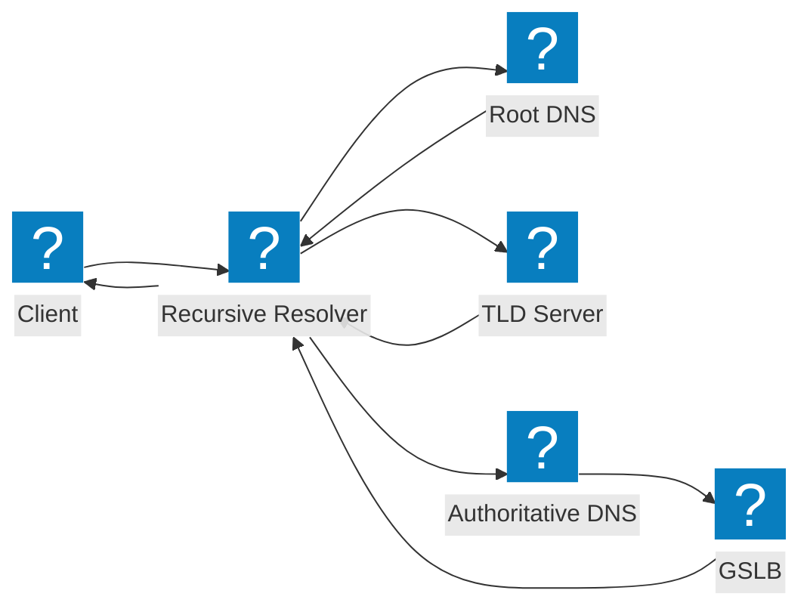
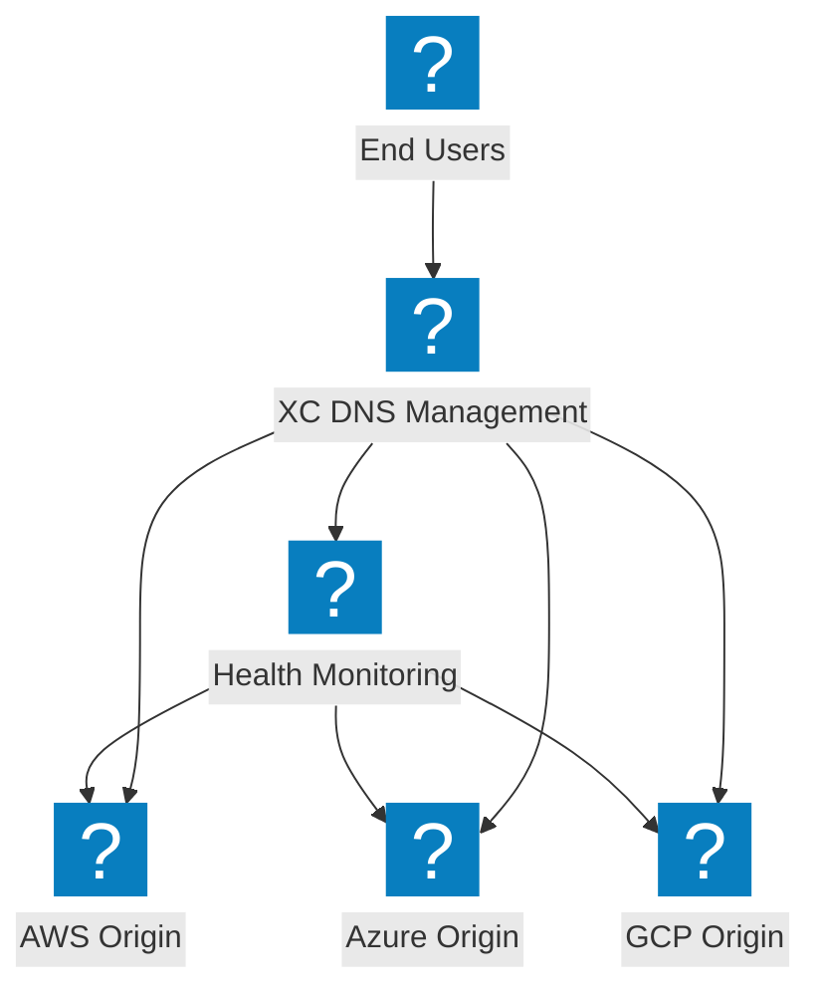

Diagrammes d'architecture DNS couvrant les flux de résolution récursive, l'équilibrage de charge global des serveurs et la gestion DNS F5 Distributed Cloud.

## Flux de résolution DNS

Résolution standard des requêtes DNS du client vers le résolveur récursif jusqu'au serveur de noms faisant autorité avec intégration GSLB.

## Gestion DNS F5 XC

Gestion DNS F5 Distributed Cloud offrant un équilibrage de charge DNS intelligent à travers des origines multi-cloud.

## Architecture d'équilibrage de charge DNS

Équilibrage de charge DNS multi-niveaux avec routage géographique, vérifications de l'état et basculement entre les régions cloud.

```mermaid
architecture-beta
  group dns(carbon:dns-services)[DNS Infrastructure]
  group region1(hashicorp-flight:aws-color)[US East]
  group region2(hashicorp-flight:azure-color)[EU West]

  service gslb(carbon:load-balancer-global)[GSLB] in dns
  service health(carbon:application)[Health Check] in dns
  service lb1(carbon:load-balancer-application)[Regional LB] in region1
  service app1(carbon:virtual-machine)[App Servers] in region1
  service lb2(carbon:load-balancer-application)[Regional LB] in region2
  service app2(carbon:virtual-machine)[App Servers] in region2

  gslb:R --> L:health
  gslb:B --> T:lb1
  lb1:R --> L:app1
  gslb:B --> T:lb2
  lb2:R --> L:app2
```

