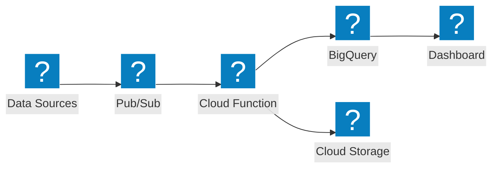

Schémas d'infrastructure Google Cloud utilisant les packs d'icônes HashiCorp Flight et Carbon pour la mise en réseau VPC, GKE et les services gérés.

## VPC GCP avec GKE

Projet Google Cloud avec un équilibreur de charge global distribuant le trafic vers un cluster GKE et des Cloud Functions.

```mermaid
architecture-beta
  group gcp(hashicorp-flight:gcp-color)[GCP Project]
  group frontend(carbon:ibm-cloud-subnets)[Frontend Tier] in gcp
  group backend(carbon:ibm-cloud-subnets)[Backend Tier] in gcp

  service glb(carbon:load-balancer-global)[Global LB]
  service gke(hashicorp-flight:kubernetes-color)[GKE Cluster] in frontend
  service func(carbon:application)[Cloud Functions] in frontend
  service sql(carbon:data-base)[Cloud SQL] in backend
  service store(carbon:data-base)[Firestore] in backend

  glb:R --> L:gke
  glb:B --> T:func
  gke:R --> L:sql
  func:R --> L:store
  sql:B --> T:store
```

## GKE avec F5 XC App Connect

Cluster GKE avec F5 Distributed Cloud assurant la connectivité des applications et l'Observabilité dans les environnements cloud.

```mermaid
architecture-beta
  group xc(lucide:cloud)[F5 XC]
  group gke(hashicorp-flight:kubernetes-color)[GKE Cluster]

  service appconn(f5xc:multi-cloud-app-connect)[App Connect] in xc
  service obs(f5xc:observability)[Observability] in xc
  service ingress(carbon:gateway)[Ingress] in gke
  service web(hashicorp-flight:docker-color)[Web Pods] in gke
  service api(carbon:api)[API Pods] in gke
  service sql(carbon:data-base)[Cloud SQL]

  appconn:R --> L:obs
  obs:R --> L:ingress
  ingress:R --> L:web
  ingress:B --> T:api
  api:R --> L:sql
```

## Pipeline de données sans serveur

Pipeline de traitement de données sans serveur GCP avec Pub/Sub, Cloud Functions et BigQuery.

