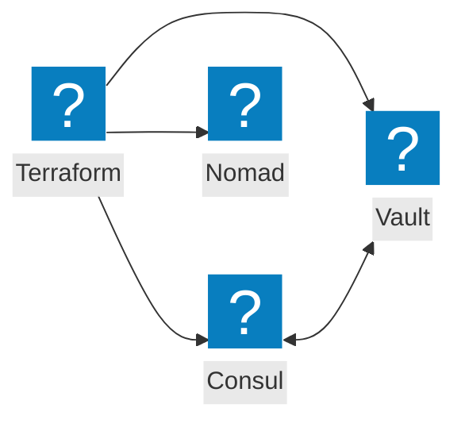
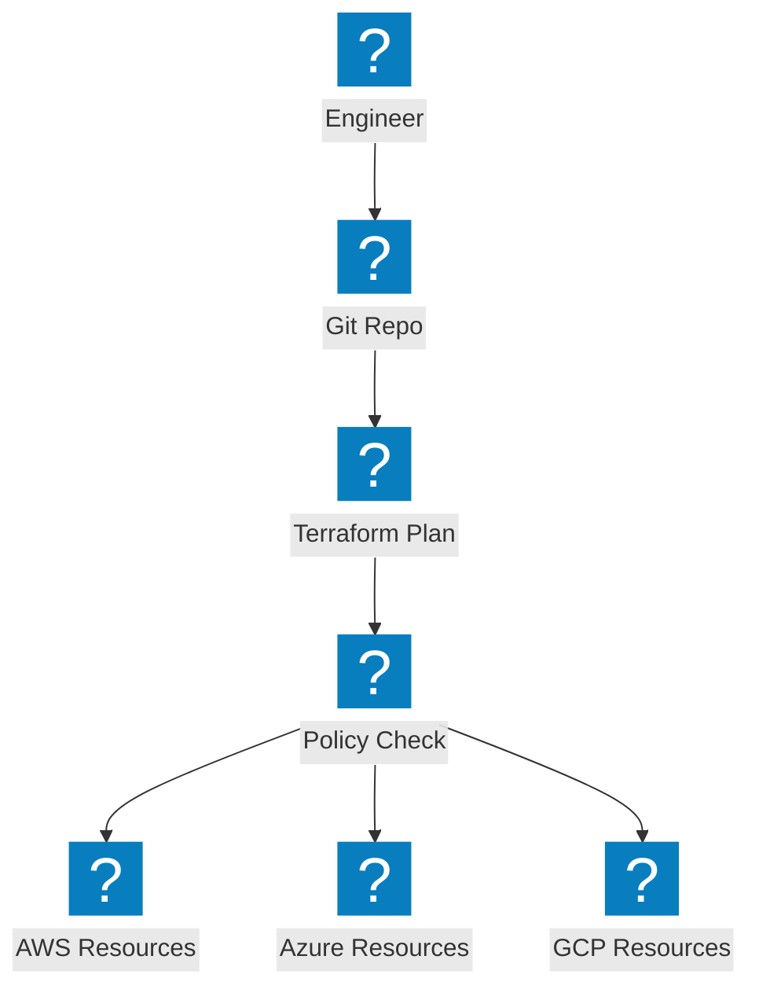

Diagrammes d'infrastructure en tant que code couvrant l'Automatisation Terraform, l'intégration des outils HashiCorp et les flux de travail de provisionnement multi-cloud.

## Intégration de la pile HashiCorp

Terraform orchestrant le provisionnement de l'infrastructure avec Consul pour la découverte de services, Vault pour les secrets et Nomad pour la planification des charges de travail.

## Pipeline IaC multi-cloud

Terraform provisionnant l'infrastructure sur AWS, Azure et GCP avec la gestion des états et l'application des politiques.

## Automatisation de l'infrastructure F5 XC

Terraform automatisant la configuration de F5 Distributed Cloud avec des équilibreurs de charge, des pools d'origine et des politiques de sécurité.

```mermaid
architecture-beta
  group iac(hashicorp-flight:terraform-color)[Terraform Workspace]
  group xc(lucide:cloud)[F5 XC Tenant]

  service tfplan(hashicorp-flight:terraform-color)[Terraform] in iac
  service vault(hashicorp-flight:vault-color)[Vault Secrets] in iac
  service consul(hashicorp-flight:consul-color)[Consul Registry] in iac
  service waap(f5xc:web-app-and-api-protection)[WAAP Policy] in xc
  service lb(f5xc:multi-cloud-app-connect)[App Connect] in xc
  service dns(f5xc:dns-management)[DNS Config] in xc

  tfplan:R --> L:vault
  vault:R --> L:consul
  tfplan:B --> T:waap
  tfplan:B --> T:lb
  tfplan:B --> T:dns
```

