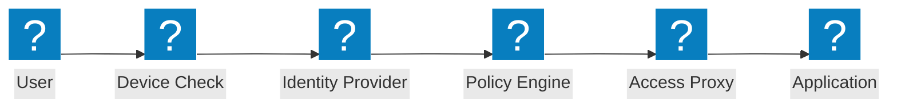
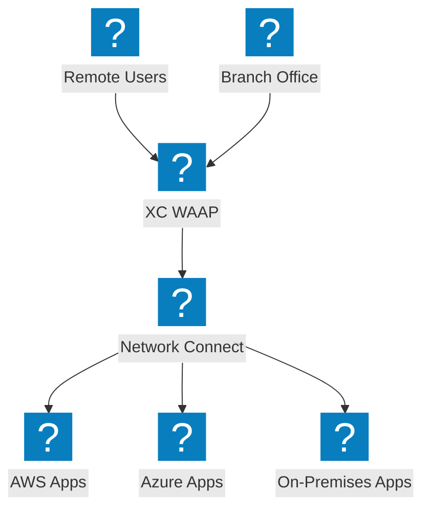

Diagrammes d'architecture Zero Trust couvrant les flux d'accès ZTNA, la vérification d'identité, le contrôle d'accès basé sur les politiques et la micro-segmentation avec l'intégration F5 XC.

## Flux d'accès Zero Trust

Flux d'accès Zero Trust avec vérification de la posture du périphérique, vérification d'identité, évaluation des politiques et accès à l'application via proxy.

## Architecture Zero Trust F5 XC

F5 Distributed Cloud fournissant un accès applicatif Zero Trust avec WAAP, proxy prenant en compte l'identité et micro-segmentation sur plusieurs clouds.

## Architecture de micro-segmentation

Micro-segmentation réseau avec des politiques basées sur l'identité contrôlant le trafic est-ouest entre les niveaux applicatifs.

```mermaid
architecture-beta
  group trust(lucide:shield)[Zero Trust Fabric]
  group apps(carbon:cloud-services)[Application Tiers]

  service idp(lucide:key)[Identity Provider] in trust
  service policy(carbon:gateway-security)[Policy Engine] in trust
  service seg(carbon:subnet-acl-rules)[Segmentation] in trust
  service web(carbon:application)[Web Tier] in apps
  service api(carbon:api)[API Tier] in apps
  service data(carbon:data-base)[Data Tier] in apps

  idp:R --> L:policy
  policy:R --> L:seg
  seg:R --> L:web
  web:R --> L:api
  api:R --> L:data
```

