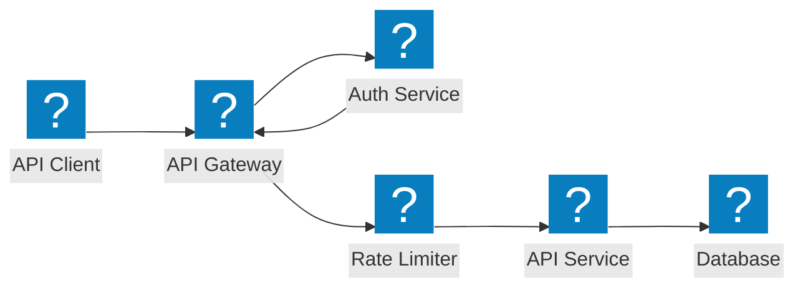
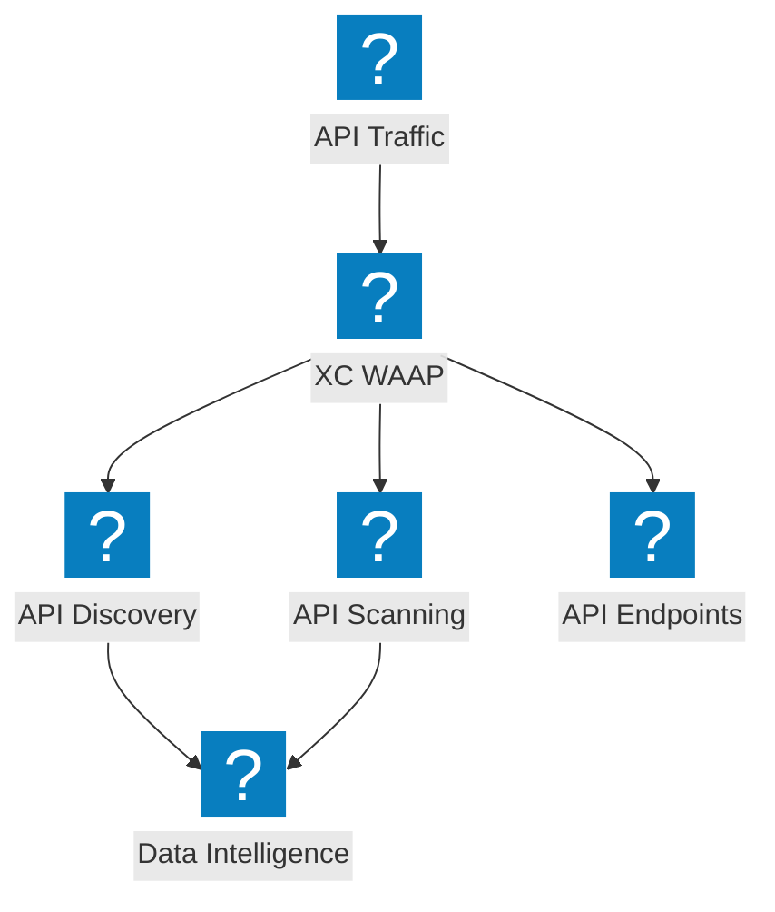

F5 Distributed Cloud के साथ API गेटवे सुरक्षा, शैडो API डिस्कवरी, रेट लिमिटिंग, और स्कीमा वैलिडेशन को कवर करने वाले API सुरक्षा आर्किटेक्चर आरेख।

## API गेटवे सुरक्षा

बैकएंड सेवाओं तक पहुँचने से पहले प्रमाणीकरण, प्राधिकरण, रेट लिमिटिंग, और स्कीमा वैलिडेशन के साथ API गेटवे।

## F5 XC API डिस्कवरी और सुरक्षा

F5 Distributed Cloud द्वारा API डिस्कवरी, शैडो API डिटेक्शन, और ट्रैफ़िक इनसाइट के साथ व्यापक API सुरक्षा प्रदान करना।

## API सुरक्षा पाइपलाइन

TLS, JWT वेरिफिकेशन, रेट लिमिटिंग, और पेलोड इंस्पेक्शन के साथ बहु-चरणीय API अनुरोध वैलिडेशन पाइपलाइन।

```mermaid
architecture-beta
  group security(lucide:shield)[API Security Layer]
  group backend(carbon:cloud-services)[Backend Services]

  service tls(lucide:lock)[TLS Termination] in security
  service jwt(lucide:key)[JWT Validation] in security
  service rate(carbon:load-balancer-vpc)[Rate Limiter] in security
  service schema(carbon:gateway-security)[Schema Validation] in security
  service api1(carbon:api)[Users API] in backend
  service api2(carbon:api)[Orders API] in backend

  tls:R --> L:jwt
  jwt:R --> L:rate
  rate:R --> L:schema
  schema:R --> L:api1
  schema:B --> T:api2
```

