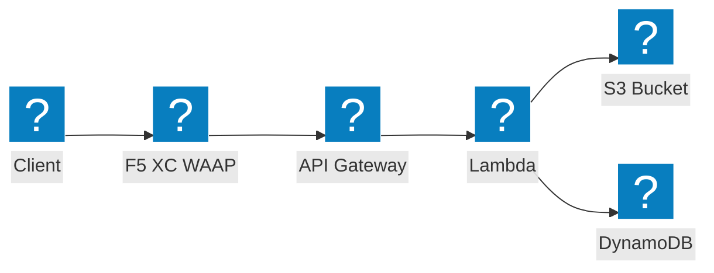

AWS इन्फ्रास्ट्रक्चर डायग्राम HashiCorp Flight और Carbon आइकन पैक का उपयोग करके VPC नेटवर्किंग, कंप्यूट, और सर्वरलेस आर्किटेक्चर के लिए।

## ALB और EC2 के साथ VPC

पब्लिक और प्राइवेट सबनेट जिसमें एप्लिकेशन लोड बैलेंसर RDS द्वारा समर्थित EC2 इंस्टेंस पर ट्रैफ़िक वितरित करता है।

```mermaid
architecture-beta
  group vpc(carbon:virtual-private-cloud)[AWS VPC]
  group pubsub(carbon:ibm-cloud-subnets)[Public Subnet] in vpc
  group privsub(carbon:ibm-cloud-subnets)[Private Subnet] in vpc

  service igw(carbon:gateway)[Internet GW] in vpc
  service alb(carbon:load-balancer-application)[ALB] in pubsub
  service ec2a(hashicorp-flight:aws-ec2-color)[EC2] in privsub
  service ec2b(hashicorp-flight:aws-ec2-color)[EC2] in privsub
  service rds(carbon:data-base)[RDS] in privsub

  igw:R --> L:alb
  alb:R --> L:ec2a
  alb:B --> T:ec2b
  ec2a:R --> L:rds
  ec2b:R --> L:rds
```

## F5 XC WAAP के साथ EKS क्लस्टर

Amazon EKS क्लस्टर जिसमें F5 Distributed Cloud एज पर वेब एप्लिकेशन और API सुरक्षा प्रदान करता है।

```mermaid
architecture-beta
  group edge(lucide:shield)[F5 XC Edge]
  group eks(hashicorp-flight:kubernetes-color)[EKS Cluster]

  service waap(f5xc:web-app-and-api-protection)[WAAP] in edge
  service bot(f5xc:bot-defense)[Bot Defense] in edge
  service ingress(carbon:gateway)[Ingress] in eks
  service frontend(hashicorp-flight:docker-color)[Frontend] in eks
  service api(carbon:api)[API Service] in eks
  service db(carbon:data-base)[Aurora DB]

  waap:R --> L:bot
  bot:R --> L:ingress
  ingress:R --> L:frontend
  ingress:B --> T:api
  api:R --> L:db
```

## सर्वरलेस इवेंट पाइपलाइन

AWS Lambda S3 से इवेंट प्रोसेस करता है जिसमें API Gateway फ्रंटएंड है, F5 XC द्वारा सुरक्षित।

