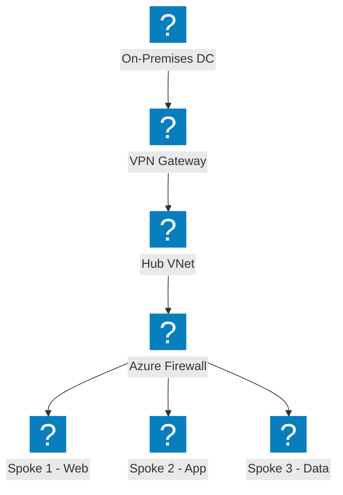
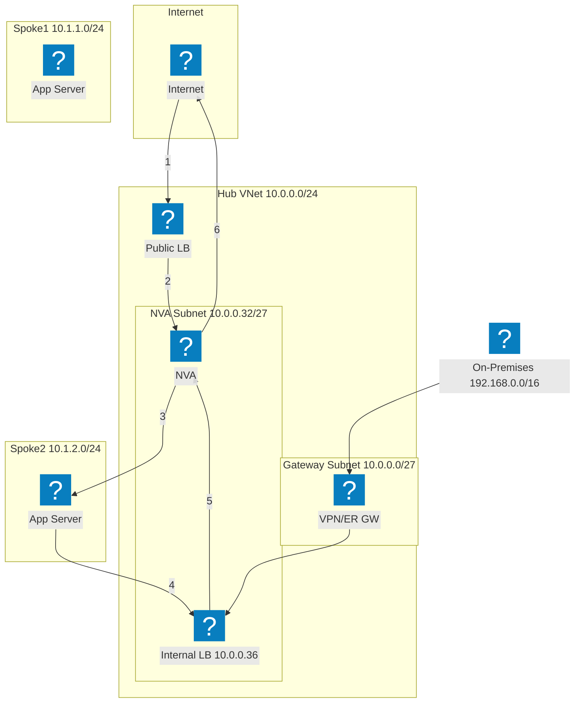
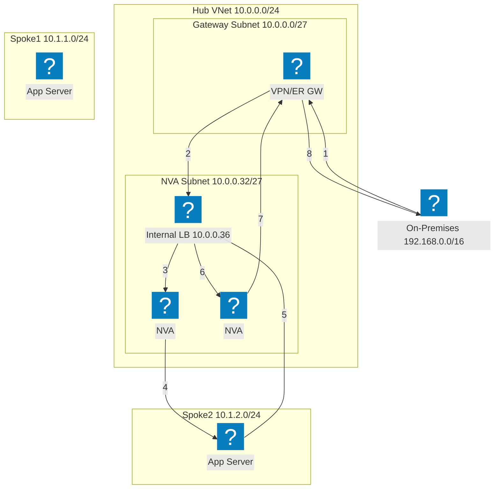
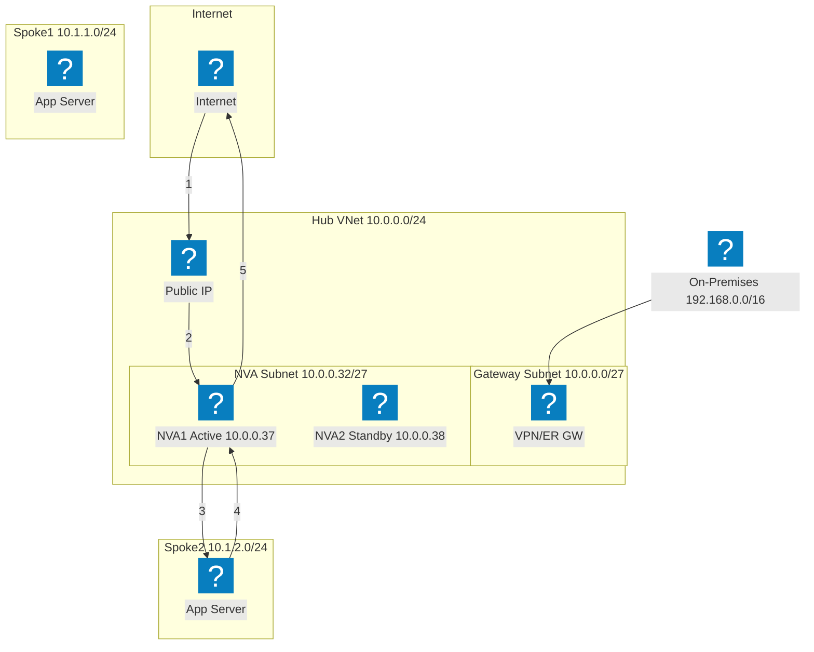
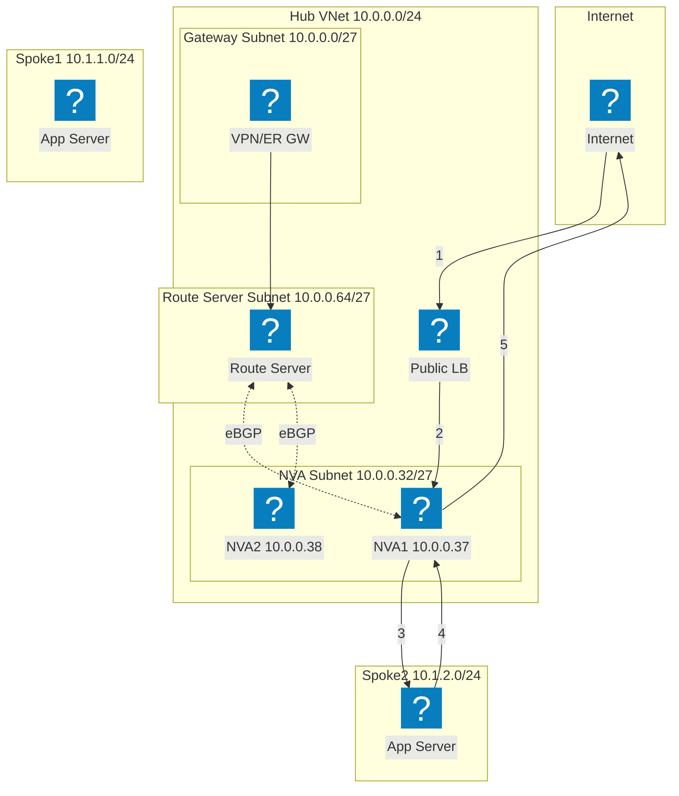
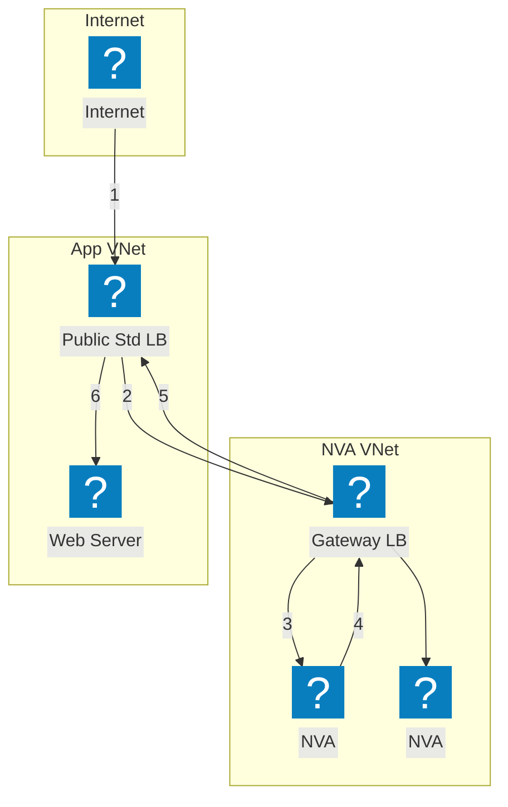

HashiCorp Flight और Carbon आइकन पैक का उपयोग करके Azure इन्फ्रास्ट्रक्चर डायग्राम, जिनमें VNet नेटवर्किंग, कंप्यूट, और प्रबंधित सेवाएँ शामिल हैं।

## App Gateway के साथ VNet

Azure VNet में गेटवे, एप्लिकेशन, और डेटा सबनेट शामिल हैं। Application Gateway VM Scale Sets पर ट्रैफ़िक वितरित करता है।

```mermaid
architecture-beta
  group vnet(carbon:virtual-private-cloud)[Azure VNet]
  group gwsub(carbon:ibm-cloud-subnets)[Gateway Subnet] in vnet
  group appsub(carbon:ibm-cloud-subnets)[App Subnet] in vnet
  group datasub(carbon:ibm-cloud-subnets)[Data Subnet] in vnet

  service appgw(carbon:gateway-security)[App Gateway] in gwsub
  service vm1(hashicorp-flight:azure-vms-color)[VM Scale Set] in appsub
  service vm2(hashicorp-flight:azure-vms-color)[VM Scale Set] in appsub
  service sqldb(carbon:data-base)[Azure SQL] in datasub

  appgw:R --> L:vm1
  appgw:B --> T:vm2
  vm1:R --> L:sqldb
  vm2:R --> L:sqldb
```

## F5 XC मल्टी-क्लाउड कनेक्ट के साथ AKS

Azure Kubernetes Service को F5 Distributed Cloud द्वारा फ्रंट किया गया है, जो मल्टी-क्लाउड एप्लिकेशन कनेक्टिविटी और सुरक्षा प्रदान करता है।

```mermaid
architecture-beta
  group xc(lucide:cloud)[F5 XC]
  group aks(hashicorp-flight:azure-aks-color)[AKS Cluster]

  service mcn(f5xc:multi-cloud-network-connect)[Network Connect] in xc
  service waap(f5xc:web-app-and-api-protection)[WAAP] in xc
  service ingress(carbon:gateway)[Ingress] in aks
  service app(hashicorp-flight:docker-color)[App Pods] in aks
  service cache(carbon:datastore)[Redis Cache] in aks
  service blob(hashicorp-flight:azure-blob-storage-color)[Blob Storage]

  mcn:R --> L:waap
  waap:R --> L:ingress
  ingress:R --> L:app
  app:B --> T:cache
  app:R --> L:blob
```

## Hub-Spoke नेटवर्क टोपोलॉजी

Azure Hub-Spoke आर्किटेक्चर जिसमें केंद्रीकृत सुरक्षा और साझा सेवाएँ कई Spoke VNet को जोड़ती हैं।

## लोड बैलेंसर के साथ NVA HA — इंटरनेट ट्रैफ़िक

आने वाला इंटरनेट ट्रैफ़िक एक पब्लिक लोड बैलेंसर पर पहुँचता है, जो हब में NVA इंस्टेंस पर वितरित करता है। NVA निरीक्षण किए गए ट्रैफ़िक को Spoke वर्कलोड पर अग्रेषित करता है। Spoke से रिटर्न ट्रैफ़िक एग्रेस के लिए एक इंटर्नल लोड बैलेंसर के माध्यम से NVA पर वापस रूट होता है। क्रमांकित चरण आने वाले पथ (1-3) और वापसी पथ (4-6) को दर्शाते हैं।

## लोड बैलेंसर के साथ NVA HA — ऑन-प्रिमाइसेस ट्रैफ़िक

ऑन-प्रिमाइसेस ट्रैफ़िक VPN या ExpressRoute गेटवे के माध्यम से प्रवेश करता है और कई NVA इंस्टेंस को फ्रंट करने वाले इंटर्नल लोड बैलेंसर पर निर्देशित होता है। NVA ट्रैफ़िक का निरीक्षण करके उसे Spoke वर्कलोड पर अग्रेषित करता है। रिटर्न ट्रैफ़िक फ्लो सिमेट्री सुनिश्चित करने के लिए उसी इंटर्नल लोड बैलेंसर से होकर गुजरता है, जिससे असिमेट्रिक रूटिंग समस्याओं से बचा जाता है।

## PIP/UDR के साथ NVA HA — Active/Standby

Active/Standby NVA जोड़ी जिसमें सक्रिय इंस्टेंस (NVA1) पब्लिक IP एड्रेस रखता है। विफलता की स्थिति में, स्टैंडबाय NVA2 पब्लिक IP को पुनः असाइन करने और यूज़र-डिफाइंड रूट को स्वयं की ओर अपडेट करने के लिए Azure API को कॉल करता है। यह दृष्टिकोण लोड बैलेंसर से बचता है लेकिन API-स्तरीय फेलओवर ऑर्केस्ट्रेशन की आवश्यकता होती है।

## Azure Route Server के साथ NVA HA

Azure Route Server का उपयोग करके BGP-आधारित उच्च उपलब्धता। Route Server दोनों NVA इंस्टेंस के साथ eBGP adjacencies स्थापित करता है और Spoke प्रभावी रूट को गतिशील रूप से प्रोग्राम करता है। ECMP यूज़र-डिफाइंड रूट के बिना NVA पर लोड बैलेंस करता है। Route Server सभी पीयर किए गए VNet में दोनों NVA IP के लिए next-hop एंट्री इंजेक्ट करता है।

## Gateway Load Balancer के साथ NVA HA

Azure Gateway Load Balancer का उपयोग करके पारदर्शी NVA इन्सर्शन। एप्लिकेशन के लिए निर्धारित ट्रैफ़िक पब्लिक स्टैंडर्ड लोड बैलेंसर से एक अलग NVA VNet में Gateway LB पर पारदर्शी रूप से डायवर्ट होता है। NVA ट्रैफ़िक का निरीक्षण करके उसे Gateway LB को वापस करते हैं, जो उसे एप्लिकेशन पर अग्रेषित करता है। NVA और एप्लिकेशन VNet के बीच VNet पीयरिंग या UDR की आवश्यकता नहीं है।

