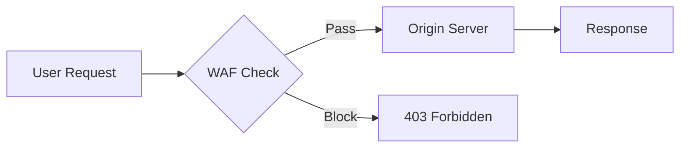
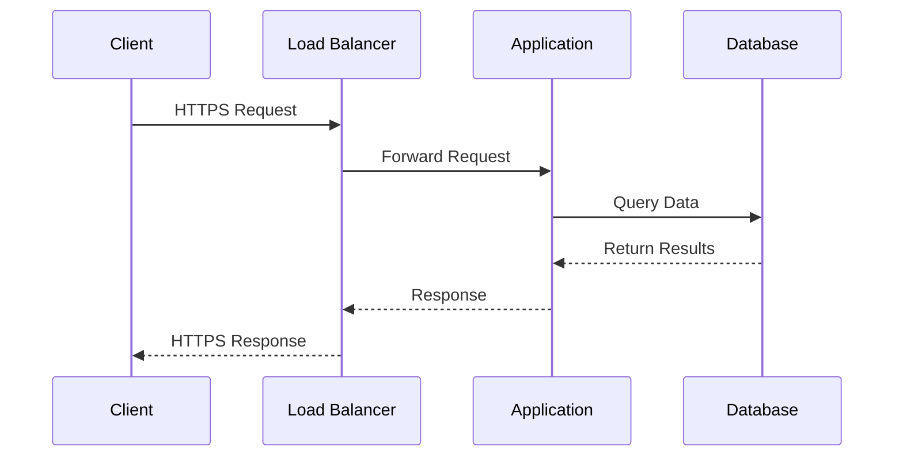
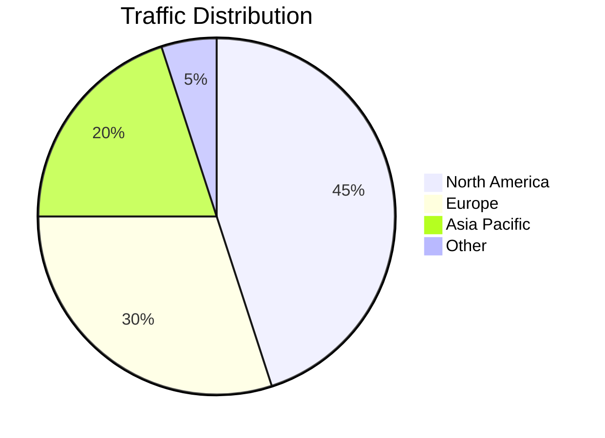
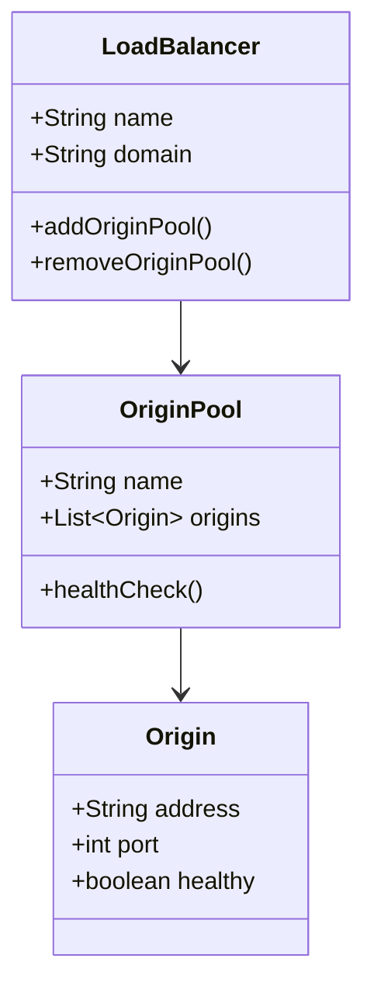
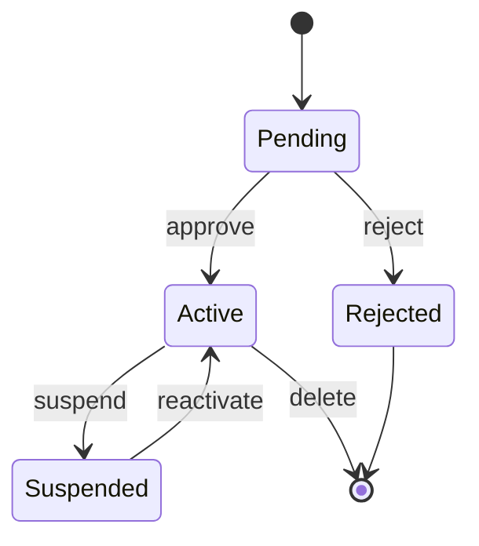
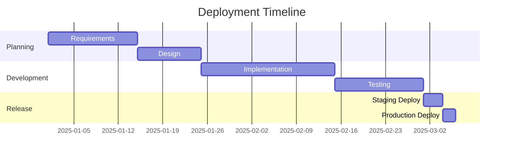

सामान्य-उद्देश्य दस्तावेज़ीकरण के लिए मुख्य Mermaid आरेख प्रकार। ये किसी भी कस्टम आइकन पैक के बिना काम करते हैं।

## फ्लोचार्ट

## अनुक्रम आरेख

## पाई चार्ट

## क्लास आरेख

## स्टेट आरेख

## गैंट चार्ट

