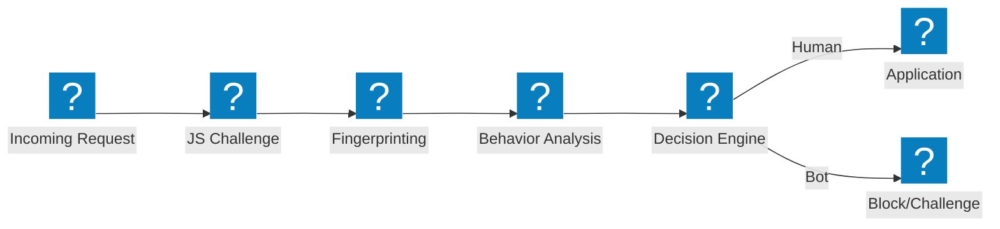
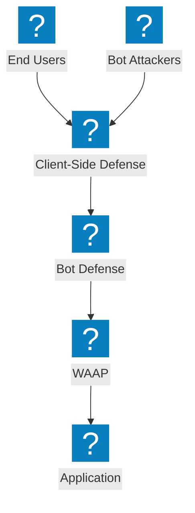

Bot रक्षा आर्किटेक्चर आरेख जो डिटेक्शन पाइपलाइन, क्रेडेंशियल स्टफिंग शमन, क्लाइंट-साइड डिफेंस, और F5 Distributed Cloud बॉट प्रबंधन क्षमताओं को कवर करते हैं।

## Bot डिटेक्शन पाइपलाइन

JavaScript चैलेंज, व्यवहार विश्लेषण, और फिंगरप्रिंटिंग के साथ बहु-चरणीय बॉट डिटेक्शन पाइपलाइन, जो एक्सेस की अनुमति देने से पहले कार्य करती है।

## F5 XC Bot Defense और क्लाइंट-साइड डिफेंस

F5 Distributed Cloud एकीकृत बॉट रक्षा जिसमें क्रेडेंशियल स्टफिंग और अकाउंट टेकओवर रोकथाम के लिए क्लाइंट-साइड सुरक्षा शामिल है।

## क्रेडेंशियल स्टफिंग रक्षा आर्किटेक्चर

डिवाइस फिंगरप्रिंटिंग, क्रेडेंशियल इंटेलिजेंस, और अकाउंट सुरक्षा के साथ क्रेडेंशियल स्टफिंग हमलों के विरुद्ध बहु-स्तरीय रक्षा।

