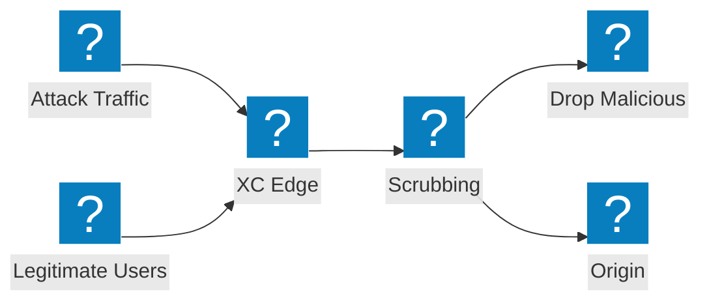

DDoS शमन आर्किटेक्चर आरेख जिनमें स्क्रबिंग केंद्र डिज़ाइन, ट्रांज़िट सेवा एकीकरण और F5 Distributed Cloud वॉल्यूमेट्रिक हमले की सुरक्षा शामिल है।

## DDoS शमन आर्किटेक्चर

नेटवर्क-लेयर स्क्रबिंग, एप्लिकेशन-लेयर निरीक्षण और ऑरिजिन सर्वर तक क्लीन ट्रैफ़िक डिलीवरी के साथ मल्टी-टियर DDoS शमन।

```mermaid
architecture-beta
  group scrub(lucide:shield)[Scrubbing Center]
  group origin(carbon:cloud-services)[Origin DC]

  service edge(carbon:edge-node)[Edge Router] in scrub
  service filter(carbon:firewall)[Traffic Filter] in scrub
  service clean(carbon:load-balancer-global)[Clean Pipe] in scrub
  service lb(carbon:load-balancer-application)[Load Balancer] in origin
  service app(carbon:application)[Application] in origin
  service db(carbon:data-base)[Database] in origin

  edge:R --> L:filter
  filter:R --> L:clean
  clean:R --> L:lb
  lb:R --> L:app
  app:B --> T:db
```

## F5 XC DDoS और ट्रांज़िट सेवाएं

F5 Distributed Cloud एकीकृत CDN और एप्लिकेशन सुरक्षा के साथ DDoS सुरक्षा और ट्रांज़िट सेवाएं प्रदान करता है।

```mermaid
architecture-beta
  group xc(lucide:cloud)[F5 Distributed Cloud]
  group cloud(carbon:cloud-services)[Cloud Infrastructure]

  service ddos(f5xc:ddos-and-transit-services)[DDoS Protection] in xc
  service cdn(f5xc:content-delivery-network)[CDN] in xc
  service waap(f5xc:web-app-and-api-protection)[WAAP] in xc
  service lb(carbon:load-balancer-application)[Load Balancer] in cloud
  service app(carbon:application)[App Cluster] in cloud
  service db(carbon:data-base)[Database] in cloud

  ddos:R --> L:cdn
  cdn:R --> L:waap
  waap:R --> L:lb
  lb:R --> L:app
  app:B --> T:db
```

## वॉल्यूमेट्रिक हमले का प्रवाह

हमले के ट्रैफ़िक का प्रवाह दर्शाता है कि कैसे वॉल्यूमेट्रिक DDoS हमलों को ऑरिजिन सर्वर इंफ्रास्ट्रक्चर तक पहुंचने से पहले F5 XC एज पर अवशोषित और शमन किया जाता है।

