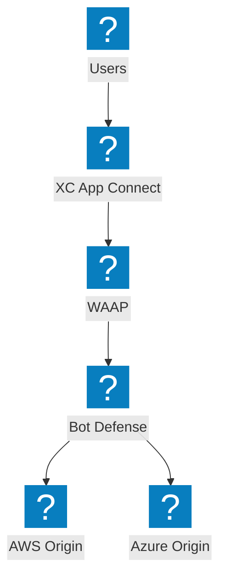
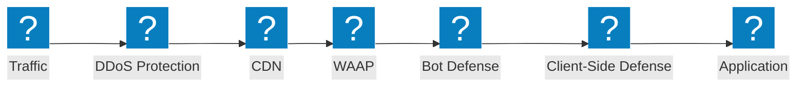

F5 उत्पाद आइकन शोकेस डायग्राम जो `f5xc` और `f5-brand` आइकन पैक का उपयोग करके F5 XC सेवा पोर्टफोलियो, NGINX उत्पाद लाइन, और BIG-IP क्षमताओं को प्रदर्शित करते हैं।

## F5 XC सेवा पोर्टफोलियो

F5 Distributed Cloud सेवाओं का अवलोकन जो सुरक्षा, नेटवर्किंग और एप्लिकेशन डिलीवरी को समाहित करता है।

## F5 XC सुरक्षा स्टैक

संपूर्ण F5 XC सुरक्षा स्टैक जिसमें WAAP, bot defense, client-side defense, DDoS सुरक्षा, और API डिस्कवरी शामिल हैं।

## F5 XC नेटवर्किंग सेवाएं

F5 Distributed Cloud नेटवर्किंग सेवाएं जिनमें मल्टी-क्लाउड कनेक्ट, DNS प्रबंधन, और वितरित एप्लिकेशन शामिल हैं।

```mermaid
architecture-beta
  group xc(lucide:cloud)[F5 Distributed Cloud]
  group infra(carbon:cloud-services)[Infrastructure]

  service mcn(f5xc:multi-cloud-network-connect)[Network Connect] in xc
  service mca(f5xc:multi-cloud-app-connect)[App Connect] in xc
  service dns(f5xc:dns-management)[DNS Management] in xc
  service dapp(f5xc:distributed-apps)[Distributed Apps] in xc
  service k8s(hashicorp-flight:kubernetes-color)[K8s Clusters] in infra
  service vm(carbon:virtual-machine)[VM Workloads] in infra

  mcn:R --> L:mca
  mca:R --> L:dns
  dns:R --> L:dapp
  mcn:B --> T:k8s
  mca:B --> T:vm
```

## F5 XC अवलोकनीयता और इंटेलिजेंस

व्यापक एप्लिकेशन दृश्यता के लिए F5 Distributed Cloud अवलोकनीयता, ट्रैफ़िक इनसाइट, और डेटा इंटेलिजेंस।

```mermaid
architecture-beta
  group apps(carbon:cloud-services)[Application Layer]
  group intel(lucide:cloud)[F5 XC Intelligence]

  service app1(carbon:application)[Web App] in apps
  service app2(carbon:api)[API Service] in apps
  service app3(f5xc:distributed-apps)[Distributed App] in apps
  service obs(f5xc:observability)[Observability] in intel
  service ati(f5xc:application-traffic-insight)[Traffic Insight] in intel
  service di(f5xc:data-intelligence)[Data Intelligence] in intel

  app1:B --> T:obs
  app2:B --> T:ati
  app3:B --> T:di
  obs:R --> L:ati
  ati:R --> L:di
```

