F5 Distributed Cloud उपयोग केस डायग्राम जो `f5-brand` आइकन पैक का उपयोग करके सुरक्षा, नेटवर्किंग, और एप्लिकेशन डिलीवरी आर्किटेक्चर को प्रदर्शित करते हैं।

## वेब ऐप और API सुरक्षा

### WAAP सुरक्षा निरीक्षण पाइपलाइन

मल्टी-लेयर WAAP निरीक्षण पाइपलाइन जिसमें फ़ायरवॉल, एप्लिकेशन कोड सुरक्षा, और bot रक्षा एप्लिकेशन तक पहुँचने से पहले मौजूद हैं।

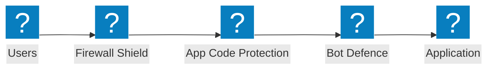

### एज सुरक्षा आर्किटेक्चर

एज सुरक्षा आर्किटेक्चर जिसमें WAF, शील्ड चेकमार्क सत्यापन, और क्लाउड ऑरिजिन के पार एप्लिकेशन सुरक्षा समूह हैं।

```mermaid
architecture-beta
  group edge(f5-brand:security-firewall-shield)[Security Edge]
  group origins(carbon:cloud-services)[Cloud Origins]

  service waf(f5-brand:security-firewall)[WAF] in edge
  service shield(f5-brand:security-shield-checkmark)[Shield Verify] in edge
  service appshield(f5-brand:security-shield-app-code)[App Shield] in edge
  service aws(hashicorp-flight:aws-color)[AWS Origin] in origins
  service azure(hashicorp-flight:azure-color)[Azure Origin] in origins

  waf:R --> L:shield
  shield:R --> L:appshield
  appshield:R --> L:aws
  appshield:B --> T:azure
```

### रेट लिमिटिंग के साथ API सुरक्षा

API अनुरोध सत्यापन पाइपलाइन जिसमें API एंडपॉइंट तक पहुँचने से पहले फ़ायरवॉल, रेट लिमिटिंग, और स्कीमा सत्यापन होता है।

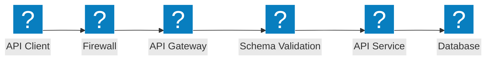

## Bot रक्षा

### Bot डिटेक्शन पाइपलाइन

मल्टी-स्टेज bot डिटेक्शन जिसमें JavaScript चैलेंज, डिवाइस फ़िंगरप्रिंटिंग, व्यवहार विश्लेषण, और निर्णय इंजन शामिल हैं।

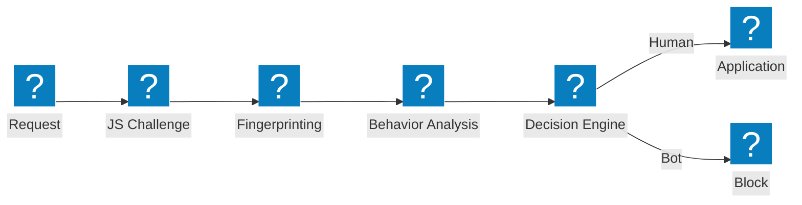

### Bot रक्षा लेयर

लेयर्ड bot रक्षा आर्किटेक्चर जिसमें क्रेडेंशियल इंटेलिजेंस, bot डिटेक्शन, और डिवाइस पोस्चर विश्लेषण शामिल हैं।

```mermaid
architecture-beta
  group defense(f5-brand:security-bot-defence)[Bot Defense Layers]
  group app(carbon:cloud-services)[Application]

  service botfw(f5-brand:security-firewall-bot)[Bot Firewall] in defense
  service botdef(f5-brand:security-bot-defence)[Bot Defence] in defense
  service intel(f5-brand:security-password-bot)[Credential Intel] in defense
  service login(carbon:application)[Login Service] in app
  service account(carbon:security)[Account Service] in app
  service db(carbon:data-base)[User Store] in app

  botfw:R --> L:botdef
  botdef:R --> L:intel
  intel:R --> L:login
  login:R --> L:account
  account:B --> T:db
```

### क्लाइंट-साइड डिफेंस

क्लाइंट-साइड डिफेंस पाइपलाइन जिसमें डिवाइस पोस्चर सत्यापन, लैपटॉप bot डिटेक्शन, और Magecart सुरक्षा शामिल है।

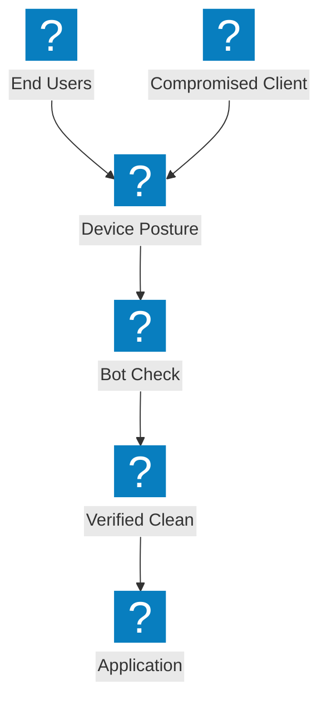

## मल्टी-क्लाउड नेटवर्किंग

### मल्टी-क्लाउड ऐप कनेक्ट

AWS, Azure, और GCP में केंद्रीकृत ऐप डिलीवरी फ़ैब्रिक के साथ मल्टी-क्लाउड एप्लिकेशन कनेक्टिविटी।


### साइट मेश के साथ नेटवर्क कनेक्ट

साइट मेश टोपोलॉजी और क्लाउड क्षेत्रों को जोड़ने वाले ट्रांजिट गेटवे के साथ मल्टी-क्लाउड नेटवर्क कनेक्ट।

```mermaid
architecture-beta
  group net(f5-brand:cloud-network-connect)[Network Connect]
  group region1(hashicorp-flight:aws-color)[AWS Region]
  group region2(hashicorp-flight:azure-color)[Azure Region]

  service mesh(f5-brand:cloud-multi-network)[Site Mesh] in net
  service gw(f5-brand:network-gateway)[Transit Gateway] in net
  service web1(carbon:virtual-machine)[Web Tier] in region1
  service db1(carbon:data-base)[Database] in region1
  service web2(carbon:virtual-machine)[Web Tier] in region2
  service db2(carbon:data-base)[Database] in region2

  mesh:R --> L:gw
  gw:B --> T:web1
  web1:R --> L:db1
  gw:B --> T:web2
  web2:R --> L:db2
```

### मल्टी-क्लाउड ऐप डिलीवरी

ग्लोबल लोड बैलेंसिंग, सुरक्षा, और वितरित वर्कलोड के साथ एंड-टू-एंड मल्टी-क्लाउड ऐप डिलीवरी।

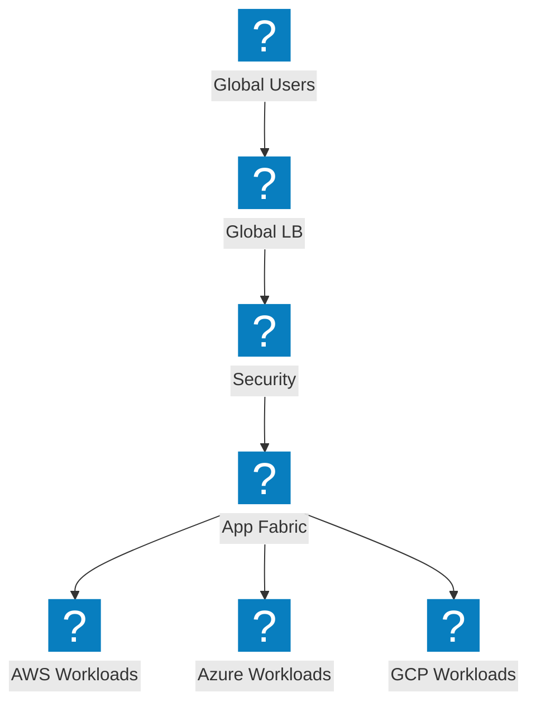

## DDoS सुरक्षा और एज सेवाएँ

### DDoS स्क्रबिंग आर्किटेक्चर

DDoS स्क्रबिंग सेंटर जिसमें नेटवर्क-लेयर सुरक्षा, साइट स्क्रबिंग, और ऑरिजिन सर्वर तक स्वच्छ ट्रैफ़िक डिलीवरी है।

```mermaid
architecture-beta
  group scrub(f5-brand:network-ddos-protection)[Scrubbing Center]
  group origin(carbon:cloud-services)[Origin DC]

  service ddos(f5-brand:network-ddos-protection)[DDoS Protection] in scrub
  service sitescrub(f5-brand:security-site-scrubbing)[Site Scrubbing] in scrub
  service clean(f5-brand:network-globe-load-balance)[Clean Pipe] in scrub
  service lb(carbon:load-balancer-application)[Load Balancer] in origin
  service app(carbon:application)[Application] in origin
  service db(carbon:data-base)[Database] in origin

  ddos:R --> L:sitescrub
  sitescrub:R --> L:clean
  clean:R --> L:lb
  lb:R --> L:app
  app:B --> T:db
```

### वॉल्यूमेट्रिक अटैक शमन

अटैक ट्रैफ़िक फ्लो जो ऑरिजिन सर्वर तक पहुँचने से पहले एज पर वॉल्यूमेट्रिक DDoS अवशोषण और शमन दर्शाता है।

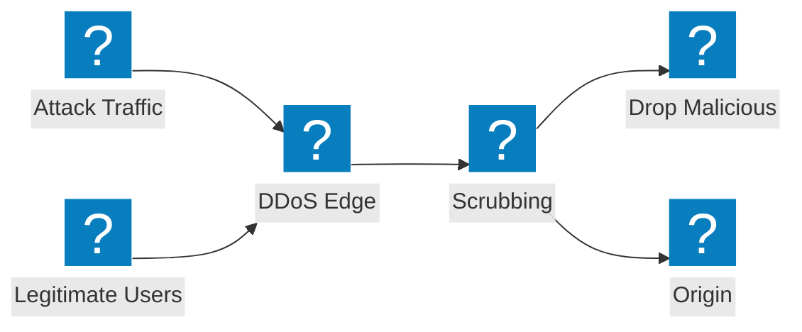

### CDN + DDoS + WAF लेयर्ड सुरक्षा

लेयर्ड एज सुरक्षा जो एकीकृत पाइपलाइन में CDN कैशिंग, DDoS शमन, और WAF निरीक्षण को जोड़ती है।

```mermaid
architecture-beta
  group edge(f5-brand:cloud-performance-arrow)[Edge Services]
  group security(f5-brand:security-firewall-shield)[Security Layer]
  group app(carbon:cloud-services)[Application]

  service cdn(f5-brand:cloud-performance-arrow)[CDN] in edge
  service ddos(f5-brand:network-ddos-protection)[DDoS Protection] in edge
  service waf(f5-brand:security-firewall-shield)[WAF] in security
  service shield(f5-brand:security-shield-checkmark)[Shield] in security
  service web(carbon:application)[Web App] in app
  service api(carbon:api)[API Service] in app

  cdn:R --> L:ddos
  ddos:R --> L:waf
  waf:R --> L:shield
  shield:R --> L:web
  shield:B --> T:api
```

## DNS और ट्रैफ़िक प्रबंधन

### हेल्थ मॉनिटरिंग के साथ DNS-आधारित GSLB

मल्टी-क्लाउड एंडपॉइंट में हेल्थ मॉनिटरिंग के साथ DNS-आधारित ग्लोबल सर्वर लोड बैलेंसिंग।

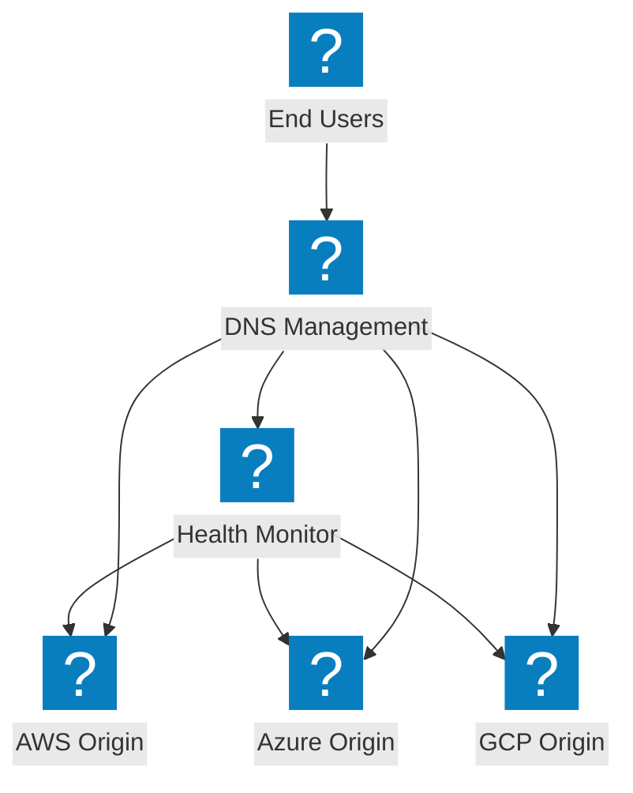

### DNS प्रबंधन आर्किटेक्चर

DNS प्रबंधन बुनियादी ढाँचा जिसमें DNS लोड बैलेंसिंग और क्लाउड क्षेत्रों में शील्ड DNS सुरक्षा है।

```mermaid
architecture-beta
  group dnsinfra(f5-brand:network-dns-1)[DNS Infrastructure]
  group region1(hashicorp-flight:aws-color)[US East]
  group region2(hashicorp-flight:azure-color)[EU West]

  service dns(f5-brand:network-dns-load-balance)[DNS Load Balance] in dnsinfra
  service shielddns(f5-brand:security-shield-dns)[Shield DNS] in dnsinfra
  service lb1(carbon:load-balancer-application)[Regional LB] in region1
  service app1(carbon:virtual-machine)[App Servers] in region1
  service lb2(carbon:load-balancer-application)[Regional LB] in region2
  service app2(carbon:virtual-machine)[App Servers] in region2

  dns:R --> L:shielddns
  dns:B --> T:lb1
  lb1:R --> L:app1
  dns:B --> T:lb2
  lb2:R --> L:app2
```

### फेलओवर के साथ इंटेलिजेंट DNS लोड बैलेंसिंग

क्लाउड DNS एकीकरण, परफ़ॉर्मेंस रूटिंग, और स्वचालित फेलओवर के साथ इंटेलिजेंट DNS लोड बैलेंसिंग।

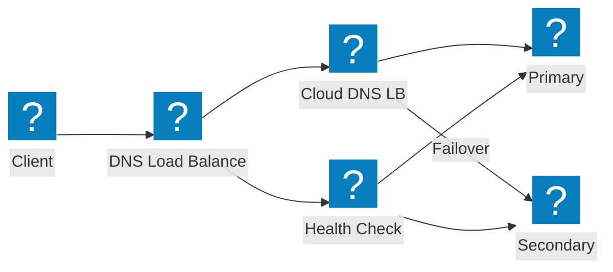

## API सुरक्षा और डिस्कवरी

### शैडो API डिस्कवरी पाइपलाइन

शैडो API डिस्कवरी पाइपलाइन जो ट्रैफ़िक विश्लेषण और इन्वेंटरी प्रबंधन के माध्यम से अज्ञात APIs का पता लगाती है।

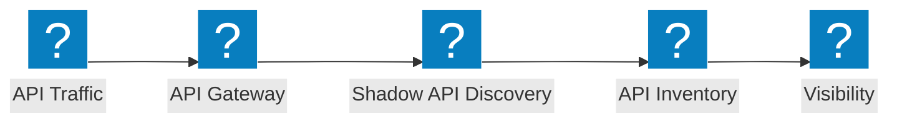

### API गेटवे आर्किटेक्चर

API गेटवे जिसमें प्रमाणीकरण, रेट लिमिटिंग, और सुरक्षा सत्यापन बैकएंड API सेवाओं की रक्षा करता है।

```mermaid
architecture-beta
  group gateway(f5-brand:network-api-gateway)[API Gateway]
  group backend(carbon:cloud-services)[Backend Services]

  service apigw(f5-brand:network-api-gateway)[API Gateway] in gateway
  service auth(f5-brand:security-key-lock)[Authentication] in gateway
  service rate(f5-brand:network-api)[Rate Limiter] in gateway
  service shield(f5-brand:security-shield-checkmark)[Schema Check] in gateway
  service api1(carbon:api)[Users API] in backend
  service api2(carbon:api)[Orders API] in backend

  apigw:R --> L:auth
  auth:R --> L:rate
  rate:R --> L:shield
  shield:R --> L:api1
  shield:B --> T:api2
```

### API जीवनचक्र: डिस्कवरी से सुरक्षा तक

शैडो API डिस्कवरी से इन्वेंटरी कैटलॉगिंग होते हुए सक्रिय सुरक्षा तक API जीवनचक्र पाइपलाइन।

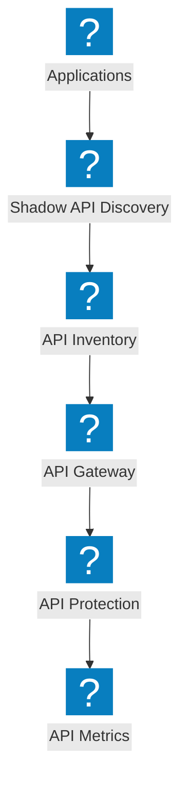

## प्लेटफ़ॉर्म और अवलोकनीयता

### NGINX One के साथ वितरित ऐप्स

NGINX One प्रबंधन, Kubernetes वर्कलोड, और केंद्रीकृत नियंत्रण के साथ वितरित एप्लिकेशन प्लेटफ़ॉर्म।

```mermaid
architecture-beta
  group platform(f5-brand:service-f5)[F5 Platform]
  group compute(carbon:cloud-services)[Compute]

  service nginx(f5-brand:service-nginx)[NGINX One] in platform
  service netng(f5-brand:network-nginx)[NGINX Network] in platform
  service f5svc(f5-brand:service-f5)[F5 Service] in platform
  service k8s(f5-brand:app-kubernetes)[Kubernetes] in compute
  service dist(f5-brand:cloud-distributed)[Distributed App] in compute
  service container(f5-brand:cloud-container-app)[Container App] in compute

  nginx:R --> L:netng
  netng:R --> L:f5svc
  nginx:B --> T:k8s
  netng:B --> T:dist
  f5svc:B --> T:container
```

### अवलोकनीयता पाइपलाइन

अवलोकनीयता पाइपलाइन जो एप्लिकेशन से मेट्रिक्स एकत्र करती है और अंतर्दृष्टि, अलर्ट, और डैशबोर्ड उत्पन्न करती है।

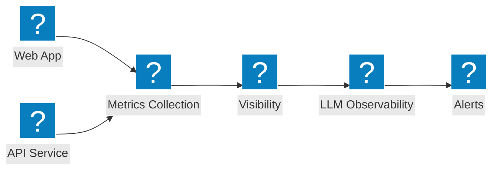

### संपूर्ण प्लेटफ़ॉर्म दृश्य

व्यापक F5 प्लेटफ़ॉर्म दृश्य जो सुरक्षा, नेटवर्किंग, और एप्लिकेशन डिलीवरी को एकीकृत सेवा के अंतर्गत जोड़ता है।

```mermaid
architecture-beta
  group f5(f5-brand:service-f5)[F5 Service Platform]
  group security(f5-brand:security-firewall-shield)[Security]
  group networking(f5-brand:cloud-network-connect)[Networking]

  service svcf5(f5-brand:service-f5)[F5 Service] in f5
  service bigip(f5-brand:service-big-ip-next)[BIG-IP Next] in f5
  service obs(f5-brand:other-site-metrics)[Observability] in f5
  service fw(f5-brand:security-firewall-shield)[WAF] in security
  service botd(f5-brand:security-bot-defence)[Bot Defence] in security
  service ddos(f5-brand:network-ddos-protection)[DDoS] in security
  service multi(f5-brand:cloud-multi-network)[Multi-Cloud Net] in networking
  service fabric(f5-brand:app-delivery-fabric)[App Fabric] in networking
  service nginx(f5-brand:service-nginx)[NGINX One] in networking

  svcf5:B --> T:fw
  svcf5:B --> T:multi
  bigip:B --> T:botd
  bigip:B --> T:fabric
  obs:B --> T:ddos
  obs:B --> T:nginx
```
