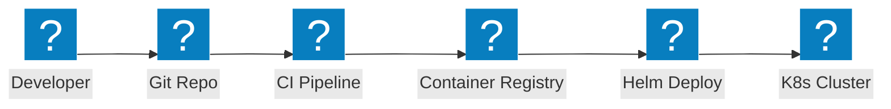

Kubernetes आर्किटेक्चर डायग्राम जिसमें इंग्रेस कंट्रोलर, सर्विस मेश पैटर्न, पॉड नेटवर्किंग, और NGINX तथा F5 XC इंटीग्रेशन के साथ कंटेनर सुरक्षा शामिल है।

## NGINX के साथ Kubernetes इंग्रेस

NGINX इंग्रेस कंट्रोलर के साथ कंटेनर-आधारित एप्लिकेशन जो फ्रंटएंड और बैकएंड पॉड्स में ट्रैफ़िक वितरित करता है।

```mermaid
architecture-beta
  group cluster(hashicorp-flight:kubernetes-color)[Kubernetes Cluster]
  group frontend(carbon:container-services)[Frontend Pods] in cluster
  group backend(carbon:container-services)[Backend Pods] in cluster

  service ingress(carbon:gateway)[Ingress Controller] in cluster
  service web(hashicorp-flight:docker-color)[Web App] in frontend
  service api(carbon:api)[API Service] in backend
  service db(carbon:data-base)[StatefulSet DB] in backend

  ingress:R --> L:web
  ingress:B --> T:api
  api:R --> L:db
```

## F5 XC के साथ सर्विस मेश

Kubernetes सर्विस मेश जिसमें F5 XC बाहरी लोड बैलेंसिंग, अवलोकनीयता, और मल्टी-क्लस्टर कनेक्टिविटी प्रदान करता है।

```mermaid
architecture-beta
  group xc(lucide:cloud)[F5 XC]
  group mesh(hashicorp-flight:kubernetes-color)[Service Mesh]

  service nginx(f5xc:nginx-one)[NGINX One] in xc
  service obs(f5xc:observability)[Observability] in xc
  service proxy1(carbon:server-proxy)[Sidecar Proxy] in mesh
  service svc1(hashicorp-flight:docker-color)[Service A] in mesh
  service proxy2(carbon:server-proxy)[Sidecar Proxy] in mesh
  service svc2(hashicorp-flight:docker-color)[Service B] in mesh

  nginx:R --> L:obs
  obs:R --> L:proxy1
  proxy1:R --> L:svc1
  svc1:B --> T:proxy2
  proxy2:R --> L:svc2
```

## कंटेनर डिप्लॉयमेंट पाइपलाइन

Helm चार्ट्स, कंटेनर रजिस्ट्री, और स्वचालित रोलआउट का उपयोग करके Kubernetes डिप्लॉयमेंट के लिए CI/CD पाइपलाइन।

